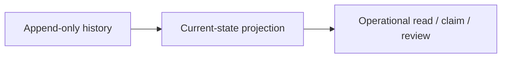

# Current-State Projection Families Contract

This page defines what kinds of autokairos records should exist as current-state projections above
durable history.

It follows:

- [30-event-log-first-durable-truth-posture.md](30-event-log-first-durable-truth-posture.md)
- [29-execution-record-store-contract.md](29-execution-record-store-contract.md)
- [26-substrate-state-surface-contract.md](../../specs/26-substrate-state-surface-contract.md)
- [21-wake-policy-contract.md](../../specs/21-wake-policy-contract.md)
- [22-standing-order-contract.md](22-standing-order-contract.md)
- [../control-plane/07-history-and-projection-model.md](../../control-plane/07-history-and-projection-model.md)

It is also informed by additional official documentation:

- [PostgreSQL Materialized Views](https://www.postgresql.org/docs/current/rules-materializedviews.html)
- [PostgreSQL CREATE VIEW](https://www.postgresql.org/docs/current/sql-createview.html)
- [OpenAI Sessions](https://openai.github.io/openai-agents-js/guides/sessions/)
- [OpenAI Context Management](https://openai.github.io/openai-agents-js/guides/context/)

## Thesis

autokairos should maintain explicit current-state projections for live operational questions, but
those projections should remain downstream of durable history.

## Why This Spec Exists

The system is not just an audit log.

It also needs to answer live questions quickly:

- what request is active?
- what attempt is claimable or live?
- what wake policy is currently in force?
- what is the current substrate posture?

Those questions should not require full replay on every read.

## Canonical Object / Interface / Boundary

This spec defines `ProjectionFamily`.

A projection family is a current-state surface derived from durable history and maintained for
operational reads, claims, and governance work.

## Required Fields Or Required Behaviors

## 1. Core projection properties

Every projection family should preserve:

- projection identifier or governed scope key
- current standing or status
- last-updated time
- source or watermark reference when meaningful
- reconciliation posture when meaningful

## 2. Canonical projection families now

The current architecture already implies these projection families.

### Proactive projections

- current wake-policy view
- current standing-order view
- current proactive standing view

### Execution projections

- `ExecutionRequestHeader` as current request view
- `ExecutionAttemptHeader` as current attempt view

### Trading substrate projections

- substrate-state surfaces such as market, account, position, order/fill, risk, and connector
  liveness surfaces

### Governance projections

- future current review standing view
- future current candidate standing view derived from decision history

## 3. Rebuild rule

Projection families should be rebuildable or reconcilable from durable history, even if the first
implementation uses simple update-in-place mechanics for convenience.

This rule matters more than whether rebuild is immediate, cheap, or fully automated.

## 4. Read optimization rule

Projections exist to support:

- low-latency operational reads
- queue and claim queries
- operator inspection
- policy and governance coordination

They are allowed to be optimized for those reads.

## 5. Not-the-only-truth rule

A projection must not become the only surviving record of why the system got to its current state.

If a projection says an attempt is `failed`, durable history should still explain:

- when it failed
- which event set it to failed
- what surface reported that failure

## Lifecycle Or State Model

Projection families usually behave like:

1. initialized
2. updated as new history arrives
3. reconciled or rebuilt when drift is detected

Unlike history families, they are expected to change over time.

## What This Is Not

This spec is not saying:

- projections are caches only
- projections are optional
- projections must always be implemented with SQL views or materialized views

It is saying something narrower:

**current-state surfaces are legitimate first-class objects, but they remain downstream of durable
history and should not erase it.**

## Failure Modes / Invariants

### Invariants

- current operational posture is cheaply readable
- projection meaning is explicit
- history remains the deeper authority beneath the projection

### Failure modes

- projections become the only truth surface
- no watermark or reconciliation posture exists
- operational reads require full replay every time
- status meaning drifts because the projection no longer points back to stable history

## Relationship To Adjacent Specs

This spec works with:

- [30-event-log-first-durable-truth-posture.md](30-event-log-first-durable-truth-posture.md)
- [31-history-record-families-contract.md](31-history-record-families-contract.md)

It sharpens the interpretation of:

- [29-execution-record-store-contract.md](29-execution-record-store-contract.md)
- [26-substrate-state-surface-contract.md](../../specs/26-substrate-state-surface-contract.md)
- [21-wake-policy-contract.md](../../specs/21-wake-policy-contract.md)
- [22-standing-order-contract.md](22-standing-order-contract.md)
