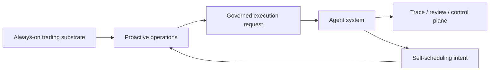

# Proactive Operations Overview

This page defines why autokairos needs a dedicated proactive-operations subsystem.

It follows:

- [README.md](README.md)
- [../foundation/01-naming-and-vocabulary.md](../foundation/01-naming-and-vocabulary.md)
- [../specs/04-boundaries.md](../specs/04-boundaries.md)
- [../trading-substrate/01-overview.md](../trading-substrate/01-overview.md)
- [../control-plane/05-proactive-policy-and-wake-records.md](../control-plane/05-proactive-policy-and-wake-records.md)
- [../../sources/synthesis/proactive-operations-and-wake-orchestration.md](../../sources/synthesis/proactive-operations-and-wake-orchestration.md)

## Purpose

Define proactive operations as a subsystem above the cognitive runtime.

## Scope And Non-Goals

This page covers:

- why proactive operations are distinct from the agent runtime
- what work belongs in this layer
- the main abstractions and boundaries

This page does not cover:

- detailed trigger schemas
- self-scheduling contract details
- the internal agent loop

## Responsibilities

The proactive-operations subsystem should:

- own the taxonomy of wake sources
- translate periodic or event signals into governed work
- keep wake-policy truth outside the runtime
- rely on the control plane to preserve wake authority as durable truth
- distinguish main-session turns, detached runs, and review follow-up work
- keep standing authority and escalation rules explicit

## System Boundaries

This subsystem sits above the agent runtime and below the broader control plane.

It should not:

- become the control plane itself
- become the runtime itself
- silently mutate candidate standing or promotion state

## Primary Abstractions

- `WakePolicy`
  durable rule that says when and why work should be awakened
- `WakeTrigger`
  concrete firing of a policy or event source
- `HeartbeatTurn`
  approximate main-context periodic turn
- `ScheduledRun`
  detached or durable scheduled execution
- `EventTrigger`
  wake driven by market, order, risk, operator, or external tool events
- `StandingOrder`
  durable authority with triggers, approval gates, and escalation
- `SelfSchedulingIntent`
  agent proposal to change future wake behavior

## Primary Flows

## Failure And Recovery Model

This subsystem should assume:

- missed fires happen
- repeated triggers happen
- events can arrive out of order
- some wakeups should collapse into one governed request
- some wakeups should be suppressed because the stage, time window, or policy says so

## Dependencies On Other Subsystems

- It depends on the always-on trading substrate for signals.
- It depends on the control plane for durable policy truth.
- It hands work into the agent system through governed execution objects.

## What Is Still Delegated To Specs / ADRs

- trigger-family semantics move into
  [../specs/19-wake-orchestration-and-trigger-model.md](../specs/19-wake-orchestration-and-trigger-model.md)
- self-scheduling details move into
  [../specs/20-governed-self-scheduling-contract.md](../specs/20-governed-self-scheduling-contract.md)
- durable wake-authority contracts move into
  [../specs/21-wake-policy-contract.md](../specs/21-wake-policy-contract.md) and
  [../specs/22-standing-order-contract.md](../specs/22-standing-order-contract.md)
- durable wake-history contracts move into
  [../specs/23-wake-trigger-record-contract.md](../specs/23-wake-trigger-record-contract.md)

## Core Claim

autokairos should not treat "persistent agent" as a synonym for "one runtime that stays alive."

The stronger source-grounded model is:

- always-on trading substrate
- proactive wake orchestration
- wakeable cognitive runtime

That is closer to OpenClaw's distinction between heartbeat, cron, and standing orders, closer to
Claude Code's split between `/loop`, local scheduled tasks, and routines, and closer to Codex's
separation between automations and the review queue.
