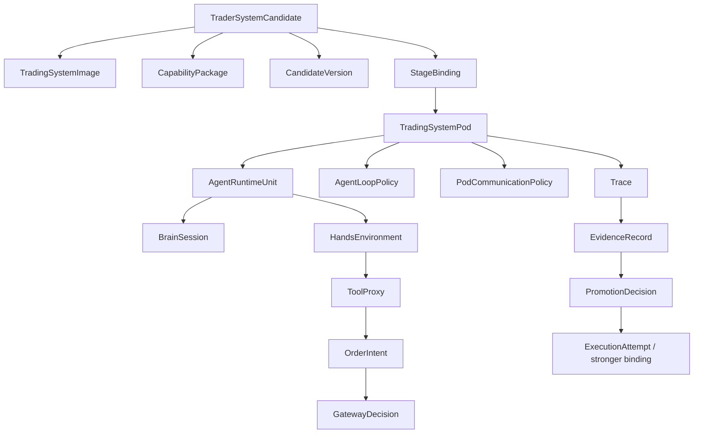

# Core Primitives

## Purpose

This page defines the smallest autokairos-owned object set for the current MLP-01 architecture.

## Thesis

autokairos must model the candidate as a trader system, not as a strategy note.

The primitive set therefore centers on:

```text
TraderSystemCandidate
-> TradingSystemImage
-> CapabilityPackage
-> StageBinding
-> TradingSystemPod
-> AgentRuntimeUnit
-> Trace
-> EvidenceRecord
-> PromotionDecision
```

## Primitive Matrix

| Primitive | Meaning | Durable owner |
| --- | --- | --- |
| `TraderSystemCandidate` | promotable candidate trading system | control plane |
| `TradingSystemImage` | versioned artifact for system behavior, brain/team contract, and required interfaces | artifact store / control plane |
| `CapabilityPackage` | versioned context/tool/skill/data-access artifact | artifact store / control plane |
| `CapabilityPackageManifest` | inspectable trust and permission declaration for one capability package | artifact store / control plane |
| `CandidateVersion` | cloned version used for safe self-evolution | control plane |
| `Stage` | product-level legitimacy stage: backtest, paper, live | control plane |
| `StageBinding` | concrete execution binding for a stage | control plane / runtime bridge |
| `BacktestBindingProfile` | typed binding profile for historical/simulated evaluation | control plane / runtime bridge |
| `PaperBindingProfile` | typed binding profile for live-like simulated execution | control plane / runtime bridge |
| `LiveBindingProfile` | typed binding profile for real-risk execution behind gateway limits | control plane / runtime bridge |
| `TradingSystemPod` | stage-bound execution instance of a candidate | runtime bridge with control-plane record |
| `AgentRuntimeUnit` | one brain/hands/session participant plus provider/driver selection in a pod or pod team | runtime bridge with control-plane reference |
| `AgentLoopPolicy` | autonomy envelope for one-shot, evaluation, or continuous-live agent loops | control plane / runtime bridge |
| `RuntimeProviderAdapter` | executable adapter contract for a concrete provider invocation surface | runtime bridge |
| `BrainSession` | provider/harness reasoning session | runtime bridge / provider, referenced durably |
| `HandsEnvironment` | sandbox/tool/data/gateway environment | runtime bridge |
| `ToolProxy` | authority boundary for tools, credentials, and side effects | control plane / runtime bridge |
| `PodCommunicationPolicy` | unified provider-neutral policy for communication, sharing, routing, and isolation between agent runtime units | control plane / runtime bridge |
| `A2AAgentEndpoint` | discoverable independent agent endpoint | runtime bridge / endpoint registry |
| `A2ATaskRecord` | traceable agent-to-agent task exchange | trace store / control plane |
| `A2AArtifact` | output from an A2A task | artifact store / trace store |
| `SharedContextSurface` | explicit non-secret shared context made available to multiple agents | control plane / artifact store |
| `TeamTrace` | durable trace of multi-agent messages, tasks, and artifacts | trace store |
| `Trace` | raw external record of a run | trace store |
| `EvidenceRecord` | externally judged evidence | evaluation-and-progression / control plane |
| `PromotionDecision` | governance decision changing candidate standing | evaluation-and-progression / control plane |
| `OrderIntent` | agent proposal for a possible live trading action | control plane / trace store |
| `GatewayDecision` | gateway decision to accept, reject, or clip one order intent | trading-substrate / control plane |
| `ExecutionAttempt` | durable live execution attempt | control plane |
| `WakeTriggerRecord` | durable wake event and reason | control plane |

## Object Relationships



## `TraderSystemCandidate`

The candidate is the system under judgment.

It should reference:

- candidate id
- current standing
- image ref
- capability package refs
- version lineage
- first market scope
- provenance
- evaluation and promotion history

It is not a prompt, brain session, hands environment, or one run.

## `TradingSystemImage`

The image is the stable artifact that should remain the same across bindings.

It may include:

- system manifest
- agent/team contract
- required tool contracts
- trading behavior source or artifact refs
- expected inputs and outputs
- version metadata

It should not include secrets, live credentials, or counted evidence.

## `CapabilityPackage`

The package is a versioned artifact for context/tool/skill/data-access injection.

It may include:

- tool contract declarations
- MCP/tool proxy requirements
- market context
- skills
- data access requirements
- compatibility rules
- allowed stages
- future license/marketplace metadata

It must not include secrets or exchange credentials.

### `CapabilityPackageManifest`

Every active package must expose a manifest.

The minimum manifest fields are:

- package id and version
- package kind
- provenance
- declared tools
- declared data access
- allowed stages
- required permissions
- forbidden contents
- compatibility notes

The manifest does not grant access by itself. `StageBinding` and `ToolProxy` decide actual runtime
access.

Forbidden package contents include:

- exchange credentials
- gateway signing keys
- evaluator secrets or hidden labels
- live gateway tokens
- undeclared executable side-effect paths

## `StageBinding`

`StageBinding` is the concrete environment injection for `backtest`, `paper`, or `live`.

It resolves:

- data source
- clock
- evaluator
- exchange or simulated exchange
- risk envelope
- tool proxy endpoints
- credential policy
- execution legitimacy mode

Backtest, paper, and live are bindings for the same candidate artifact, not separate systems.

### Binding Profiles

All binding profiles implement `StageBinding`, but they must not share one vague field bag.

`BacktestBindingProfile` must define at least:

- historical or replay data source
- deterministic clock
- simulator reference
- evaluator reference
- no live credentials

`PaperBindingProfile` must define at least:

- live or delayed market data source
- simulated order gateway
- paper risk envelope
- no real exchange execution

`LiveBindingProfile` must define at least:

- live market data source
- real gateway reference
- risk envelope reference
- credential binding reference outside packages
- wake policy reference

Live binding cannot be constructed from prompt text alone. It must be downstream of a
`PromotionDecision` and a `GovernedExecutionRequest`.

## `TradingSystemPod`

The pod is the execution instance of a candidate under one binding.

It is composed from:

- `TradingSystemImage`
- `CapabilityPackage`
- `StageBinding`
- one or more `AgentRuntimeUnit` records
- `ToolProxy`

It does not own candidate truth, evidence truth, promotion authority, or unrestricted live
execution authority.

## `AgentRuntimeUnit`

`AgentRuntimeUnit` is the participant boundary for a single agent brain/hands/session loop.

It may represent:

- one local harness process
- one Claude Managed Agents thread/session participant
- one Codex or Claude Code run
- one A2A-compatible remote agent endpoint
- one future OpenClaw/ACP or Multica-like runtime participant

It should reference:

- `runtime_unit_role`:
  `builder_agent`, `evaluation_runner`, `live_operator_agent`, `critic_agent`, or
  `remote_specialist`
- concrete `provider_kind`:
  `codex_cli`, `codex_sdk_ts`, `codex_cloud`, `claude_agent_sdk_python`,
  `claude_agent_sdk_ts`, `claude_cli`, `openclaw_acp`, `a2a_endpoint`, `local_process`, or a
  future explicitly designed equivalent
- invocation surface:
  subprocess, TypeScript SDK, Python SDK, cloud task, ACP bridge, A2A endpoint, or local process
- auth reference
- sandbox and working-directory policy
- output contract reference
- trace destination
- brain/session provider
- hands environment
- allowed tools
- allowed communication channels
- trace export destination

A single-agent pod has one `AgentRuntimeUnit`.

A multi-agent pod has several `AgentRuntimeUnit` records plus explicit communication policy and
shared context surfaces.

The provider/driver is per runtime unit. A `TradingSystemPod` can therefore contain mixed provider
participants without becoming several product objects.

`runtime_unit_role` answers why the unit exists.

`provider_kind` answers how the unit runs.

PR1 defaults to:

```text
runtime_unit_role = builder_agent
provider_kind = codex_cli
model = gpt-5.4
```

PR3 requires at least one `live_operator_agent`. It must not inherit builder-agent semantics from
PR1.

Provider labels alone are not implementation-grade. The runtime bridge must use a
`RuntimeProviderAdapter` contract, defined in
[../06-runtime-provider-adapter-feasibility.md](../06-runtime-provider-adapter-feasibility.md),
before a real provider run can materialize a candidate or run a pod.

## `AgentLoopPolicy`

`AgentLoopPolicy` defines the autonomy envelope around an agent runtime unit.

It does not direct each reasoning step. It defines:

- trigger source
- loop mode
- cadence
- max turns or live heartbeat expectations
- timeout and cancellation policy
- retry and resume posture
- trace export requirement
- tool access posture
- stop conditions

The current loop modes are:

- `one_shot_builder`
- `bounded_batch_evaluation`
- `continuous_live`

See [15-agent-loop-policy-contract.md](15-agent-loop-policy-contract.md).

## `RuntimeProviderAdapter`

`RuntimeProviderAdapter` is the executable seam between autokairos and provider runtimes.

It must answer:

- how availability and version are probed
- how working directories, prompts, schemas, and policies are prepared
- how the run starts
- how events stream into trace
- how cancellation works
- how artifacts, final output, and provider metadata are collected
- whether resume is supported

The first concrete adapter target is `codex_cli` through local `codex exec`. Claude should be added
through Claude Agent SDK, not by treating "Claude" as an abstract runtime label.

## `BrainSession` And `HandsEnvironment`

Claude Managed Agents provides the key reference: brain, hands, and session must stay decoupled.

- `BrainSession` is the provider/harness reasoning session.
- `HandsEnvironment` is where tools, sandboxed code, data, and gateways live.
- The durable event log and candidate truth stay outside both.

## Multi-Agent Communication Primitives

`PodCommunicationPolicy` is one unified policy object for the pod.

It defines:

- topology:
  `isolated`, `coordinator_routed`, `direct_allowed`, or `external_endpoint_routed`
- allowed channels:
  provider-native thread, A2A-compatible task/message/artifact, control-plane mediated message,
  or none
- shared context surfaces
- artifact export requirements
- forbidden communication edges
- live-stage restrictions

It does not choose the provider. Provider selection lives on each `AgentRuntimeUnit`.

MLP-01 starts single-agent.

Multi-agent admission is allowed only when a current PRD acceptance criterion cannot be met by one
runtime unit. It requires:

- explicit `runtime_unit_role` for each unit
- one `PodCommunicationPolicy`
- `TeamTrace`
- shared context declared as non-secret
- no communication path to live authority except `ToolProxy` / gateway

`A2AAgentEndpoint` is a discoverable independent agent endpoint, inspired by A2A agent cards.

`A2ATaskRecord` records one task/message exchange with an independent agent endpoint.

`A2AArtifact` records an output produced by that exchange.

`SharedContextSurface` is the explicit context made available to multiple agent runtime units. It
must not carry secrets.

`TeamTrace` is the durable trace for multi-agent collaboration.

These primitives are communication and trace surfaces. They are not evidence, promotion, or live
authority by themselves.

## `ToolProxy`

The tool proxy is the boundary between agent intent and real capability.

For live trading:

```text
BrainSession -> OrderIntent -> ToolProxy / Gateway -> GatewayDecision -> ExecutionAttempt
```

The agent may propose. autokairos decides what is executed.

`OrderIntent` and `GatewayDecision` are defined in
[16-order-intent-and-gateway-decision-contract.md](16-order-intent-and-gateway-decision-contract.md).

## Self-Evolution Primitive

Self-evolution uses `CandidateVersion`.

Valid flow:

```text
live insight -> proposed CandidateVersion -> backtest binding -> evidence -> promotion
```

Invalid flow:

```text
live pod mutates itself in place
```

## Acceptance Test

A reader should be able to explain:

- what candidate means
- why image and package are separate
- why binding changes do not create a new system
- why binding profiles prevent backtest/paper/live ambiguity
- why pod execution does not own truth
- why `runtime_unit_role` and `provider_kind` are separate
- why agent loops are autonomous but bounded by policy
- why packages need manifests and permission boundaries
- why provider labels must resolve to a callable adapter surface
- why multi-agent communication does not automatically create evidence or authority
- why live action is bounded through gateway
