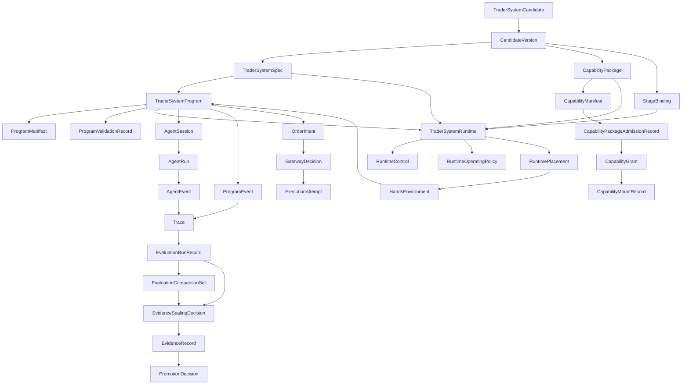

# Core Primitives

## Purpose

This page defines the smallest autokairos-owned object set for the current MLP-01 architecture.

## Thesis

autokairos models agent-built trader systems as deployable, observable, governable artifacts.

It does not author the internal trading loop and does not activate every agent step. External agents
create or update `TraderSystemSpec`, `TraderSystemProgram`, and `CapabilityPackage` artifacts.
autokairos registers, deploys, starts, pauses, stops, inspects, gates, evaluates, promotes, and
audits those artifacts.

The primitive set therefore centers on:

```text
TraderSystemCandidate
-> CandidateVersion
-> TraderSystemSpec
-> TraderSystemProgram
-> CapabilityPackage
-> StageBinding
-> RuntimeControl
-> TraderSystemRuntime
-> RuntimePlacement
-> RuntimeOperatingPolicy
-> AgentSession / AgentRun / AgentEvent
-> Trace
-> EvaluationRunRecord
-> EvidenceSealingDecision
-> EvidenceRecord
-> PromotionDecision
```

## Primitive Matrix

| Primitive | Meaning | Durable owner |
| --- | --- | --- |
| `TraderSystemCandidate` | promotable candidate trading system | control plane |
| `CandidateVersion` | cloned version used for safe self-evolution | control plane |
| `TraderSystemSpec` | versioned artifact defining the trader system | artifact store / control plane |
| `TraderSystemProgram` | agent-authored executable behavior bundle | artifact store / control plane |
| `ProgramManifest` | declaration for one executable program bundle | artifact store / control plane |
| `ProgramValidationRecord` | decision on whether a program is safe enough to mount or execute | control plane / artifact store |
| `CapabilityPackage` | versioned context/tool/skill/data-access artifact | artifact store / control plane |
| `CapabilityManifest` | package trust and permission declaration | artifact store / control plane |
| `CapabilityPackageAdmissionRecord` | validation record deciding whether a package can be considered for runtime injection | control plane / artifact store |
| `CapabilityGrant` | stage-bound grant of actual package access through ToolProxy, binding, vault, or gateway surfaces | control plane / runtime connector |
| `CapabilityMountRecord` | record of package content injected into one placement/hands environment | runtime connector / trace store |
| `Stage` | product-level legitimacy stage: backtest, paper, live | control plane |
| `StageBinding` | concrete execution binding for a stage | control plane / runtime connector |
| `BacktestBindingProfile` | typed profile for historical/simulated evaluation | control plane / runtime connector |
| `PaperBindingProfile` | typed profile for live-like simulated execution | control plane / runtime connector |
| `LiveBindingProfile` | typed profile for real-risk execution behind gateway limits | control plane / runtime connector |
| `RuntimeControl` | lifecycle/governance command surface: register, deploy, start, pause, resume, stop, inspect, override, kill | control plane |
| `RuntimeControlDecision` | durable result of accepting, rejecting, or applying a runtime-control command | control plane / audit |
| `RuntimeLifecycleEvent` | trace/audit event for runtime lifecycle state changes | trace store / control plane |
| `TraderSystemRuntime` | logical deployed runtime instance of a candidate version | control plane / runtime connector |
| `RuntimeOperatingPolicy` | lifecycle, placement, trace, tool/gateway, stop, recovery, and audit boundary for a runtime | control plane / runtime connector |
| `RuntimePlacement` | physical execution placement and handles for one launch/resume | runtime connector / trace store |
| `ExecutionPod` | optional pod-like physical execution group under a runtime placement | runtime connector / execution substrate |
| `AgentSpec` | configured agent participant definition | artifact store / control plane |
| `AgentSession` | running provider-backed participant used by the trader system when needed | runtime connector with control-plane reference |
| `AgentRun` | one provider invocation, task, turn, or attempt | runtime connector / trace store |
| `AgentEvent` | normalized raw provider output | trace store |
| `RuntimeProviderAdapter` | executable adapter contract for a concrete provider invocation surface | runtime connector |
| `BrainSession` | provider/harness reasoning session | runtime connector / provider, referenced durably |
| `HandsEnvironment` | sandbox/tool/data/program execution surface | runtime connector |
| `ToolProxy` | authority boundary for tools, credentials, and side effects | control plane / runtime connector |
| `RuntimeCommunicationPolicy` | provider-neutral policy for communication, sharing, routing, and isolation between agent sessions | control plane / runtime connector |
| `RuntimeMemorySurface` | scoped runtime context derived from trace, approved artifacts, and explicit memory resources | control plane / trace store / artifact store |
| `A2AAgentEndpoint` | discoverable independent remote agent endpoint | runtime connector / endpoint registry |
| `A2ATaskRecord` | traceable agent-to-agent task exchange | trace store / control plane |
| `A2AArtifact` | output from an A2A task | artifact store / trace store |
| `SharedContextSurface` | explicit non-secret shared context made available to multiple agents | control plane / artifact store |
| `TeamTrace` | durable trace of multi-agent messages, tasks, and artifacts | trace store |
| `ProgramEvent` | normalized event from `TraderSystemProgram` execution | trace store |
| `Trace` | recoverable runtime history | trace store |
| `EvaluationRunRecord` | evaluator pass over trace inputs with provider/model/run attribution | evaluation-and-progression / control plane |
| `EvaluationComparisonSet` | record of which evaluation runs are comparable and why | evaluation-and-progression / control plane |
| `EvidenceSealingDecision` | decision that turns evaluator output into counted, non-counted, or quarantined evidence | evaluation-and-progression / control plane |
| `EvidenceRecord` | externally judged evidence | evaluation-and-progression / control plane |
| `PromotionDecision` | governance decision changing candidate standing | evaluation-and-progression / control plane |
| `OrderIntent` | trader-system proposal for a possible live trading action | control plane / trace store |
| `GatewayDecision` | gateway decision to accept, reject, or clip one order intent | trading-substrate / control plane |
| `ExecutionAttempt` | durable live execution attempt | control plane |

## Object Relationships



## `TraderSystemCandidate`

The candidate is the system under judgment.

It is not a prompt, provider session, hands environment, or one run. It references candidate id,
current standing, candidate versions, spec refs, capability package refs, first market scope,
provenance, evaluation history, and promotion history.

## `TraderSystemSpec`

The spec is the stable trader-system definition that can run under different bindings.

It may include system manifest refs, program refs, agent/team contract, required tool contracts,
expected inputs and outputs, supported stage binding profiles, and version metadata.

It must not include secrets, live credentials, evaluator ground truth, counted evidence, promotion
state, or live approval.

See [19-trader-system-artifact-contract.md](19-trader-system-artifact-contract.md).

## `TraderSystemProgram`

`TraderSystemProgram` is the agent-authored executable behavior bundle for one trader-system spec.

It is not a human-defined strategy DSL. It may include Python scripts, TypeScript modules,
generated policies, local planners, indicators, experiment scripts, internal state files, and
adapter code for allowed tool-proxy surfaces.

The program owns internal trading behavior. It may decide when to call provider-backed agents. It
may process streams, maintain local state, and emit boundary outputs.

Allowed boundary outputs:

- `ProgramEvent`
- `AgentRun` / `AgentEvent`
- `ToolRequest`
- `OrderIntent`
- diagnostic artifact
- metric snapshot
- review request
- candidate-version proposal

Forbidden behavior:

- direct exchange API calls
- raw secret or credential reads
- hidden network side effects outside `ToolProxy`
- self-promotion
- writing counted evidence
- live mutation without `CandidateVersion` and re-evaluation

## `CapabilityPackage`

The package is a versioned artifact for context/tool/skill/data-access injection.

It declares capabilities. It does not grant access.

Actual runtime access is granted by `StageBinding`, `ToolProxy`, vault or credential binding,
gateway policy, and `CapabilityGrant`.

The active package flow is:

```text
CapabilityPackage
-> CapabilityManifest
-> CapabilityPackageAdmissionRecord
-> CapabilityGrant
-> CapabilityMountRecord
-> Trace
```

See [18-capability-package-trust-and-permission-contract.md](18-capability-package-trust-and-permission-contract.md).

## `StageBinding`

`Stage` answers product legitimacy. `StageBinding` answers operational injection.

Typed profiles:

- `BacktestBindingProfile`: historical data, deterministic clock, simulator, evaluator ref, no
  live credentials
- `PaperBindingProfile`: live-like data, simulated order gateway, paper risk envelope, no real
  exchange execution
- `LiveBindingProfile`: live data, real gateway ref, risk envelope, credential binding ref, kill
  switch posture

Backtest, paper, and live are not different systems. They are bindings for the same artifact.

## `RuntimeControl`

`RuntimeControl` is how autokairos operates a deployed trader system.

Minimum control commands:

- `register`
- `deploy`
- `start`
- `pause`
- `resume`
- `stop`
- `inspect`
- `override`
- `kill`

`RuntimeControlDecision` records whether a command was accepted, rejected, clipped, modified, or
applied and why.

`RuntimeLifecycleEvent` records lifecycle changes such as registered, deployed, starting, running,
paused, resumed, stopping, stopped, failed, killed, superseded, or review_required.

Runtime control is not internal step orchestration. It must not choose each market reaction, agent
call, script execution, or local planner step.

## `TraderSystemRuntime`

`TraderSystemRuntime` is the logical deployed runtime instance of a candidate version under one
stage binding.

It is assembled from:

- candidate version
- trader-system spec
- trader-system program
- capability packages
- stage binding
- runtime operating policy
- runtime communication policy
- runtime placement history
- trace cursor
- memory surface refs

It is not a process, Docker container, Kubernetes Pod, provider session, or remote endpoint.

## `RuntimeOperatingPolicy`

`RuntimeOperatingPolicy` defines the governance envelope around one runtime.

It may define:

- allowed lifecycle transitions
- placement class
- trace export requirement
- timeout and cancellation posture
- retry/resume posture
- checkpoint and artifact export posture
- tool access posture
- outbound gateway policy
- stop and kill conditions
- recovery posture
- operator audit requirement

It does not direct every reasoning step and does not decide whether the trader system should use an
agent call, script execution, local planner, or no-op internally.

See [15-runtime-operating-policy-contract.md](15-runtime-operating-policy-contract.md).

## `RuntimePlacement`

`RuntimePlacement` records the physical placement selected for one launch or resume.

Examples:

- local process
- container-backed `HandsEnvironment`
- provider-managed session
- OpenClaw/ACP harness session
- A2A-compatible remote endpoint

`ExecutionPod` is allowed only when the physical placement is genuinely pod-like.

## `AgentSpec`, `AgentSession`, `AgentRun`, `AgentEvent`

`AgentSpec` configures a participant.

`AgentSession` is one provider-backed running participant used by the trader system when needed.

`AgentRun` is one provider invocation, task, turn, or attempt.

`AgentEvent` is raw provider output normalized into trace.

The provider-backed chain is:

```text
TraderSystemProgram
-> AgentSession
-> RuntimeProviderAdapter
-> Codex / Claude / OpenClaw-ACP / A2A / local_process
-> AgentRun
-> AgentEvent
-> Trace
```

Provider output is not evidence, promotion, gateway decision, or durable product truth.

## `RuntimeMemorySurface`

`RuntimeMemorySurface` is versioned, scoped, auditable runtime context.

It is not evidence, live authority, provider-private memory, or promotion truth.

Minimum shape:

- `runtime_memory_surface_id`
- `scope`
- `trust_class`
- `access_mode`
- `version`
- `source_refs`
- `content_ref` or `summary_ref`
- `visible_to_runtime`
- `visible_to_evaluator`
- `created_from_trace_ref`
- `last_review_status`
- `quarantine_status`
- `rollback_from_ref`

Runtime-originated memory change must start as a trace-backed proposal, not silent mutation.

## `Trace`

Trace is recoverable runtime history.

It records provider events, program events, tool requests/results, lifecycle events, memory
influence, order intents, gateway decisions, artifacts, checkpoints, errors, and audit linkage.

Trace is not evidence. Evidence requires evaluation and sealing.

## `EvaluationRunRecord`, `EvidenceSealingDecision`, `EvidenceRecord`

The active evidence chain is:

```text
Trace
-> EvaluationRunRecord
-> EvaluationComparisonSet
-> EvidenceSealingDecision
-> EvidenceRecord
-> PromotionDecision
```

See [17-evaluation-comparability-and-sealing-contract.md](17-evaluation-comparability-and-sealing-contract.md).

## `OrderIntent`, `GatewayDecision`, `ExecutionAttempt`

The live authority chain is:

```text
TraderSystemProgram or AgentSession
-> OrderIntent
-> TradingGateway
-> GatewayDecision
-> ExecutionAttempt
```

The trader system proposes. The gateway decides. The venue result is linked through execution
attempt records.

## Anti-Collapse Rules

- autokairos is not the trader-system author.
- runtime control is not central workflow orchestration.
- provider output is trace, not evidence.
- runtime memory is context, not evidence.
- package declaration is not permission grant.
- program validation is not promotion.
- `OrderIntent` is not live execution.
- `RuntimePlacement` is not `TraderSystemRuntime`.
- operator notification is deferred and not part of the current active runtime primitive set.
