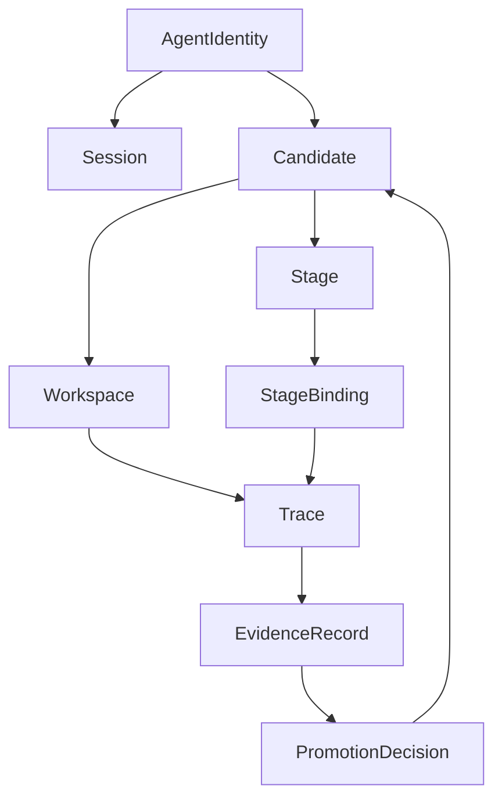

# Core Primitives

This page defines the smallest autokairos-local object set that currently appears justified by the
source base.

It does not try to mirror every upstream noun. It tries to answer a narrower question:

**which objects must autokairos itself treat as first-class if it wants to preserve durable truth,
bounded execution, staged progression, and external governance?**

This page follows:

- [00-first-principles-architecture-thesis.md](00-first-principles-architecture-thesis.md)
- [foundation/01-naming-and-vocabulary.md](../foundation/01-naming-and-vocabulary.md)
- [../sources/synthesis/agent-runtime-and-harness-principles.md](../../sources/synthesis/agent-runtime-and-harness-principles.md)
- [../sources/synthesis/evaluation-governance-and-promotion.md](../../sources/synthesis/evaluation-governance-and-promotion.md)

## Thesis

autokairos should keep a small set of first-class primitives and refuse to promote convenience
objects into durable truth.

## Why This Spec Exists

This spec exists to answer one question:

**what are the smallest autokairos-owned objects that the architecture must treat as canonical?**

## Primitive Selection Rules

An object belongs in the primitive set only if at least one of these is true.

1. It carries durable truth the system cannot lose.
2. It marks a boundary the system cannot safely blur.
3. It is required to explain staged progression.
4. It survives a specific runtime or harness choice.

That rule matters because the source set contains many nouns:

- `session`, `harness`, `sandbox`, `manifest`
- `plugin`, `skill`, `hook`, `MCP`
- `trace`, `grader`, `eval run`
- `task`, `goal`, `budget`, `approval`, `rollback`

autokairos should not promote all of them into local architecture primitives.

## Primitive Families

The current primitive set is best read in four families.

### Acting and continuity

- `AgentIdentity`
- `Session`

### Progression and execution

- `Candidate`
- `Stage`
- `StageBinding`
- `Workspace`

### Raw run record

- `Trace`

### Judgment and governance

- `EvidenceRecord`
- `PromotionDecision`

That grouping is more important than the exact order of the list.

## Primitive Matrix

| Primitive | Family | Durable? | What it answers |
| --- | --- | --- | --- |
| `AgentIdentity` | acting and continuity | yes | who is acting? |
| `Session` | acting and continuity | yes | what continuity surface carries work across runs? |
| `Candidate` | progression and execution | yes | what promotable line of work is being judged? |
| `Stage` | progression and execution | yes | under what legitimacy level is the candidate operating? |
| `StageBinding` | progression and execution | recomputable but must be explicit | what does this stage mean operationally right now? |
| `Workspace` | progression and execution | no | what bounded execution surface does the runtime see? |
| `Trace` | raw run record | yes | what happened during one execution attempt? |
| `EvidenceRecord` | judgment and governance | yes | what counted from evaluation? |
| `PromotionDecision` | judgment and governance | yes | what governance action changed candidate standing? |

## 1. AgentIdentity

`AgentIdentity` is the durable acting identity in the autokairos model.

It exists because the design does not currently justify splitting the actor into separate
`research` and `execution` identities by default.

### It answers

- who is acting across runs and stages?

### It is not

- a runtime session
- a workspace
- a candidate
- a model name

### Naming note

`AgentIdentity` is an autokairos-local abstraction, not an upstream standard term. It should be
kept distinct from the live runtime loop.

## 2. Session

`Session` is the continuity surface across runs.

It exists because the source layer repeatedly separates durable continuity from the current
workspace or current process.

### It answers

- what lets work continue coherently after interruption, resume, or runtime replacement?

### It should hold or reference

- continuity of interaction over time
- links to traces and execution attempts
- links to the currently relevant candidate-stage line of work

### It is not

- the promotable object
- the workspace
- the final source of success judgment

## 3. Candidate

`Candidate` is the promotable line of work.

This is the object that persists across `backtesting`, `paper`, and `live`.

### It answers

- what is being judged, advanced, paused, rejected, or demoted?

### It should hold or reference

- lineage or origin
- current stage standing
- links to traces
- links to evidence
- links to promotion decisions

### It is not

- a session
- a task-local runtime attempt
- a workspace

## 4. Stage

`Stage` is the governance-level progression state.

Initial stages remain:

- `backtesting`
- `paper`
- `live`

### It answers

- what level of legitimacy and risk is currently in effect for this candidate?

### It changes

- permitted side effects
- evaluator expectations
- review expectations
- operational risk posture

### It is not

- a runtime configuration blob
- a prompt label

## 5. StageBinding

`StageBinding` is the concrete operational meaning attached to a stage for one run.

### It answers

- what do the current stage's permissions, connectors, evaluator surfaces, and execution semantics
  actually resolve to?

### It may include

- connector semantics
- permission posture
- evaluator posture
- stage-specific instruction surfaces
- execution-mode selection

### It is not

- the same thing as `Stage`

`Stage` is governance meaning.

`StageBinding` is execution meaning.

### Naming note

`StageBinding` is also an autokairos-local abstraction. It is justified, but it must be treated as
local vocabulary rather than assumed-standard vocabulary.

## 6. Workspace

`Workspace` is the bounded execution surface presented to the runtime.

### It answers

- what local surface does the runtime see and manipulate during one execution attempt?

### It may contain

- files
- instructions
- task-local artifacts
- output directories
- mounted stage-local data

### It is

- isolated
- disposable
- execution-scoped

### It is not

- durable truth
- evidence
- promotion history
- continuity by itself

## 7. Trace

`Trace` is the raw external record of one execution attempt.

### It answers

- what happened during the run?

### It should capture

- runtime status changes
- model outputs
- tool and connector activity
- interruptions and failures
- stage and workspace references where relevant

### It is not

- judged evidence
- a promotion act

## 8. EvidenceRecord

`EvidenceRecord` is the judged artifact derived from traces and evaluators.

### It answers

- what counted from evaluation?

### It may include

- backtest metrics
- paper-trading outcomes
- live results
- grader outputs
- risk or policy findings

### It is not

- the raw trace
- the final governance action

## 9. PromotionDecision

`PromotionDecision` is the explicit governance action that changes candidate standing.

### It answers

- what changed because of the evidence?

### It should capture

- candidate reference
- stage relationship
- evidence basis
- outcome
- rationale
- responsible governing surface

### It is not

- an approval prompt
- an evidence record
- a runtime event

## Primitive Relationships

## What Is Not Primitive Yet

The following are important, but not yet core local primitives:

- `plugin`
- `skill`
- `hook`
- `MCP server`
- `manifest`
- `budget`
- `approval policy`
- `connector`
- `UI projection`

These may become extension surfaces, bindings, policy objects, or subsystem concerns later, but
the current source base does not force them into the smallest core object model.

## What This Spec Is Not

This spec is not:

- a database schema
- a transport or API definition
- a full subsystem narrative
- a list of every runtime-local object that may ever exist

## Summary

The primitive set should stay small.

autokairos currently needs primitives for:

- actor continuity
- promotable work
- execution meaning
- raw run history
- judged evidence
- explicit progression decisions

Anything beyond that should face a higher burden of proof.

## Failure Modes / Invariants

The key invariants are:

- primitives must represent durable truth or durable architectural seams
- a workspace must not be promoted into truth merely because it is convenient
- runtime-local helper objects must not silently become canonical records

Failure begins when:

- tasks, prompts, or containers are treated as promotable units
- stage semantics are inferred without `StageBinding`
- trace, evidence, and decision collapse into one generic run record

## Relationship To Adjacent Specs

This primitive set is constrained by:

- [00-first-principles-architecture-thesis.md](00-first-principles-architecture-thesis.md)
- [04-boundaries.md](04-boundaries.md)

It is elaborated by:

- [03-staged-evaluation.md](03-staged-evaluation.md)
- [05-agent-execution-architecture.md](05-agent-execution-architecture.md)
- [08-candidate-contract.md](08-candidate-contract.md)
- [09-trace-contract.md](09-trace-contract.md)
- [10-evidence-record-contract.md](10-evidence-record-contract.md)
- [11-promotion-decision-contract.md](11-promotion-decision-contract.md)
