# Staged Evaluation

This page defines the minimum stage semantics needed by the current MLP-01 baseline.

It follows directly from:

- [02-core-primitives.md](02-core-primitives.md)
- [04-boundaries.md](04-boundaries.md)
- [../02-pr2-candidate-becomes-externally-evaluated-design.md](../02-pr2-candidate-becomes-externally-evaluated-design.md)

## Thesis

Stages are legitimacy boundaries.

They do not exist to add taxonomy.

They exist so autokairos can keep:

- search cheap
- evidence legitimacy explicit
- live risk gated rather than implied

## Why This Spec Exists

This spec exists to answer one implementation question:

**under what stage conditions may raw activity become counted evidence, and when may one live gate
open?**

## Current Active Applicability

This spec is currently active mainly for PR2.

It provides the stage meaning that lets the system say:

- which raw runs belong to which legitimacy context
- whether an `EvidenceRecord` can count or not count
- whether one candidate is merely accumulating activity or is actually becoming eligible for one
  serious live review

PR3 and PR4 still depend on these stage boundaries, but they should not redefine them.

## Current Stage Ladder

The active stage ladder remains:

1. `backtesting`
2. `paper`
3. `live`

## Stage Meaning

Every stage must answer these questions:

1. what kind of execution is happening here?
2. what kind of side effects are allowed here?
3. what kind of evidence may count here?
4. what kind of progression act may happen next?

That means a stage is not just a label on a candidate.

It is the legitimacy context that keeps evidence, promotion, and live risk from collapsing into one
blurred path.

## Stage Definitions

### `backtesting`

`backtesting` is the cheap rejection stage.

Its main job is to eliminate weak paths cheaply and produce early judged evidence without implying
that the candidate is ready for live review.

Minimum meaning:

- historical or replay-driven execution
- no real external trading side effects
- may produce counted or non-counted evidence
- may strengthen or weaken the candidate
- does not by itself justify live deployment

### `paper`

`paper` is the live-like validation stage.

Its main job is to test whether the candidate behaves acceptably under more realistic conditions
without opening real financial risk.

Minimum meaning:

- simulated or non-risk-bearing live-like execution
- stronger legitimacy than `backtesting`
- may produce counted or non-counted evidence
- may support one serious live-gate review when the judged basis is strong enough
- does not itself start live execution

### `live`

`live` is the real-risk stage.

Its main job is not broad search.

Its main job is controlled real execution after explicit promotion.

Minimum meaning:

- real external trading side effects
- explicit live limits and stronger governance
- real live outcome evidence can be produced here
- live posture remains subject to later wake, pause, stop, and override

## Progression Rules

The current progression rules are:

- traces alone do not change stage standing
- counted evidence may change candidate progression meaning
- non-counted evidence must remain visible but non-authoritative
- live-gate meaning opens only through explicit review and `PromotionDecision`
- live execution starts only after the live-gate act, not during evaluation

## Current Boundary Rules

- stage is not the same thing as execution mode details
- stage does not equal candidate status meaning
- stage does not equal live permission
- `paper` success must not be read as implicit `live` approval
- `live` must remain downstream of explicit gate meaning

## Not In The Active Baseline

The current active baseline does not need:

- deeper future stage taxonomies
- multi-venue stage variants
- speculative rollout ladders beyond `backtesting -> paper -> live`

If later work needs those, it should justify them explicitly rather than expanding this spec by
default.
- no promotion because a hands environment or pod output "looks good"

A stage transition must point to:

- the candidate
- the source stage
- the destination stage
- the evidence basis
- the responsible governing surface
- the rationale

## The Possible Outcomes Of A Stage

A stage should not only support `pass/fail`.

The useful outcome set is:

- `promote`
- `stay`
- `pause`
- `demote`
- `reject`

### Promote

Advance to the next stage because external evidence justifies it.

### Stay

Remain in the current stage because evidence is incomplete or not yet strong enough.

### Pause

Stop active progression without deleting lineage. Use when review, investigation, or cooldown is
needed.

### Demote

Move a candidate downward because later-stage evidence shows that the previous level of trust was
too high.

### Reject

Terminate the candidate line because the evidence shows it should not continue.

This broader outcome model matters because stage progression is governance, not just routing.

## The Promotion Rule

Promotion should always be harder than generation.

That is the architectural rule that ties the whole system together.

Practically, this means:

- many candidates may be created
- fewer should survive backtesting
- fewer still should survive paper
- live should open only under the strongest evidence and governance

## Stage Bindings

`StageBinding` is what makes staging concrete.

For each stage, binding should specify at least:

- execution implementation
- evaluator implementation
- approval model
- side-effect policy
- evidence sink

Without stage bindings, staging becomes a naming exercise rather than a control mechanism.

## Typed Binding Profiles

`StageBinding` must be implemented through typed profiles, not one vague field bag.

### `BacktestBindingProfile`

Minimum fields:

- historical or replay data source
- deterministic clock
- simulator reference
- evaluator reference
- side-effect policy: no real trading side effects
- credential policy: no live credentials

### `PaperBindingProfile`

Minimum fields:

- live, delayed, or replay-like market data source
- simulated order gateway
- paper risk envelope
- evidence sink
- side-effect policy: no real exchange execution
- credential policy: no real exchange execution credentials

### `LiveBindingProfile`

Minimum fields:

- live market data source
- real gateway reference
- risk envelope reference
- credential binding reference outside packages
- wake policy reference
- side-effect policy: real trading side effects only through gateway

`LiveBindingProfile` cannot be constructed without:

- upstream `PromotionDecision`
- downstream `GovernedExecutionRequest`
- explicit live limit / risk envelope reference

## Evidence By Stage

Different stages produce different evidence shapes.

```mermaid
flowchart LR
    A["TraderSystemCandidate"] --> B["Backtest StageBinding"]
    B --> C["Backtest trace"]
    C --> D["Backtest evidence"]
    D --> E["Promotion decision"]
    E --> F["Paper StageBinding"]
    F --> G["Paper trace"]
    G --> H["Paper evidence"]
    H --> I["Promotion decision"]
    I --> J["Live StageBinding"]
    J --> K["Live trace"]
    K --> L["Live evidence"]
    L --> M["Continue / Pause / Demote / Reject"]
```

The point of this flow is that the pod does not directly promote itself. Evidence and
promotion sit outside the active execution environment.

## Candidate Lineage Over Hands-Environment Lineage

What advances through stages is the `TraderSystemCandidate`, not the hands environment itself.

This is an important distinction.

- hands environments are disposable
- brain sessions may resume
- traces accumulate
- evidence accumulates
- promotion decisions accumulate

But the thing that actually progresses is the candidate lineage.

This keeps stage progression from collapsing into "keep using the same mutable environment forever."

## Human Role In The Stage Ladder

The human role shifts upward rather than disappearing.

Humans should primarily define:

- what counts as evidence at each stage
- what thresholds or review rules apply
- what requires approval
- what requires pause or rollback
- what kinds of failure invalidate a candidate

The human is not the permanent source of every trading idea. The human is the owner of the stage
system and its legitimacy rules.

## What This Spec Is Not

This spec is not:

- the exact evidence schema
- the exact promotion-decision schema
- the runtime-bridge interface
- a complete policy engine

## What This Page Intentionally Does Not Define Yet

This page does not yet define:

- the exact evidence schema
- the exact promotion-decision schema
- the exact runtime adapter surface
- the exact connector contracts

Those should be derived from the stage model, not guessed before it.

## Failure Modes / Invariants

The important invariants are:

- a stage is a contract, not a label
- stage progression operates on trader-system candidates, not hands environments
- promotion must remain explicit and external
- the same agent-facing interface may persist while underlying semantics change

The design is failing if:

- `host-local` convenience is treated as equivalent to stage-valid evidence
- a pod promotes itself
- stage differences are encoded only in prompts
- role splits replace legitimacy boundaries without source justification

## Design Consequence

The next design question is no longer "should autokairos have stages?"

The next design question is:

**what exact contracts connect `Stage`, `StageBinding`, `Trace`, `EvidenceRecord`, and
`PromotionDecision` without letting the hands environment or pod become the source of truth?**

## Relationship To Adjacent Specs

This spec depends on:

- [02-core-primitives.md](02-core-primitives.md)
- [04-boundaries.md](04-boundaries.md)

It is made concrete by:

- [05-agent-execution-architecture.md](05-agent-execution-architecture.md)
- [06-containerized-execution.md](06-containerized-execution.md)
- [08-candidate-contract.md](08-candidate-contract.md)
- [10-evidence-record-contract.md](10-evidence-record-contract.md)
- [11-promotion-decision-contract.md](11-promotion-decision-contract.md)
