# Staged Evaluation

This page defines how autokairos should think about stage progression.

The point of staging is not just to have nicer labels than `dev` and `prod`. The point is to make
search cheap, risk legible, and advancement explicit.

This page follows directly from:

- [00-first-principles-architecture-thesis.md](00-first-principles-architecture-thesis.md)
- [02-core-primitives.md](02-core-primitives.md)
- [../sources/synthesis/evaluation-governance-and-promotion.md](../../sources/synthesis/evaluation-governance-and-promotion.md)

## Thesis

Stages are legitimacy boundaries that change execution semantics, evidence expectations, and
promotion posture without requiring a new agent identity.

## Why This Spec Exists

This spec exists to answer one question:

**how should autokairos structure progression so search stays cheap while risk and legitimacy open
gradually?**

## Why Staging Exists

The source layer pushes toward one consistent conclusion:

- search should be cheap
- trustworthy evaluation should be harder
- real-world side effects should open gradually

Anthropic's AAR and W2S material show that once search scales, evaluation becomes the bottleneck.
The automated-w2s-research repo shows that execution mode changes legitimacy, not just convenience.
Paperclip reinforces that advancement should be governed explicitly, not inferred from the active
agent loop.

For autokairos, staging is the mechanism that turns those lessons into system structure.

## The Three Initial Stages

The initial staged ladder remains:

1. `backtesting`
2. `paper`
3. `live`

These are not merely UI labels. They are different legitimacy levels with different bindings,
evidence standards, and risk surfaces.

## Stage Model

Each stage should define five things:

1. `execution semantics`
2. `allowed side effects`
3. `evidence expectations`
4. `promotion requirements`
5. `failure consequences`

That means a stage is not just a string attached to a candidate. It is a contract that changes how
the same candidate is allowed to run and how the results are judged.

## What Stays Stable Across Stages

The agent should not need to become a different architectural species at every stage.

What should stay relatively stable:

- the `AgentIdentity`
- the `Candidate`
- the high-level task shape
- the agent-facing capability surface where possible
- the external promotion model

This is the key reason for using stages instead of hard-coded role splits.

## What Changes Across Stages

What should change across stages:

- the `StageBinding`
- the legitimacy of the execution environment
- the allowed side effects
- the evaluator strictness
- the evidence threshold for advancement
- the human approval burden

This lets the same high-level action mean different things in different stages.

Example:

- `place_order` in `backtesting` means a historical simulation action
- `place_order` in `paper` means a non-risk-bearing simulated live-market action
- `place_order` in `live` means a real external side effect

The interface can stay stable while the meaning underneath changes materially.

## Stage As A Legitimacy Boundary

The `automated-w2s-research` implementation is useful here because it makes a crucial distinction:
some execution modes are convenient, but not legitimate enough to count as promotable evidence.

autokairos should adopt the same principle.

A stage is partly a legitimacy boundary.

It should answer:

- does this run count as promotable evidence?
- what kind of evidence does it produce?
- what risks are still excluded?
- what evaluator is authoritative here?

That matters because not every successful run should count equally.

## The Stage Definitions

### 1. Backtesting

`backtesting` is the cheap rejection stage.

Its main job is not to prove a candidate is good. Its main job is to kill weak candidates cheaply.

#### Purpose

- fast search
- wide candidate branching
- cheap negative selection
- early evaluator feedback

#### Execution semantics

- historical or replay-based environment
- no real side effects
- relaxed runtime cost relative to later stages

#### Expected evidence

- strategy metrics
- robustness checks
- trace-derived failure patterns
- policy or risk violations detected in simulation

#### Promotion posture

- passing backtesting should not be read as "this is live-worthy"
- it only means "this candidate deserves more expensive scrutiny"

### 2. Paper

`paper` is the behavior-validation stage.

Its main job is to test whether the candidate behaves acceptably under live-ish conditions without
opening real financial risk.

#### Purpose

- validate that the candidate survives contact with a live-like environment
- check runtime behavior and decision quality under current market conditions
- expose failures that historical replay may miss

#### Execution semantics

- mock or simulated execution against real or near-real market conditions
- no final real-money side effect
- stronger legitimacy than backtesting, but still not final

#### Expected evidence

- paper-trading outcomes
- live-ish timing and behavior traces
- connector/runtime stability signals
- approval and policy interaction traces

#### Promotion posture

- passing paper means "eligible for real-risk review"
- it should not auto-open live execution

### 3. Live

`live` is the risk-bearing stage.

Its purpose is not broad exploration. Its purpose is controlled real-world execution under the
strictest governance.

#### Purpose

- execute in the real environment
- gather real outcome evidence
- continue under explicit oversight and reversible controls

#### Execution semantics

- real external side effects
- strongest approval and safety requirements
- most expensive failure mode

#### Expected evidence

- real execution outcomes
- risk incidents and near-misses
- audited traces of action and response
- promotion, pause, or rollback decisions over time

#### Promotion posture

`live` is not the end of evaluation. It is the stage where the system is judged under the highest
stakes, and therefore where pause, demotion, or rollback remain necessary.

## Stage Progression Rules

A candidate should move between stages only through explicit `PromotionDecision` records.

That means:

- no implicit promotion based on current state alone
- no promotion based on agent self-report
- no promotion because a workspace "looks good"

A stage transition must point to:

- the candidate
- the source stage
- the destination stage
- the evidence basis
- the responsible governing surface
- the rationale

## The Possible Outcomes Of A Stage

A stage should not only support `pass/fail`.

The useful outcome set is:

- `promote`
- `stay`
- `pause`
- `demote`
- `reject`

### Promote

Advance to the next stage because external evidence justifies it.

### Stay

Remain in the current stage because evidence is incomplete or not yet strong enough.

### Pause

Stop active progression without deleting lineage. Use when review, investigation, or cooldown is
needed.

### Demote

Move a candidate downward because later-stage evidence shows that the previous level of trust was
too high.

### Reject

Terminate the candidate line because the evidence shows it should not continue.

This broader outcome model matters because stage progression is governance, not just routing.

## The Promotion Rule

Promotion should always be harder than generation.

That is the architectural rule that ties the whole system together.

Practically, this means:

- many candidates may be created
- fewer should survive backtesting
- fewer still should survive paper
- live should open only under the strongest evidence and governance

## Stage Bindings

`StageBinding` is what makes staging concrete.

For each stage, binding should specify at least:

- execution implementation
- evaluator implementation
- approval model
- side-effect policy
- evidence sink

Without stage bindings, staging becomes a naming exercise rather than a control mechanism.

## Evidence By Stage

Different stages produce different evidence shapes.

```mermaid
flowchart LR
    A["Candidate"] --> B["Backtesting workspace"]
    B --> C["Backtest trace"]
    C --> D["Backtest evidence"]
    D --> E["Promotion decision"]
    E --> F["Paper workspace"]
    F --> G["Paper trace"]
    G --> H["Paper evidence"]
    H --> I["Promotion decision"]
    I --> J["Live workspace"]
    J --> K["Live trace"]
    K --> L["Live evidence"]
    L --> M["Continue / Pause / Demote / Reject"]
```

The point of this flow is that the workspace does not directly promote itself. Evidence and
promotion sit outside the active execution environment.

## Candidate Lineage Over Workspace Lineage

What advances through stages is the `Candidate`, not the workspace itself.

This is an important distinction.

- workspaces are disposable
- sessions may resume
- traces accumulate
- evidence accumulates
- promotion decisions accumulate

But the thing that actually progresses is the candidate lineage.

This keeps stage progression from collapsing into "keep using the same mutable environment forever."

## Human Role In The Stage Ladder

The human role shifts upward rather than disappearing.

Humans should primarily define:

- what counts as evidence at each stage
- what thresholds or review rules apply
- what requires approval
- what requires pause or rollback
- what kinds of failure invalidate a candidate

The human is not the permanent source of every trading idea. The human is the owner of the stage
system and its legitimacy rules.

## What This Spec Is Not

This spec is not:

- the exact evidence schema
- the exact promotion-decision schema
- the runtime-bridge interface
- a complete policy engine

## What This Page Intentionally Does Not Define Yet

This page does not yet define:

- the exact evidence schema
- the exact promotion-decision schema
- the exact runtime adapter surface
- the exact connector contracts

Those should be derived from the stage model, not guessed before it.

## Failure Modes / Invariants

The important invariants are:

- a stage is a contract, not a label
- stage progression operates on candidates, not workspaces
- promotion must remain explicit and external
- the same agent-facing interface may persist while underlying semantics change

The design is failing if:

- `host-local` convenience is treated as equivalent to stage-valid evidence
- a workspace promotes itself
- stage differences are encoded only in prompts
- role splits replace legitimacy boundaries without source justification

## Design Consequence

The next design question is no longer "should autokairos have stages?"

The next design question is:

**what exact contracts connect `Stage`, `StageBinding`, `Trace`, `EvidenceRecord`, and
`PromotionDecision` without letting the workspace become the source of truth?**

## Relationship To Adjacent Specs

This spec depends on:

- [02-core-primitives.md](02-core-primitives.md)
- [04-boundaries.md](04-boundaries.md)

It is made concrete by:

- [05-agent-execution-architecture.md](05-agent-execution-architecture.md)
- [06-containerized-execution.md](06-containerized-execution.md)
- [08-candidate-contract.md](08-candidate-contract.md)
- [10-evidence-record-contract.md](10-evidence-record-contract.md)
- [11-promotion-decision-contract.md](11-promotion-decision-contract.md)
