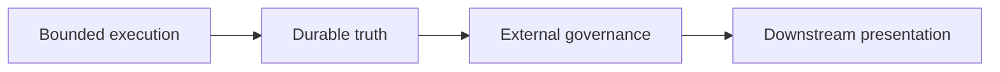

# Boundaries

This page defines the separations autokairos must preserve.

The biggest architectural risk at this stage is not missing one more abstraction. It is allowing
unlike things to collapse into the same layer.

This page follows:

- [../../product/mlp-01/prds/01-hypothesis-to-candidate.md](../../product/mlp-01/prds/01-hypothesis-to-candidate.md)
- [../01-pr1-path-becomes-real-design.md](../01-pr1-path-becomes-real-design.md)
- [02-core-primitives.md](02-core-primitives.md)
- [03-staged-evaluation.md](03-staged-evaluation.md)

## Thesis

autokairos must preserve four high-level separations:

1. execution is not truth
2. truth is not governance
3. governance is not presentation
4. runtime-local control is not progression control

Every more specific boundary in this document is a consequence of those four.

## Why This Spec Exists

This spec exists to answer one question:

**what separations must autokairos preserve so that execution, truth, governance, and
presentation do not collapse into one fuzzy layer?**

## The Four System Zones

This flow is directional.

- execution produces run history
- durable truth preserves what matters
- governance judges and changes standing
- presentation reads downstream

The arrows must not silently reverse.

## Boundary Families

The detailed boundaries are easiest to read in four families.

### Identity and continuity boundaries

- `AgentIdentity` vs `Candidate`
- `Session` vs `Workspace`

### Execution and truth boundaries

- `Workspace` vs durable truth
- `Stage` vs `StageBinding`
- `Trace` vs `EvidenceRecord`

### Governance boundaries

- `EvidenceRecord` vs `PromotionDecision`
- runtime-local approval vs promotion governance
- runtime vs control plane
- native runtime vs external runtime bridge

### Product-shape boundaries

- convenience mode vs promotable mode
- system core vs presentation

## PR1 Boundary Focus

For the current implementation pass, four PR1 boundaries matter most.

### 1. Surfaced path vs durable candidate

- a surfaced path belongs to the runtime-side origination flow
- a durable candidate begins only when the control plane materializes it
- path appearance alone must not be treated as system-owned truth

The agent system surfaces the path.

The control plane makes it real.

### 2. Runtime or session output vs durable candidate truth

- chat output is not durable candidate truth
- session memory is not durable candidate truth
- workspace notes are not durable candidate truth
- transient runtime artifacts are not durable candidate truth

If the runtime can disappear and the path meaning disappears with it, PR1 has failed.

### 3. Provenance capture vs later evaluation

- provenance explains why the path appeared and where it came from
- provenance is required in PR1
- provenance does not count as judged evidence
- provenance must not silently imply legitimacy

PR1 preserves origin.

PRD 2 decides what counts.

### 4. Candidate existence vs legitimacy, promotion, and live meaning

- candidate materialization proves:
  this path is now real
- candidate materialization does not prove:
  this path counted,
  this path is stronger,
  this path is promotable,
  this path is approved,
  this path is live

This is the most important anti-blur rule for the first implementation slice.

## What This Spec Is Not

This spec is not:

- the full object model
- the runtime-bridge interface
- a UI composition guide
- an operator runbook

## 1. AgentIdentity vs Candidate

These must not collapse into one object.

### `AgentIdentity`

The durable acting identity.

### `Candidate`

The promotable line of work.

### Why the split matters

The system must be able to say:

- this agent worked on this candidate
- this candidate advanced, stalled, or failed

without implying they are the same thing.

## 2. Session vs Workspace

These must not collapse into one object.

### `Session`

The continuity surface across runs.

### `Workspace`

The bounded execution surface for one active attempt.

### Why the split matters

If `Session == Workspace`, then:

- restart looks like identity loss
- discarding a workspace destroys continuity
- the current directory becomes the implicit source of truth

The source layer argues strongly against all three.

## 3. Workspace vs Durable Truth

This is the single most important boundary.

The workspace may contain:

- instructions
- temporary artifacts
- generated files
- task-local notes
- runtime outputs

But the workspace must not become the final authority on:

- whether a path became a durable candidate
- whether a run counts
- whether evidence is legitimate
- whether a candidate is promotable
- whether governance requirements were satisfied

### Durable truth must live outside the workspace

At minimum, durable truth belongs in:

- `Session`
- `Candidate`
- `Trace`
- `EvidenceRecord`
- `PromotionDecision`

That is the only way to survive workspace loss without truth loss.

## 4. Stage vs StageBinding

These are related, but not identical.

### `Stage`

Governance meaning:

- what legitimacy level is in effect?

### `StageBinding`

Execution meaning:

- what permissions, connectors, evaluators, and side-effect rules are actually in force?

### Why the split matters

If `Stage` collapses into `StageBinding`, progression becomes a pile of environment configs.

If `StageBinding` disappears, stage becomes a label with no operational force.

The system needs both.

## 5. Trace vs EvidenceRecord

These must not collapse into one object.

### `Trace`

What happened during execution.

### `EvidenceRecord`

What counted from evaluation.

### Why the split matters

If raw traces become judged evidence automatically:

- every log line becomes promotable fact
- external evaluation disappears into runtime exhaust
- the system loses the distinction between history and judgment

PR1 stops before this boundary becomes active.

That is exactly why candidate materialization must stay separate from evaluation meaning.

## 6. EvidenceRecord vs PromotionDecision

These must not collapse into one object.

### `EvidenceRecord`

What the system knows from evaluation.

### `PromotionDecision`

What the system decides because of that evidence.

### Why the split matters

Evidence may accumulate without immediate advancement.

Advancement must never occur without evidence.

That asymmetry is the point.

## 7. Runtime-Local Approval vs Promotion Governance

This distinction must stay explicit.

### Runtime-local approval

Examples:

- tool permission prompts
- shell approvals
- local side-effect gates

These belong inside execution.

### Promotion governance

Examples:

- promote candidate to `paper`
- pause candidate for review
- reject or demote candidate

These belong after execution.

### Why the split matters

If local approval and promotion collapse together, the system will confuse "allowed to act now"
with "deserves to advance."

Those are not the same question.

## 8. Runtime vs Control Plane

This is the largest product-level boundary.

### Runtime side

- live loop
- workspace execution
- tool and connector invocation
- runtime-local controls

### Control-plane side

- candidate standing
- session continuity records
- trace ownership
- evidence ownership
- review work
- promotion decisions
- audit and policy records

### Why the split matters

If runtime and control plane collapse:

- truth drifts into runtime state
- governance drifts into runtime config
- product boundaries become unclear

## 9. Native Runtime vs External Runtime Bridge

The system must also distinguish:

- a runtime autokairos owns directly
- a runtime autokairos governs through a bridge

This is how autokairos can supervise work without claiming to own every upstream harness loop.

## 10. Convenience Mode vs Promotable Mode

Not every successful run should count equally.

Examples of convenience surfaces:

- raw host-local execution
- ad hoc debugging modes
- local scratch notes

Examples of promotable surfaces:

- serious staged execution
- stage-valid trace
- explicit evidence records

This boundary is what prevents convenience from silently becoming governance truth.

## 11. System Core vs Presentation

Presentation is downstream.

It may display:

- candidate state
- traces
- evidence
- review queues
- decision history

But it must not become the canonical place where:

- stage logic lives
- promotion is implicitly encoded
- truth is stored

The system must remain coherent even if there is no UI at all.

## Boundary Matrix

| Boundary | Left side | Right side | Why the split matters |
| --- | --- | --- | --- |
| identity | `AgentIdentity` | `Candidate` | actor is not the promotable object |
| continuity | `Session` | `Workspace` | continuity must survive disposable execution |
| truth | `Workspace` | durable records | execution is not final truth |
| stage meaning | `Stage` | `StageBinding` | progression meaning differs from runtime semantics |
| evaluation | `Trace` | `EvidenceRecord` | raw history is not judged evidence |
| governance | `EvidenceRecord` | `PromotionDecision` | knowledge is not yet decision |
| approval | runtime-local approval | promotion governance | permission is not advancement |
| product | runtime | control plane | execution and governance must not collapse |
| integration | native runtime | external bridge | governance can outlive one runtime implementation |
| legitimacy | convenience mode | promotable mode | not every run should count equally |
| presentation | system core | UI/projection | truth must not depend on presentation |

## Failure Modes / Invariants

### Workspace-as-truth failure

- promotion inferred from files in the current workspace
- auditability becomes weak
- restart looks like amnesia

### Runtime-as-control-plane failure

- governance hidden in runtime config
- evaluator and review ownership become unclear

### Stage-as-label failure

- `backtesting`, `paper`, and `live` differ only in wording
- risk increases without stronger governance

### Approval-as-promotion failure

- runtime-local permissions get mistaken for advancement
- candidate standing drifts implicitly

### UI-as-core failure

- truth hides in dashboards or operator flows
- headless operation becomes incoherent

## Summary

The architecture should not be judged only by what objects it names.

It should be judged by what it refuses to collapse.

autokairos is viable only if:

- execution remains bounded
- truth remains externalized
- governance remains explicit
- presentation remains downstream

## Relationship To Adjacent Specs

This spec depends on:

- [00-first-principles-architecture-thesis.md](00-first-principles-architecture-thesis.md)
- [02-core-primitives.md](02-core-primitives.md)

It constrains:

- [03-staged-evaluation.md](03-staged-evaluation.md)
- [05-agent-execution-architecture.md](05-agent-execution-architecture.md)
- [07-runtime-bridge-interface.md](07-runtime-bridge-interface.md)
- [08-candidate-contract.md](08-candidate-contract.md)
- [09-trace-contract.md](09-trace-contract.md)
- [10-evidence-record-contract.md](10-evidence-record-contract.md)
- [11-promotion-decision-contract.md](11-promotion-decision-contract.md)
