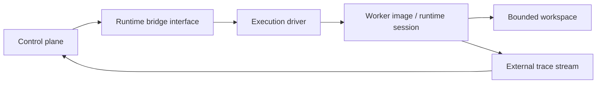

# Runtime Bridge Interface

This page defines the interface autokairos needs between its control plane and whatever runtime
actually executes the agent loop.

It follows:

- [05-agent-execution-architecture.md](05-agent-execution-architecture.md)
- [06-containerized-execution.md](06-containerized-execution.md)
- [03-staged-evaluation.md](03-staged-evaluation.md)
- [04-boundaries.md](04-boundaries.md)
- [../sources/library/repo-multica.md](../../sources/library/repo-multica.md)
- [../sources/library/repo-openclaw.md](../../sources/library/repo-openclaw.md)
- [../sources/library/openai-next-evolution-of-the-agents-sdk.md](../../sources/library/openai-next-evolution-of-the-agents-sdk.md)
- [../sources/library/anthropic-managed-agents.md](../../sources/library/anthropic-managed-agents.md)
- [../sources/library/repo-safety-research-automated-w2s-research.md](../../sources/library/repo-safety-research-automated-w2s-research.md)

It is also informed by additional official Docker documentation:

- [Docker Compose](https://docs.docker.com/compose/)
- [How Compose works](https://docs.docker.com/compose/intro/compose-application-model/)
- [Running containers](https://docs.docker.com/engine/containers/run/)
- [Bind mounts](https://docs.docker.com/engine/storage/bind-mounts/)

## Thesis

autokairos should define one explicit runtime-bridge interface that:

- takes governed execution state from the control plane
- turns it into a live runtime session
- keeps run visibility outside the runtime
- does not become the source of candidate truth or promotion authority

This interface is where autokairos becomes executable without collapsing into one provider's CLI,
one container instance, or one orchestration tool.

## Why This Spec Exists

The source set points to the same boundary from several angles:

- Anthropic separates `session`, `harness`, and `sandbox`
- OpenAI separates `harness` from `compute`
- OpenClaw separates Gateway-owned session/control state from ACP-backed runtime sessions
- Multica separates daemon/runtime-bridge behavior from higher-level task and runtime records
- W2S separates the worker container from the server-side evaluator and findings surfaces

Taken together, these sources imply that autokairos cannot let the runtime process itself become:

- the candidate registry
- the session authority
- the trace sink
- the evaluator
- the promotion engine

So it needs an interface layer that is powerful enough to start real runs, but narrow enough to
keep truth and governance elsewhere.

## What The Runtime Bridge Is

The runtime bridge is the per-run execution contract between:

- the autokairos control plane
- the selected execution environment
- the chosen harness/runtime implementation

It is the layer that:

- chooses the execution driver
- materializes the workspace
- launches or wakes the runtime
- streams trace outward
- reports liveness and completion back to the control plane

## What This Spec Is Not

The runtime bridge is not:

- a candidate registry
- a promotion engine
- a source of durable evidence
- a full control plane
- a dashboard
- a Docker Compose file

This last point matters enough to state explicitly.

## Compose Is Optional, Not Core

Official Docker docs describe Compose as a tool for defining and running **multi-container
applications** and their application model. That makes it useful for local support stacks, not as
the fundamental per-run runtime contract.

For autokairos, `docker compose` can be useful for local development when you want to start things
such as:

- an evaluator API
- a local database
- an artifact store
- a dashboard or observability stack

But Compose should not be the primary abstraction the runtime bridge speaks.

The runtime bridge should speak in terms of:

- execution driver
- worker image
- mount policy
- session attach/resume
- trace streaming
- liveness
- teardown

If Compose is present, it should remain a convenience layer around supporting services, not the
authoritative execution protocol.

## Interface Boundary

The runtime bridge should sit between the control plane and the execution environment.

The bridge interface is not the same as the driver.

- the **interface** is the stable autokairos contract
- the **driver** is the implementation path behind that contract

## Required Inputs

The runtime bridge should accept a governed execution request with at least these fields.

### Identity and continuity

- `agent_identity_ref`
- `candidate_ref`
- `session_ref`

### Stage and semantics

- `stage`
- `stage_binding`

### Workspace shaping

- `workspace_spec`
- `mount_policy`
- `instruction_surfaces`

### Execution environment

- `execution_mode`
  - `host-local`
  - `containerized-local`
  - `containerized-remote`
- `worker_image_ref` when container-backed
- runtime/provider selection data

### Governance-linked parameters

- timeout / max duration
- interrupt policy
- trace destination
- approval hooks if required by the stage

## Required Outputs

The runtime bridge should produce external records and a narrow operational handle.

### Operational output

- `execution_handle`
  an interface-local handle for an active execution attempt

This is not a core primitive. It is a bridge-local reference used to:

- query liveness
- interrupt
- stop
- attach to an active run

### Externalized outputs

- trace events
- runtime status transitions
- heartbeat/liveness signals
- completion or failure result
- artifact references if outputs were produced

These outputs should flow outward while the runtime is still active, not only after it exits.

## Required Operations

The runtime bridge interface should support the following operations.

### 1. `probeDriver`

Ask whether the selected driver is available and healthy.

Examples:

- local container driver reachable
- remote container backend reachable
- native CLI present
- external bridge endpoint reachable

### 2. `prepareWorkspace`

Materialize the bounded workspace before runtime activation.

This includes:

- filesystem layout
- bind mounts or staged copies
- instruction surfaces
- stage-specific connectors/tools
- output locations

### 3. `startExecution`

Start a new execution attempt under the selected driver.

This should:

- select the runtime path
- create or start the worker host
- attach the runtime session to the prepared workspace
- begin streaming trace outward immediately

### 4. `attachOrResume`

Reattach to an active or resumable runtime session when continuity exists.

This should be anchored in:

- `Session`
- control-plane execution state
- externally visible trace/progress

It must not rely solely on one prior container still being alive.

### 5. `streamTrace`

Emit execution events to the external trace sink in a normalized way.

At minimum this should cover:

- model output
- tool/connector calls
- failures
- interruptions
- status transitions

### 6. `heartbeat`

Report bridge-side liveness for active execution.

Multica is especially useful here: daemon heartbeats and task progress are outside the harness and
therefore visible to the platform.

autokairos should do the same.

### 7. `interruptExecution`

Interrupt an active run without losing external visibility into what was happening.

Interrupt should be distinct from destroy.

### 8. `stopExecution`

End the active execution attempt cleanly when possible.

### 9. `teardownWorkspaceHost`

Stop and clean up the workspace host when the run is complete, failed, or abandoned.

This is where disposable-workspace discipline is enforced.

## Driver Modes

The interface should allow multiple drivers behind one contract.

## 1. Host-local driver

Use for:

- harness debugging
- runtime development
- non-legitimate convenience runs

This driver should be supported, but clearly marked as weak legitimacy.

## 2. Containerized-local driver

Use for:

- default serious local execution
- most `backtesting`
- most `paper`

This should likely be the default driver for stage-valid local runs.

## 3. Containerized-remote driver

Use for:

- scalable remote workers
- expensive or parallel runs
- stronger infrastructure separation

This is the natural extension of the same bridge contract outward.

## Failure Modes / Invariants

Regardless of the driver, the bridge should preserve these invariants.

### 1. Candidate truth stays outside

The bridge can execute work for a candidate. It does not own candidate lineage.

### 2. Session continuity stays outside the current workspace host

The bridge may attach to or help resume a session, but it does not define session truth by itself.

### 3. Trace is external while the run is alive

The run should not need to finish before the system can see what it is doing.

### 4. Evidence is derived later

The bridge emits trace and execution state. It does not issue final evidence or promotion
judgments.

### 5. Stage semantics are injected, not inferred

The bridge should receive `StageBinding`; it should not guess risk level from prompt wording.

## Bind-Mount And Workspace Cautions

Official Docker docs matter here.

`docker run` bind mounts are read-write by default, and bind-mounting over an existing container
path obscures the pre-existing container contents at that path.

That means autokairos should not treat mount configuration as an incidental implementation detail.
The runtime bridge must define mount policy explicitly:

- what is mounted read-only
- what is writable
- what paths must not be obscured
- what should be copied into the workspace instead of mounted directly

This is one more reason the bridge interface must own `mount_policy` explicitly.

## Compose Guidance

If a local development stack needs:

- evaluator API
- local DB
- object store
- dashboard
- metrics/log aggregation

then `docker compose` is reasonable.

But Compose should remain outside the runtime-bridge contract itself.

Put differently:

- `docker compose` may orchestrate supporting services
- the runtime bridge should still talk about one execution attempt at a time

autokairos should not let per-run legitimacy depend on the details of a Compose file merge graph.

## Design Consequence

After this document, the most natural next contract pages are:

1. `candidate contract`
2. `trace contract`
3. `evidence contract`
4. `promotion decision contract`
5. concrete driver contract for container-backed execution

Those should all be written assuming this runtime-bridge interface exists.

## Relationship To Adjacent Specs

This spec depends on:

- [05-agent-execution-architecture.md](05-agent-execution-architecture.md)
- [06-containerized-execution.md](06-containerized-execution.md)
- [04-boundaries.md](04-boundaries.md)

It is adjacent to:

- [08-candidate-contract.md](08-candidate-contract.md)
- [09-trace-contract.md](09-trace-contract.md)
