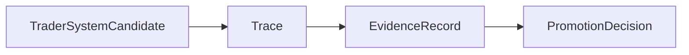
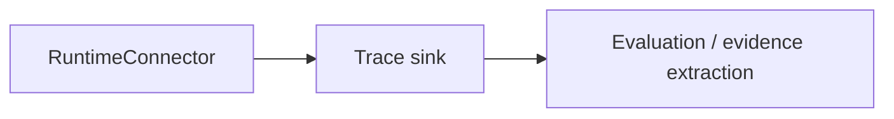

# Trace Contract

This page defines what a `Trace` is in autokairos.

It follows:

- [02-core-primitives.md](02-core-primitives.md)
- [07-runtime-connector-contract.md](07-runtime-connector-contract.md)
- [08-candidate-contract.md](08-candidate-contract.md)
- [17-evaluation-comparability-and-sealing-contract.md](17-evaluation-comparability-and-sealing-contract.md)
- [../../sources/library/anthropic-managed-agents.md](../../sources/library/anthropic-managed-agents.md)
- [../sources/library/openai-next-evolution-of-the-agents-sdk.md](../../sources/library/openai-next-evolution-of-the-agents-sdk.md)
- [../sources/library/repo-multica.md](../../sources/library/repo-multica.md)
- [../sources/library/repo-safety-research-automated-w2s-research.md](../../sources/library/repo-safety-research-automated-w2s-research.md)
- [../sources/synthesis/evaluation-governance-and-promotion.md](../../sources/synthesis/evaluation-governance-and-promotion.md)

It is also strengthened by current official OpenAI evaluation docs:

- [Evaluate agent workflows](https://developers.openai.com/api/docs/guides/agent-evals)
- [Trace grading](https://developers.openai.com/api/docs/guides/trace-grading)

## Thesis

`Trace` is the external raw record of one execution attempt.

It is not the final judgment.

It is the thing that preserves what happened during execution so that:

- a run can be inspected
- a run can be compared
- evidence can later be derived
- regressions can be diagnosed
- promotion is never forced to trust self-report

OpenAI's official evaluation docs are explicit here: a trace is the end-to-end record of model
calls, tool calls, guardrails, and handoffs for one run. autokairos should keep that same raw
record posture, even though its domain is trading rather than general agent workflows.

## Why This Spec Exists

The source set supports `Trace` for three different reasons.

### 1. OpenAI evaluation posture

OpenAI explicitly says to start with traces when debugging behavior and defines trace grading as
the process of assigning structured scores or labels to an agent's trace.

That only works if trace is preserved as a raw, inspectable record.

### 2. W2S external-log posture

Anthropic's W2S work and the automated-w2s-research implementation both keep critical logs outside
the sandbox. That means the worker cannot fully rewrite the record that later judges it.

### 3. Runtime-connector observation posture

Multica is useful because task progress, task messages, and daemon heartbeats are external event
surfaces rather than implicit CLI output only. autokairos should adopt the same instinct.

## What This Spec Is Not

`Trace` is not:

- a `TraderSystemCandidate`
- a `BrainSession`
- a `HandsEnvironment`
- a `TraderSystemRuntime`
- an `EvidenceRecord`
- a `PromotionDecision`
- a metrics summary
- a single chat transcript

Most importantly:

**Trace is not the same thing as evidence.**

Trace is raw record. Evidence is judged record.

## Trace Definition

A `Trace` should be understood as:

> the external, end-to-end, append-oriented record of one execution attempt, including model
> activity, tool/connector activity, runtime status transitions, and other events needed to
> reconstruct what happened.

The phrase `one execution attempt` matters.

One `TraderSystemCandidate` may accumulate many traces over time.

One trace should correspond to one attempt to execute work under a particular `StageBinding` and
runtime boundary.

## Trace In The System



And operationally:



The important separation is:

- the runtime connector emits trace
- trace exists outside the active runtime
- evaluation acts on trace later or alongside it

## Trace Contract

The trace contract should carry at least these categories of information.

## 1. Identity

The trace needs stable identity.

### Required fields

- `trace_id`
- `created_at`
- `sealed_at` or equivalent finalization time
- `status`

### Suggested status values

- `open`
- `sealed`
- `failed`
- `abandoned`

This is trace lifecycle, not candidate lifecycle.

## 2. Work Context

The trace must say what it is about.

### Required fields

- `candidate_ref`
- `trader_system_spec_ref`
- `capability_package_refs`
- `runtime_ref`
- `runtime_placement_ref`
- `brain_session_ref`
- `hands_environment_ref`
- `agent_session_refs`
- `stage`
- `stage_binding_ref`
- `runtime_operating_policy_ref`
- provider/model/version attribution for every provider-backed run when applicable
- prompt and output contract refs
- capability package versions
- data window or market-context refs when the run is evaluation-relevant
- memory refs, lifecycle refs, and control-decision refs that influenced the run

### Why

Without these references, a trace becomes hard to interpret later.

The system should always be able to answer:

- which trader-system candidate was being worked on?
- which trader-system spec and packages were active?
- under which stage and binding?
- which brain session and hands environment produced the events?
- which provider/model/version and output contract produced the raw events?
- which memory, lifecycle, and control context may have influenced behavior?

## 3. Execution Context

The trace must say how the run was executed.

### Required fields

- `execution_mode`
  - `host-local`
  - `containerized-local`
  - `containerized-remote`
- runtime/provider selection metadata
- provider kind, invocation surface, provider version, model, and model access basis when applicable
- provider readiness record ref when provider-backed execution is relevant
- prompt contract ref and output contract ref
- optional `trader_system_spec_ref`
- optional `hands_environment_ref`
- optional `tool_proxy_ref`
- optional runtime-connector execution handle reference

### Why

The W2S repo makes legitimacy depend partly on execution mode. Therefore the trace must preserve
that environment context.

## 4. Comparable Evaluation Metadata

When a trace may later feed evaluation, it must preserve enough metadata to support
`EvaluationRunRecord` and `EvaluationComparisonSet`.

### Required fields when evaluation-relevant

- `candidate_version_ref`
- `trader_system_spec_ref`
- `trader_system_program_ref`
- capability package ids and versions
- `stage_binding_ref`
- legitimacy mode
- data window, replay window, live-like window, or market-context ref
- provider kind, model, version, invocation surface, and readiness record ref when applicable
- evaluator-visible memory refs with memory id, version, trust class, and quarantine status
- attention request refs that shaped the run
- tool proxy and gateway refs when their results affected the run

### Why

The evaluator should never have to infer whether two runs are comparable from prose. Trace must
preserve the attribution needed to explain why a result counted, did not count, or was quarantined.

## 5. Hands Environment Context

The trace should include enough hands-environment context to make the run interpretable without
making the hands environment the source of truth.

### Required fields

- `hands_environment_ref`
- relevant instruction-surface refs when available
- output location refs when relevant

### Why

You often need to know which hands environment, tool proxy, and instruction surfaces were in play
when diagnosing behavior.

## 6. Event Stream

The trace must preserve a sequenced event stream.

This is the heart of the contract.

### Required fields

- ordered `events`
- per-event sequence index or monotonic ordering key
- per-event timestamp
- per-event type
- per-event source
- per-event causal parent or correlation ref when available
- per-event payload or payload ref
- per-event artifact refs when emitted

### Candidate event types

- `status`
- `text_output`
- `thinking`
- `tool_call`
- `tool_result`
- `connector_call`
- `connector_result`
- `approval_request`
- `approval_response`
- `interrupt`
- `error`
- `artifact_emitted`
- `runtime_placement_bound`
- `agent_session_attached`
- `agent_run_started`
- `agent_event`
- `program_event`
- `tool_request`
- `tool_result`
- `attention_construction`
- `attention_admission`
- `attention_outcome`
- `attention_quality_review`
- `next_attention_plan`
- `next_attention_validation`
- `memory_read_ref`
- `memory_write_proposal`
- `memory_revision`
- `memory_quarantine`
- `memory_rollback`
- `evaluation_run_recorded`
- `evaluation_comparison_set_recorded`
- `evidence_sealing_decision`
- `order_intent`
- `gateway_decision`
- `checkpoint`
- `runtime_stopped`

The exact taxonomy can evolve, but the contract must support structured event typing rather than a
single undifferentiated log blob.

This follows OpenAI's trace vocabulary, Claude Managed Agents' event-stream/session-log posture, and
Multica's external task-message distinctions.

## 7. Status Transitions

The trace should preserve high-level run state transitions.

### Required fields

- `queued_at` or equivalent if available
- `started_at`
- `last_event_at`
- `completed_at` or `failed_at`

### Why

The system should be able to reconstruct:

- when execution actually started
- whether it stalled
- how long it ran
- whether it ended cleanly

## 8. Error And Interruption Context

The trace should preserve failures and interruptions as first-class events.

### Required fields

- interrupt markers when the run was interrupted
- failure markers when the run failed
- optional reason / error payload

### Why

A candidate can survive a failed run, but only if the run record still explains what happened.

## Trace Event Shape

At the contract level, each event should have a stable skeleton.

### Required event fields

- `seq`
- `at`
- `type`
- `source`
- `payload`

### About `source`

`source` should distinguish where the event came from.

Example values:

- `runtime`
- `runtime_connector`
- `tool`
- `connector`
- `governance`

This matters because not all events originate inside the model loop.

## Minimum Session Trace Envelope

For active autokairos work, a trace event must be specific enough to reconstruct the product-visible
session after physical runtime loss.

Minimum event envelope:

```text
TraceEvent
  event_id
  trace_id
  seq
  occurred_at
  source = control_plane | runtime_connector | provider | hands_environment |
           trader_system_program | tool_proxy | gateway | evaluator | operator
  event_kind
  actor_ref
  runtime_ref
  runtime_placement_ref?
  agent_session_ref?
  agent_run_ref?
  hands_environment_ref?
  memory_surface_ref?
  memory_surface_version?
  causality_ref?
  payload_ref
  artifact_refs
  redaction_policy
```

The minimum active event set is:

- `runtime_launch_requested`
- `runtime_placement_bound`
- `agent_session_attached`
- `agent_run_started`
- `agent_event`
- `program_event`
- `tool_request`
- `tool_result`
- `attention_construction`
- `attention_admission`
- `attention_outcome`
- `attention_quality_review`
- `next_attention_plan`
- `next_attention_validation`
- `memory_read_ref`
- `memory_write_proposal`
- `memory_revision`
- `memory_quarantine`
- `memory_rollback`
- `evaluation_run_recorded`
- `evaluation_comparison_set_recorded`
- `evidence_sealing_decision`
- `order_intent`
- `gateway_decision`
- `checkpoint`
- `operator_wake_request`
- `operator_action`
- `error`
- `runtime_stopped`

The trace must make these questions answerable:

- what logical runtime was running?
- where was it physically running?
- which provider/session and hands environment were attached?
- which runtime-control command or lifecycle transition caused placement or state change?
- what pre-control context was available?
- was the control command accepted, rejected, deferred, modified, or applied?
- what did the runtime observe?
- what did it emit?
- what was allowed, rejected, clipped, paused, stopped, or overridden?
- which artifacts are needed to resume, evaluate, or debug?

## Runtime Control Trace

Trace must explain runtime lifecycle and control without turning autokairos into an internal
strategy workflow engine.

Minimum runtime-control trace records:

- `runtime_control_requested`: command, actor, reason, runtime ref, and target state
- `runtime_control_decision`: accepted, rejected, modified, deferred, applied, failed, or review
  required
- `runtime_lifecycle_event`: registered, deployed, starting, running, paused, resumed, stopping,
  stopped, failed, killed, superseded, or review_required
- `runtime_placement_event`: placement attached, created, replaced, failed, or ended
- `runtime_control_outcome`: resulting trace, placement, artifact, audit, or failure refs

Runtime-control records are not `EvidenceRecord`. They can become inputs to evaluation or audit, but
only the evaluation path can seal evidence.

## Runtime Memory Influence

Trace must explain how `RuntimeMemorySurface` influenced runtime behavior.

When memory is included in runtime context, the trace must preserve enough information to recover:

- memory surface id
- memory version
- trust class
- access mode
- scope
- source refs
- quarantine status at read time

Runtime-originated memory changes are not direct mutations. They are `memory_write_proposal` events
until accepted as `memory_revision` or rejected through `memory_quarantine`.

Rollback is a `memory_rollback` event that changes the accepted memory pointer. It never deletes
prior trace events or rejected memory revisions.

## Recoverability Contract

Trace is not only for audit after the fact. It is the minimum recoverable session log.

Recovery from a failed process, container, provider session, or connector must start from durable
records:

```text
Trace
+ RuntimePlacement
+ control-plane candidate/spec/package/binding records
+ exported artifacts / checkpoints
```

It must not start from private runtime memory as the only source of truth.

Minimum checkpoint fields:

- `checkpoint_id`
- `trace_id`
- `seq`
- `runtime_ref`
- `runtime_placement_ref`
- `agent_session_refs`
- `hands_environment_ref`
- `exported_artifact_refs`
- `program_state_snapshot_refs` when intentionally exported
- `last_processed_input_ref`
- `next_attention_plan_ref` when one exists
- `created_at`

Recovery outcomes:

- `reattached`: provider/session and hands environment are still resumable
- `recreated`: a new runtime placement is created from durable records
- `stopped_for_review`: trace is sufficient to inspect, but safe continuation requires operator
  review
- `abandoned`: trace is incomplete or policy forbids continuation

This mirrors the Managed Agents lesson: session/event truth must sit outside the harness and the
sandbox so that a new harness or hands environment can resume from the event log.

## Trace vs Session

These must stay separate.

### BrainSession

- provider or harness reasoning continuity
- may have its own interaction history
- may span multiple execution attempts

### Trace

- one execution attempt
- raw external run record

One `BrainSession` may be linked to many traces.

One trace should point to brain-session context for continuity, but it should not become the
brain-session context itself.

## Trace vs TraderSystemCandidate

These also must stay separate.

### TraderSystemCandidate

- judged line of work
- durable across stages and attempts

### Trace

- raw record of one attempt

One `TraderSystemCandidate` may have:

- many traces
- many sealed traces
- conflicting traces over time

That is not a problem. It is expected.

## Trace vs EvidenceRecord

This is the most important semantic separation.

### Trace

- what happened
- raw
- append-oriented
- may contain noise
- may contain failure and ambiguity

### EvidenceRecord

- what counted
- normalized
- judged
- structured for promotion and review

OpenAI's docs help here: traces come first, then graders and eval runs. The same posture should
apply in autokairos.

## Trace Lifecycle

Trace lifecycle should remain simple and external.

### Open

The execution attempt is live and events are still arriving.

### Sealed

The attempt has completed and the trace has been finalized for downstream use.

### Failed

The attempt terminated in failure and the trace has been sealed as a failed run.

### Abandoned

The attempt stopped in a way that prevents a clean finish, but the trace remains as a durable raw
record.

## Failure Modes / Invariants

If the contract is correct, the following should remain true.

### 1. A trace survives the hands environment

Destroying or replacing the hands environment must not erase the trace.

### 2. A trace is candidate-addressable

The system can gather all traces associated with one `TraderSystemCandidate`.

### 3. A trace is externally readable while the run is alive

The system does not have to wait for container exit to know what is happening.

### 4. A trace is not self-judging

The trace may contain raw success claims, but those claims do not become evidence automatically.

### 5. A trace preserves execution legitimacy context

The trace says whether the run was `host-local`, `containerized-local`, or
`containerized-remote`, so later review can judge how much trust it deserves.

## Design Consequence

After this page, the most natural next contract pages are:

1. `EvidenceRecord contract`
2. `PromotionDecision contract`

Those documents should be written assuming that `Trace` is the raw external record from which
judged evidence is later derived.

## Relationship To Adjacent Specs

This spec depends on:

- [07-runtime-connector-contract.md](07-runtime-connector-contract.md)
- [08-candidate-contract.md](08-candidate-contract.md)

It feeds directly into:

- [10-evidence-record-contract.md](10-evidence-record-contract.md)
