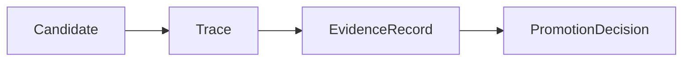
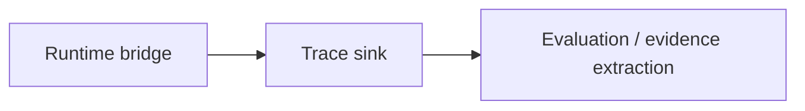

# Trace Contract

This page defines what a `Trace` is in autokairos.

It follows:

- [02-core-primitives.md](02-core-primitives.md)
- [05-agent-execution-architecture.md](05-agent-execution-architecture.md)
- [07-runtime-bridge-interface.md](07-runtime-bridge-interface.md)
- [08-candidate-contract.md](08-candidate-contract.md)
- [../sources/library/openai-next-evolution-of-the-agents-sdk.md](../../sources/library/openai-next-evolution-of-the-agents-sdk.md)
- [../sources/library/repo-multica.md](../../sources/library/repo-multica.md)
- [../sources/library/repo-safety-research-automated-w2s-research.md](../../sources/library/repo-safety-research-automated-w2s-research.md)
- [../sources/synthesis/evaluation-governance-and-promotion.md](../../sources/synthesis/evaluation-governance-and-promotion.md)

It is also strengthened by current official OpenAI evaluation docs:

- [Evaluate agent workflows](https://developers.openai.com/api/docs/guides/agent-evals)
- [Trace grading](https://developers.openai.com/api/docs/guides/trace-grading)

## Thesis

`Trace` is the external raw record of one execution attempt.

It is not the final judgment.

It is the thing that preserves what happened during execution so that:

- a run can be inspected
- a run can be compared
- evidence can later be derived
- regressions can be diagnosed
- promotion is never forced to trust self-report

OpenAI's official evaluation docs are explicit here: a trace is the end-to-end record of model
calls, tool calls, guardrails, and handoffs for one run. autokairos should keep that same raw
record posture, even though its domain is trading rather than general agent workflows.

## Why This Spec Exists

The source set supports `Trace` for three different reasons.

### 1. OpenAI evaluation posture

OpenAI explicitly says to start with traces when debugging behavior and defines trace grading as
the process of assigning structured scores or labels to an agent's trace.

That only works if trace is preserved as a raw, inspectable record.

### 2. W2S external-log posture

Anthropic's W2S work and the automated-w2s-research implementation both keep critical logs outside
the sandbox. That means the worker cannot fully rewrite the record that later judges it.

### 3. Runtime-bridge supervision posture

Multica is useful because task progress, task messages, and daemon heartbeats are external event
surfaces rather than implicit CLI output only. autokairos should adopt the same instinct.

## What This Spec Is Not

`Trace` is not:

- a `Candidate`
- a `Session`
- a `Workspace`
- an `EvidenceRecord`
- a `PromotionDecision`
- a metrics summary
- a single chat transcript

Most importantly:

**Trace is not the same thing as evidence.**

Trace is raw record. Evidence is judged record.

## Trace Definition

A `Trace` should be understood as:

> the external, end-to-end, append-oriented record of one execution attempt, including model
> activity, tool/connector activity, runtime status transitions, and other events needed to
> reconstruct what happened.

The phrase `one execution attempt` matters.

One candidate may accumulate many traces over time.

One trace should correspond to one attempt to execute work under a particular stage and runtime
binding.

## Trace In The System

And operationally:

The important separation is:

- the runtime bridge emits trace
- trace exists outside the active runtime
- evaluation acts on trace later or alongside it

## Trace Contract

The trace contract should carry at least these categories of information.

## 1. Identity

The trace needs stable identity.

### Required fields

- `trace_id`
- `created_at`
- `sealed_at` or equivalent finalization time
- `status`

### Suggested status values

- `open`
- `sealed`
- `failed`
- `abandoned`

This is trace lifecycle, not candidate lifecycle.

## 2. Work Context

The trace must say what it is about.

### Required fields

- `candidate_ref`
- `agent_identity_ref`
- `session_ref`
- `stage`
- optional `stage_binding_ref`

### Why

Without these references, a trace becomes hard to interpret later.

The system should always be able to answer:

- which candidate was being worked on?
- by which acting identity?
- under which stage?
- with what continuity surface?

## 3. Execution Context

The trace must say how the run was executed.

### Required fields

- `execution_mode`
  - `host-local`
  - `containerized-local`
  - `containerized-remote`
- runtime/provider selection metadata
- optional `worker_image_ref`
- optional runtime-bridge execution handle reference

### Why

The W2S repo makes legitimacy depend partly on execution mode. Therefore the trace must preserve
that environment context.

## 4. Workspace Context

The trace should include enough workspace context to make the run interpretable without making the
workspace the source of truth.

### Required fields

- `workspace_ref`
- relevant instruction-surface refs when available
- output location refs when relevant

### Why

You often need to know which workspace host and which instruction surfaces were in play when
diagnosing behavior.

## 5. Event Stream

The trace must preserve a sequenced event stream.

This is the heart of the contract.

### Required fields

- ordered `events`
- per-event sequence index or monotonic ordering key
- per-event timestamp
- per-event type

### Candidate event types

- `status`
- `text_output`
- `thinking`
- `tool_call`
- `tool_result`
- `connector_call`
- `connector_result`
- `approval_request`
- `approval_response`
- `interrupt`
- `error`
- `artifact_emitted`

The exact taxonomy can evolve, but the contract must support structured event typing rather than a
single undifferentiated log blob.

This follows both OpenAI's trace vocabulary and Multica's external task-message distinctions.

## 6. Status Transitions

The trace should preserve high-level run state transitions.

### Required fields

- `queued_at` or equivalent if available
- `started_at`
- `last_event_at`
- `completed_at` or `failed_at`

### Why

The system should be able to reconstruct:

- when execution actually started
- whether it stalled
- how long it ran
- whether it ended cleanly

## 7. Error And Interruption Context

The trace should preserve failures and interruptions as first-class events.

### Required fields

- interrupt markers when the run was interrupted
- failure markers when the run failed
- optional reason / error payload

### Why

A candidate can survive a failed run, but only if the run record still explains what happened.

## Trace Event Shape

At the contract level, each event should have a stable skeleton.

### Required event fields

- `seq`
- `at`
- `type`
- `source`
- `payload`

### About `source`

`source` should distinguish where the event came from.

Example values:

- `runtime`
- `bridge`
- `tool`
- `connector`
- `governance`

This matters because not all events originate inside the model loop.

## Trace vs Session

These must stay separate.

### Session

- continuity surface
- long-lived interaction history
- may span multiple execution attempts

### Trace

- one execution attempt
- raw external run record

One session may be linked to many traces.

One trace should point to one session context for continuity, but it should not become the session
itself.

## Trace vs Candidate

These also must stay separate.

### Candidate

- judged line of work
- durable across stages and attempts

### Trace

- raw record of one attempt

One candidate may have:

- many traces
- many sealed traces
- conflicting traces over time

That is not a problem. It is expected.

## Trace vs EvidenceRecord

This is the most important semantic separation.

### Trace

- what happened
- raw
- append-oriented
- may contain noise
- may contain failure and ambiguity

### EvidenceRecord

- what counted
- normalized
- judged
- structured for promotion and review

OpenAI's docs help here: traces come first, then graders and eval runs. The same posture should
apply in autokairos.

## Trace Lifecycle

Trace lifecycle should remain simple and external.

### Open

The execution attempt is live and events are still arriving.

### Sealed

The attempt has completed and the trace has been finalized for downstream use.

### Failed

The attempt terminated in failure and the trace has been sealed as a failed run.

### Abandoned

The attempt stopped in a way that prevents a clean finish, but the trace remains as a durable raw
record.

## Failure Modes / Invariants

If the contract is correct, the following should remain true.

### 1. A trace survives the workspace

Destroying or replacing the workspace must not erase the trace.

### 2. A trace is candidate-addressable

The system can gather all traces associated with one candidate.

### 3. A trace is externally readable while the run is alive

The system does not have to wait for container exit to know what is happening.

### 4. A trace is not self-judging

The trace may contain raw success claims, but those claims do not become evidence automatically.

### 5. A trace preserves execution legitimacy context

The trace says whether the run was `host-local`, `containerized-local`, or
`containerized-remote`, so later review can judge how much trust it deserves.

## Design Consequence

After this page, the most natural next contract pages are:

1. `EvidenceRecord contract`
2. `PromotionDecision contract`

Those documents should be written assuming that `Trace` is the raw external record from which
judged evidence is later derived.

## Relationship To Adjacent Specs

This spec depends on:

- [05-agent-execution-architecture.md](05-agent-execution-architecture.md)
- [07-runtime-bridge-interface.md](07-runtime-bridge-interface.md)
- [08-candidate-contract.md](08-candidate-contract.md)

It feeds directly into:

- [10-evidence-record-contract.md](10-evidence-record-contract.md)
