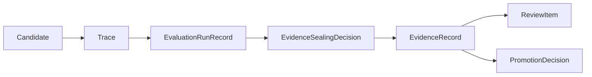

# Evidence Record Contract

This page defines the minimum `EvidenceRecord` contract needed by the current MLP-01 baseline.

It follows:

- [03-staged-evaluation.md](03-staged-evaluation.md)
- [04-boundaries.md](04-boundaries.md)
- [08-candidate-contract.md](08-candidate-contract.md)
- [09-trace-contract.md](09-trace-contract.md)
- [17-evaluation-comparability-and-sealing-contract.md](17-evaluation-comparability-and-sealing-contract.md)
- [../02-pr2-candidate-becomes-externally-evaluated-design.md](../02-pr2-candidate-becomes-externally-evaluated-design.md)

## Thesis

`EvidenceRecord` is the sealed judged artifact between raw `Trace` history and live-gate meaning.

It is where autokairos says:

- what was judged
- which evaluation run and comparison basis were used
- under which stage
- by which method
- whether it counted or did not count
- why that disposition was correct

Without this object, PR2 collapses into raw logs plus private human interpretation.

## Current Active Applicability

This spec is currently active for PR2.

Its job is not to model every future evidence family.

Its job is to make counted versus non-counted evidence durable, explainable, and safe to cite in a
later `ReviewItem` or `PromotionDecision`.

## What This Is Not

`EvidenceRecord` is not:

- a `Trace`
- a `TraderSystemCandidate`
- a `ReviewItem`
- a `PromotionDecision`
- a generic operator note

Most importantly:

- `Trace` is raw history
- `EvidenceRecord` is judged history
- `EvidenceRecord` is still not the live gate

## Canonical Role In The System

The separation must remain explicit:

- execution emits trace
- evaluation records what it inspected
- sealing decides what counted
- evidence stores the sealed judged artifact
- governance cites evidence

## Minimum Contract

An `EvidenceRecord` must carry at least:

| Field | Meaning |
| --- | --- |
| `evidence_id` | Stable durable identity |
| `candidate_ref` | Candidate being judged |
| `stage` | Stage context for the judgment |
| `input_trace_refs` | Raw runs or traces being judged |
| `evaluation_run_refs` | Evaluation runs that inspected the traces |
| `comparison_set_ref` | Comparison set used to decide comparability, when applicable |
| `evidence_sealing_decision_ref` | Sealing decision that created the evidence |
| `method_ref` | Evaluator, rubric, or methodology used |
| `evidence_disposition` | `counted`, `non_counted`, or `quarantined_for_review` |
| `disposition_reason` | Why it counted or did not count |
| `finding_summary` | Durable explanation of what was found |
| `candidate_effect_hint` | `strengthens`, `weakens`, or `inconclusive` |
| `leakage_or_gaming_flags` | Reward-hacking, leakage, or anti-tamper flags considered during sealing |
| `created_at` | When the judged record was first created |
| `sealed_at` | When the judged record became citeable |
| `status` | `draft`, `sealed`, `superseded`, or `invalidated` |

## Evidence After Sealing

Raw evaluator output is not an `EvidenceRecord`.

An `EvidenceRecord` exists only after an `EvidenceSealingDecision` says whether the evaluation
output is `counted`, `non_counted`, or `quarantined_for_review`.

That sealing decision must preserve:

- evaluator method and version
- evaluation run refs
- comparison set ref when comparison was relevant
- disposition reason
- ambiguity or partial-run status
- leakage and gaming flags
- resulting evidence refs

This keeps OpenAI eval output, Google evaluation records, A2A artifacts, tool results, memory
summaries, and operator satisfaction as judgment inputs rather than evidence by themselves.

## Required Interpretation

### Counted evidence

Counted evidence is evidence the product allows to influence candidate progression meaning and
live-gate basis.

If evidence is counted, the record must make that legitimacy visible.

Counted evidence requires a sealing decision with no unresolved leakage, gaming,
non-comparability, or partial-evaluation blocker for the claim being made.

### Non-counted evidence

Non-counted evidence is still durable and visible, but it must not silently influence candidate
standing.

Typical reasons include:

- wrong stage
- wrong method
- insufficient quality
- convenience-only run
- stale or otherwise non-legitimate basis
- non-comparable run
- partial evaluator output
- subjective satisfaction without objective performance basis
- possible evaluator-target or ground-truth leakage

### Quarantined evaluation output

Quarantined evaluation output is excluded from normal progression until review.

Typical reasons include:

- runtime access to hidden labels, benchmark answers, or scoring ground truth
- credential or live-authority leakage
- strong reward-hacking signal
- false provenance or suspected trace tampering

### Sealing boundary

Once sealed, the evidence record is the citeable judgment artifact for review and gate meaning.

The raw trace may still exist underneath, but promotion logic should cite the sealed evidence
record, not re-interpret the trace ad hoc.

## Boundary Rules

- one evidence record may reference one or more traces, but it must preserve a narrow claim boundary
- evidence disposition must be explicit, never inferred from later candidate status
- non-counted evidence must remain visible enough to explain exclusion
- counted evidence must still stop short of live execution authority

## Not In The Active Baseline

The current active baseline does not require:

- broad evidence leaderboards
- speculative future evidence taxonomies
- richer historical comparison objects beyond what PR2 needs

If later work needs more, it should add that deliberately rather than expanding this contract by
default.

## 5. Findings

The record must contain actual judgment outputs, not just metadata.

### Required fields

- structured findings summary
- scores or labels when applicable
- failure modes or flags when found
- short narrative interpretation

### Example findings

- tool or connector misuse
- policy violation
- unstable returns
- unacceptable drawdown
- promising but under-sampled behavior
- evidence of reward hacking
- insufficient legitimacy for promotion

### Why

Governance surfaces need something more interpretable than a raw trace and more stable than a
chat-side explanation.

## 6. Legitimacy Context

The record must preserve how much the result should count.

### Required fields

- `execution_mode`
  - `host-local`
  - `containerized-local`
  - `containerized-remote`
- optional legitimacy or trust tier
- optional anti-tamper notes

### Why

The W2S repo makes this explicit: not every run mode carries the same legitimacy. autokairos
should preserve that distinction inside evidence, not only in infrastructure notes.

## 7. Freshness And Validity

Trading evidence ages.

The contract should say when an evidence record is still valid enough to count.

### Required fields

- `as_of`
- optional `valid_until`
- optional freshness or staleness status

### Why

This is one place where the trading domain matters directly.

An excellent backtesting summary from a stale market regime should not look identical to a recent
paper-trading review. Evidence needs time context.

## 8. Governance Relevance

The record should indicate how it is expected to be consumed.

### Example fields

- `supports_promotion`
- `blocks_promotion`
- `requires_followup_review`
- `supersedes_evidence_refs`

### Why

Evidence is not the decision itself, but it should still be possible to tell whether the record:

- strengthens a promotion case
- weakens it
- blocks it
- replaces earlier evidence

## Evidence Lifecycle

The evidence lifecycle should remain simple.

### Suggested states

1. `draft`
2. `sealed`
3. `superseded`
4. `invalidated`

### Why

Evidence needs to be revisable by addition, not by mutation.

`draft` supports work in progress.

`sealed` means the record is stable enough for governance.

`superseded` and `invalidated` preserve auditability when newer results arrive or a flaw is found
in the methodology.

## Candidate Relationships

One candidate may accumulate many evidence records.

That is expected.

Examples:

- one trace grade about tool behavior
- one batch backtesting summary
- one human review of risk posture
- one paper-stage performance review

The system should not try to compress all of these into a single mega-record.

## Trace Relationship

One evidence record may be derived from:

- one trace
- many traces
- one eval run spanning many traces

But in all cases the relation should remain explicit.

Evidence should always be able to point backward to:

- what traces were judged
- what evaluation run inspected them
- what comparison set admitted or excluded them
- what sealing decision allowed the evidence to count or not count

## Evidence Versus Promotion

This boundary must stay clear.

An evidence record can say:

- this candidate looks promising
- this candidate violated a rule
- this candidate underperformed
- this candidate should not yet advance

But it should not itself move the candidate between stages.

That belongs to `PromotionDecision`.

## Failure Modes / Invariants

The key invariants are:

- evidence must remain a judged artifact above trace and below decision
- evidence must stay stage-scoped and legitimacy-scoped
- evidence must preserve its input basis and evaluation method

The design is failing if:

- raw trace is treated as already-judged evidence
- raw evaluator output is treated as already-sealed evidence
- evidence silently implies stage advancement
- evaluator output loses its legitimacy context or freshness assumptions
- non-comparable or quarantined output becomes counted evidence

## Design Implications

If autokairos adopts this contract, several downstream decisions become clearer.

- trace storage can stay raw and append-oriented
- evaluators can remain replaceable
- promotion can cite explicit evidence instead of runtime anecdotes
- stale or invalid evidence can be superseded without erasing history
- trading-specific freshness can be modeled without contaminating the trace layer

## Current Contract Intuition

The shortest safe intuition is:

> `Trace` answers **what happened**.
>
> `EvidenceRecord` answers **what counted and why**.
>
> `PromotionDecision` answers **what changed because of it**.

## Relationship To Adjacent Specs

This spec depends on:

- [09-trace-contract.md](09-trace-contract.md)
- [03-staged-evaluation.md](03-staged-evaluation.md)
- [17-evaluation-comparability-and-sealing-contract.md](17-evaluation-comparability-and-sealing-contract.md)

It feeds directly into:

- [11-promotion-decision-contract.md](11-promotion-decision-contract.md)
- [14-review-item-contract.md](14-review-item-contract.md)
