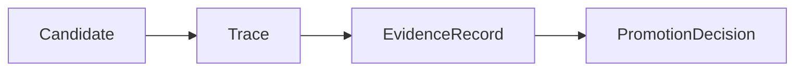
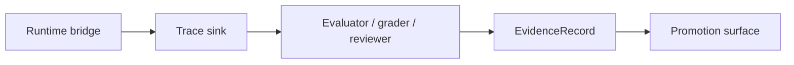

# Evidence Record Contract

This page defines what an `EvidenceRecord` is in autokairos.

It follows:

- [02-core-primitives.md](02-core-primitives.md)
- [03-staged-evaluation.md](03-staged-evaluation.md)
- [04-boundaries.md](04-boundaries.md)
- [08-candidate-contract.md](08-candidate-contract.md)
- [09-trace-contract.md](09-trace-contract.md)
- [../sources/library/anthropic-automated-alignment-researchers.md](../../sources/library/anthropic-automated-alignment-researchers.md)
- [../sources/library/anthropic-automated-w2s-researcher.md](../../sources/library/anthropic-automated-w2s-researcher.md)
- [../sources/library/repo-paperclip.md](../../sources/library/repo-paperclip.md)
- [../sources/library/repo-safety-research-automated-w2s-research.md](../../sources/library/repo-safety-research-automated-w2s-research.md)
- [../sources/synthesis/evaluation-governance-and-promotion.md](../../sources/synthesis/evaluation-governance-and-promotion.md)

It is also strengthened by current official OpenAI evaluation docs:

- [Evaluate agent workflows](https://developers.openai.com/api/docs/guides/agent-evals)
- [Trace grading](https://developers.openai.com/api/docs/guides/trace-grading)

## Thesis

`EvidenceRecord` is the sealed, judged artifact that sits between raw execution history and stage
advancement.

It is not the raw trace.

It is not the final promotion decision.

It is the object that says:

- which traces or runs were judged
- by what method
- under which stage and legitimacy conditions
- with what findings
- with what degree of freshness and trust

Without this object, autokairos collapses into one of two failures:

- trusting raw logs too directly
- letting promotion decisions float without a stable evidence basis

## Why This Spec Exists

The source set keeps forcing this object into existence.

### 1. OpenAI evaluation posture

OpenAI separates traces from graders and eval runs. A trace is the raw end-to-end record of one
run. Trace grading then assigns structured scores or labels to those traces, and eval runs extend
that judgment across repeatable datasets and comparisons.

That implies a layer above raw trace and below architecture change or rollout decisions.

### 2. Anthropic W2S posture

Anthropic's AAR and W2S work show that the hard part is not only search, but trustworthy
evaluation. Labels are removed from the worker sandbox, results come back from remote scoring, and
important logs stay outside the sandbox.

That means the thing that later counts toward progression cannot just be the worker's own account
of what happened.

### 3. Paperclip governance posture

Paperclip keeps approvals, budgets, audit, and rollback outside the active agent loop. That is a
strong product-level version of the same principle: advancement needs an explicit, reviewable
basis.

autokairos needs a local object that captures that basis.

That object is `EvidenceRecord`.

## What This Spec Is Not

`EvidenceRecord` is not:

- a `Candidate`
- a `Session`
- a `Workspace`
- a `Trace`
- a `PromotionDecision`
- a single metric
- a leaderboard row
- a free-form operator note

Most importantly:

**Trace is raw record. EvidenceRecord is judged record.**

And:

**EvidenceRecord is not yet promotion.**

It is what promotion should cite.

## Evidence Record Definition

An `EvidenceRecord` should be understood as:

> a sealed, stage-scoped, methodology-scoped judgment artifact that links one or more traces or
> evaluation runs to explicit findings, scores, flags, and interpretation metadata.

The phrases `stage-scoped` and `methodology-scoped` matter.

An evidence record should never pretend to be universal.

It should always be possible to answer:

- what was evaluated?
- under which stage?
- by what rubric or evaluator?
- using which raw inputs?
- with what freshness horizon?

## Evidence Record In The System

Operationally:

This separation must remain explicit.

- the runtime bridge emits trace
- evaluators or reviewers derive evidence
- governance consumes evidence

## Evidence Record Contract

The evidence-record contract should carry at least these categories of information.

## 1. Identity

The evidence record needs stable identity and sealing state.

### Required fields

- `evidence_id`
- `created_at`
- `sealed_at`
- `status`

### Suggested status values

- `draft`
- `sealed`
- `superseded`
- `invalidated`

### Why

Evidence should be append-oriented and reviewable. It should be possible to supersede or invalidate
old evidence without rewriting history.

## 2. Scope Of Judgment

The record must say exactly what it claims to be about.

### Required fields

- `candidate_ref`
- `stage`
- optional `stage_binding_ref`
- `evidence_kind`

### Candidate evidence kinds

- `trace_grade`
- `eval_run_summary`
- `human_review`
- `risk_review`
- `market_performance_summary`
- `regression_comparison`

### Why

An evidence record should always carry a narrow claim boundary.

It must not be ambiguous whether the record is:

- about backtesting or paper
- about correctness or risk
- about one trace or a batch of traces

## 3. Input Basis

The record must link to the raw inputs that were judged.

### Required fields

- one or more `trace_refs`
- optional eval-run or dataset references
- optional artifact refs used during judgment

### Why

Promotion should never rely on evidence that cannot be traced back to underlying records.

This is the main guard against narrative drift and unverifiable summaries.

## 4. Evaluation Method

The record must preserve how the judgment was made.

### Required fields

- `evaluator_kind`
- `method_ref` or rubric reference
- optional model / grader / reviewer identity
- optional dataset or benchmark reference

### Candidate evaluator kinds

- `llm_grader`
- `remote_eval_service`
- `human_review`
- `hybrid_review`
- `metric_aggregation`

### Why

OpenAI's eval posture is clear here: traces, graders, datasets, and eval runs are distinct
surfaces. autokairos should preserve that methodological distinction rather than flattening every
judgment into one opaque score.

## 5. Findings

The record must contain actual judgment outputs, not just metadata.

### Required fields

- structured findings summary
- scores or labels when applicable
- failure modes or flags when found
- short narrative interpretation

### Example findings

- tool or connector misuse
- policy violation
- unstable returns
- unacceptable drawdown
- promising but under-sampled behavior
- evidence of reward hacking
- insufficient legitimacy for promotion

### Why

Governance surfaces need something more interpretable than a raw trace and more stable than a
chat-side explanation.

## 6. Legitimacy Context

The record must preserve how much the result should count.

### Required fields

- `execution_mode`
  - `host-local`
  - `containerized-local`
  - `containerized-remote`
- optional legitimacy or trust tier
- optional anti-tamper notes

### Why

The W2S repo makes this explicit: not every run mode carries the same legitimacy. autokairos
should preserve that distinction inside evidence, not only in infrastructure notes.

## 7. Freshness And Validity

Trading evidence ages.

The contract should say when an evidence record is still valid enough to count.

### Required fields

- `as_of`
- optional `valid_until`
- optional freshness or staleness status

### Why

This is one place where the trading domain matters directly.

An excellent backtesting summary from a stale market regime should not look identical to a recent
paper-trading review. Evidence needs time context.

## 8. Governance Relevance

The record should indicate how it is expected to be consumed.

### Example fields

- `supports_promotion`
- `blocks_promotion`
- `requires_followup_review`
- `supersedes_evidence_refs`

### Why

Evidence is not the decision itself, but it should still be possible to tell whether the record:

- strengthens a promotion case
- weakens it
- blocks it
- replaces earlier evidence

## Evidence Lifecycle

The evidence lifecycle should remain simple.

### Suggested states

1. `draft`
2. `sealed`
3. `superseded`
4. `invalidated`

### Why

Evidence needs to be revisable by addition, not by mutation.

`draft` supports work in progress.

`sealed` means the record is stable enough for governance.

`superseded` and `invalidated` preserve auditability when newer results arrive or a flaw is found
in the methodology.

## Candidate Relationships

One candidate may accumulate many evidence records.

That is expected.

Examples:

- one trace grade about tool behavior
- one batch backtesting summary
- one human review of risk posture
- one paper-stage performance review

The system should not try to compress all of these into a single mega-record.

## Trace Relationship

One evidence record may be derived from:

- one trace
- many traces
- one eval run spanning many traces

But in all cases the relation should remain explicit.

Evidence should always be able to point backward to what was judged.

## Evidence Versus Promotion

This boundary must stay clear.

An evidence record can say:

- this candidate looks promising
- this candidate violated a rule
- this candidate underperformed
- this candidate should not yet advance

But it should not itself move the candidate between stages.

That belongs to `PromotionDecision`.

## Failure Modes / Invariants

The key invariants are:

- evidence must remain a judged artifact above trace and below decision
- evidence must stay stage-scoped and legitimacy-scoped
- evidence must preserve its input basis and evaluation method

The design is failing if:

- raw trace is treated as already-judged evidence
- evidence silently implies stage advancement
- evaluator output loses its legitimacy context or freshness assumptions

## Design Implications

If autokairos adopts this contract, several downstream decisions become clearer.

- trace storage can stay raw and append-oriented
- evaluators can remain replaceable
- promotion can cite explicit evidence instead of runtime anecdotes
- stale or invalid evidence can be superseded without erasing history
- trading-specific freshness can be modeled without contaminating the trace layer

## Current Contract Intuition

The shortest safe intuition is:

> `Trace` answers **what happened**.
>
> `EvidenceRecord` answers **what counted and why**.
>
> `PromotionDecision` answers **what changed because of it**.

## Relationship To Adjacent Specs

This spec depends on:

- [09-trace-contract.md](09-trace-contract.md)
- [03-staged-evaluation.md](03-staged-evaluation.md)

It feeds directly into:

- [11-promotion-decision-contract.md](11-promotion-decision-contract.md)
- [14-review-item-contract.md](14-review-item-contract.md)
