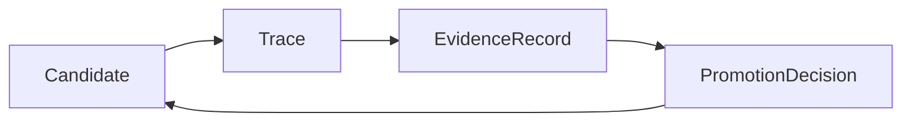
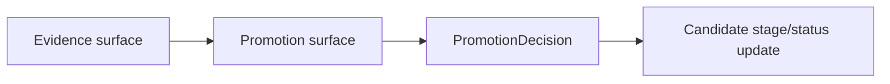

# Promotion Decision Contract

This page defines what a `PromotionDecision` is in autokairos.

It follows:

- [03-staged-evaluation.md](03-staged-evaluation.md)
- [04-boundaries.md](04-boundaries.md)
- [08-candidate-contract.md](08-candidate-contract.md)
- [09-trace-contract.md](09-trace-contract.md)
- [10-evidence-record-contract.md](10-evidence-record-contract.md)
- [../sources/library/anthropic-building-effective-agents.md](../../sources/library/anthropic-building-effective-agents.md)
- [../sources/library/anthropic-automated-alignment-researchers.md](../../sources/library/anthropic-automated-alignment-researchers.md)
- [../sources/library/anthropic-automated-w2s-researcher.md](../../sources/library/anthropic-automated-w2s-researcher.md)
- [../sources/library/repo-anthropics-claude-code.md](../../sources/library/repo-anthropics-claude-code.md)
- [../sources/library/repo-paperclip.md](../../sources/library/repo-paperclip.md)
- [../sources/synthesis/evaluation-governance-and-promotion.md](../../sources/synthesis/evaluation-governance-and-promotion.md)

It is also strengthened by current official Anthropic Claude Code administration docs:

- [Security](https://code.claude.com/docs/en/security)
- [Configure permissions](https://code.claude.com/docs/en/permissions)
- [How Claude Code works](https://code.claude.com/docs/en/how-claude-code-works)

## Thesis

`PromotionDecision` is the explicit governance act that changes a candidate's standing.

It is not a trace.

It is not evidence.

It is not a runtime permission prompt.

It is the formal record that says:

- what governance action was taken
- against which candidate
- from which stage position
- toward which new stage position or status
- on the basis of which evidence
- by which governing surface

Without this object, stage progression becomes implicit, operator memory becomes authoritative, and
promotion starts to look like a side effect of execution rather than a deliberate act of
governance.

## Why This Spec Exists

The source layer points toward this object from several directions.

### 1. Anthropic research posture

AAR and Automated W2S Researcher both make the same structural point: search can scale, but
evaluation becomes the bottleneck, and human oversight remains essential. That only makes sense if
there is some explicit act of accepting, rejecting, or constraining advancement based on external
results.

### 2. Paperclip governance posture

Paperclip is especially direct here. It treats approvals, budgets, rollback, and agent reviews as
first-class governance surfaces rather than incidental UX. That implies a distinct layer where a
governing authority commits an action that changes what the agent is allowed to do next.

### 3. Claude Code approval posture

Claude Code's permission and security docs are useful mostly as a boundary contrast. They show that
runtime approvals, command permissions, and side-effect prompts are important, but they are still
local execution controls. They are not the same thing as a promotion decision over a candidate's
stage standing.

autokairos therefore needs a separate, higher-level object for progression governance.

That object is `PromotionDecision`.

## What This Spec Is Not

`PromotionDecision` is not:

- a `Candidate`
- a `Session`
- a `Workspace`
- a `Trace`
- an `EvidenceRecord`
- a runtime approval response
- a connector permission grant
- a tool-call allowlist entry
- a free-form reviewer comment

Most importantly:

**Evidence says what counted and why. PromotionDecision says what changed because of it.**

And:

**Runtime approval is about whether an active run may do something now. PromotionDecision is about
whether a candidate may advance, stay, pause, demote, or terminate.**

## Promotion Decision Definition

A `PromotionDecision` should be understood as:

> a sealed governance record that changes or preserves a candidate's stage standing on the basis of
> explicit evidence and an identified decision surface.

The phrase `changes or preserves` matters.

A decision can promote, but it can also intentionally choose:

- stay
- pause
- demote
- reject
- rollback

## Promotion Decision In The System

Operationally:

This loop is deliberate.

- trace does not promote
- evidence does not promote
- governance promotes

## Promotion Decision Contract

The promotion-decision contract should carry at least these categories of information.

## 1. Identity

The decision needs stable identity and sealing state.

### Required fields

- `promotion_decision_id`
- `created_at`
- `sealed_at`
- `status`

### Suggested status values

- `draft`
- `committed`
- `superseded`
- `rescinded`

### Why

The decision should be reviewable as a historical governance act, not just a mutable status flag
on the candidate.

## 2. Candidate Scope

The decision must say which candidate it governs.

### Required fields

- `candidate_ref`
- `current_stage`
- optional `current_stage_binding_ref`

### Why

There should be no ambiguity about which candidate's standing changed or was preserved.

## 3. Decision Outcome

The record must carry the actual governance outcome.

### Required fields

- `decision_kind`
- `outcome`

### Candidate outcome values

- `promote`
- `stay`
- `pause`
- `demote`
- `reject`
- `rollback`

### Why

autokairos should not encode progression as a boolean `approved / denied` only.

Trading candidates need richer governance outcomes because:

- good evidence may still not be sufficient for promotion
- live execution may need pause without full rejection
- bad changes may require rollback rather than simple demotion

## 4. Stage Transition

The decision must say what stage relationship changed.

### Required fields

- `from_stage`
- optional `to_stage`
- optional resulting `candidate_status`

### Why

Some outcomes move stages and some do not.

Examples:

- `promote`: `from_stage = backtesting`, `to_stage = paper`
- `stay`: `from_stage = paper`, no `to_stage`
- `pause`: `from_stage = live`, no `to_stage`, resulting status `paused`
- `demote`: `from_stage = live`, `to_stage = paper`
- `reject`: `from_stage = backtesting`, no `to_stage`, resulting status `rejected`

## 5. Evidence Basis

The decision must point to what justified it.

### Required fields

- one or more `evidence_record_refs`
- optional `trace_refs` when relevant for direct audit convenience

### Why

Promotion should never be an uncited judgment.

This is the core anti-handwave requirement.

The system should always be able to answer:

- which sealed evidence records supported this decision?
- what were those records actually about?

## 6. Governing Surface

The decision must preserve who or what made it.

### Required fields

- `governing_surface_kind`
- `decider_ref` or equivalent identity reference

### Candidate governing-surface kinds

- `human_operator`
- `review_queue`
- `policy_engine`
- `hybrid_governance`

### Why

Not every decision will be made by the same surface.

Some may be fully human.

Some may be policy-constrained human review.

Some may be partially automated but still externally governed.

The contract should preserve that distinction explicitly.

## 7. Rationale

The decision must contain a concise explicit rationale.

### Required fields

- structured rationale summary
- optional policy or rule references

### Why

An evidence reference alone is not enough.

There needs to be a compact record of:

- why the evidence was considered sufficient or insufficient
- why a less obvious outcome such as `stay` or `rollback` was chosen

## 8. Constraints And Follow-Up

The decision should be able to impose next-step conditions.

### Example fields

- `followup_required`
- `followup_requirements`
- `expiry_at`
- `review_due_at`
- `imposed_risk_limits`

### Why

A promotion decision is not always a clean binary gate.

Examples:

- promote to paper, but require a fresh risk review within a week
- allow continued live operation, but under tighter limits
- stay in paper until a specific regression comparison is complete

## 9. Supersession And Rollback Relationship

The decision should preserve historical linkage when later decisions replace it.

### Example fields

- `supersedes_decision_ref`
- `rolled_back_by_decision_ref`

### Why

If the system later reverses or replaces a promotion decision, that should happen through a new
decision record, not by mutating the original.

## Promotion Decision Lifecycle

The decision lifecycle should remain simple.

### Suggested states

1. `draft`
2. `committed`
3. `superseded`
4. `rescinded`

### Why

`draft` supports review before commitment.

`committed` means the governance action now counts.

`superseded` and `rescinded` preserve history if later governance changes direction.

## Promotion Decision Versus Runtime Approval

This distinction must remain extremely clear.

Runtime approvals answer questions like:

- may this command run?
- may this connector make a network request?
- may this active session write to this path?

Promotion decisions answer questions like:

- may this candidate advance to paper?
- should this live candidate be paused?
- should this candidate be rolled back to an earlier stage?

Runtime approvals live near the harness.

Promotion decisions live in the control plane.

## Promotion Decision Versus Evidence

This is the second boundary that must remain crisp.

Evidence records should be able to exist without immediately changing candidate state.

Examples:

- a risk review may block promotion but not yet reject the candidate
- a trace-grade batch may reveal regressions that require more study
- a paper-stage performance summary may strengthen a case without being decisive alone

Promotion decisions consume that evidence and commit the actual governance action.

## Failure Modes / Invariants

The key invariants are:

- promotion decision is an explicit governance act
- runtime approval must remain distinct from promotion decision
- every stage-standing change must name its evidence basis and governing surface

The design is failing if:

- a candidate advances without a committed decision record
- runtime-local permission prompts are treated as promotion
- rollback or demotion has no durable supersession history

## Design Implications

If autokairos adopts this contract, several downstream decisions become clearer.

- stage progression remains explicit and auditable
- runtime approvals cannot silently substitute for progression governance
- evidence can accumulate before a decision is taken
- rollback and demotion become first-class outcomes rather than ad hoc fixes
- operator memory stops being the place where stage legitimacy lives

## Current Contract Intuition

The shortest safe intuition is:

> `Trace` answers **what happened**.
>
> `EvidenceRecord` answers **what counted and why**.
>
> `PromotionDecision` answers **what governance action changed the candidate's standing**.

## Relationship To Adjacent Specs

This spec depends on:

- [10-evidence-record-contract.md](10-evidence-record-contract.md)
- [03-staged-evaluation.md](03-staged-evaluation.md)

It is operationalized alongside:

- [14-review-item-contract.md](14-review-item-contract.md)
