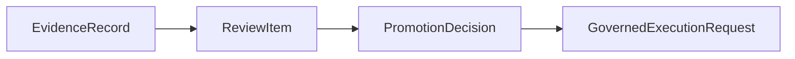

# Promotion Decision Contract

This page defines the minimum `PromotionDecision` contract needed by the current MLP-01 baseline.

It follows:

- [03-staged-evaluation.md](03-staged-evaluation.md)
- [04-boundaries.md](04-boundaries.md)
- [10-evidence-record-contract.md](10-evidence-record-contract.md)
- [17-evaluation-comparability-and-sealing-contract.md](17-evaluation-comparability-and-sealing-contract.md)
- [14-review-item-contract.md](14-review-item-contract.md)
- [../02-pr2-candidate-becomes-externally-evaluated-design.md](../02-pr2-candidate-becomes-externally-evaluated-design.md)
- [../03-pr3-bounded-live-trader-system-runtime-design.md](../03-pr3-bounded-live-trader-system-runtime-design.md)

## Thesis

`PromotionDecision` is the sealed governance act that gives one live gate its explicit meaning.

It is where autokairos says:

- which candidate was governed
- which evidence basis was cited
- what the live-gate outcome was
- which governing surface committed it

Without this object, live approval collapses into informal memory or vague UI state.

## Current Active Applicability

This spec is currently active for PR2 and PR3.

Its first job is to make the live gate real in PR2.

Its second job is to give PR3 one durable upstream approval basis before any live execution starts.

## What This Is Not

`PromotionDecision` is not:

- a `Trace`
- an `EvidenceRecord`
- a `ReviewItem`
- a runtime approval prompt
- a `GovernedExecutionRequest`

Most importantly:

- evidence says what counted and why
- `PromotionDecision` says what changed because of that evidence
- `PromotionDecision` is still not live execution

## Canonical Role In The System

The separation must remain explicit:

- evidence does not promote
- review does not commit
- promotion does not execute

## Minimum Contract

A `PromotionDecision` must carry at least:

| Field | Meaning |
| --- | --- |
| `promotion_decision_id` | Stable durable identity |
| `candidate_ref` | Candidate whose standing was governed |
| `decision_scope` | Current baseline uses `live_gate` |
| `evidence_record_refs` | Counted sealed evidence basis cited by the gate |
| `evidence_sealing_decision_refs` | Sealing decisions that made the evidence citeable |
| `comparison_set_refs` | Comparison sets that justify comparability when relevant |
| `originating_review_item_ref` | Review item resolved by the gate act |
| `decision_outcome` | `promote_to_live`, `hold`, or `reject` |
| `decision_summary` | Durable rationale in operator language |
| `decided_by_surface_kind` | Which governing surface committed the act |
| `created_at` | When the decision was first created |
| `sealed_at` | When the decision became citeable and binding |
| `status` | `draft`, `committed`, `superseded`, or `rescinded` |

## Required Interpretation

### `promote_to_live`

The candidate is eligible to enter PR3 through a governed execution request.

This is the only outcome that may open live execution.

### `hold`

The candidate is not rejected, but more evidence or review is required before live execution may
open.

### `reject`

The candidate is not eligible for live execution on the current basis.

## Boundary Rules

- current active baseline treats `PromotionDecision` as the per-candidate live gate
- live gate meaning must cite counted evidence, not raw trace alone
- live gate meaning must not cite raw evaluator output, provider output, A2A artifacts, memory
  summaries, or operator satisfaction directly
- ambiguous, partial, non-comparable, `non_counted`, or `quarantined_for_review` results cannot open
  live gate
- a committed promotion decision must still stop before creating runtime behavior
- `PromotionDecision` should be inspectable without knowing private implementation details

## Not In The Active Baseline

The current active baseline does not require:

- full multi-stage decision taxonomies
- rollback families for later live operations
- broad decision outcome catalogs beyond the current live-gate posture

If later work needs those, it should add them deliberately rather than broadening this contract by
default.

### Why

Promotion should never be an uncited judgment.

This is the core anti-handwave requirement.

The system should always be able to answer:

- which sealed evidence records supported this decision?
- what were those records actually about?
- which evaluation runs and comparison sets made those records comparable enough to count?
- what was excluded or marked non-counted?

## 6. Governing Surface

The decision must preserve who or what made it.

### Required fields

- `governing_surface_kind`
- `decider_ref` or equivalent identity reference

### Candidate governing-surface kinds

- `human_operator`
- `review_queue`
- `policy_engine`
- `hybrid_governance`

### Why

Not every decision will be made by the same surface.

Some may be fully human.

Some may be policy-constrained human review.

Some may be partially automated but still externally governed.

The contract should preserve that distinction explicitly.

## 7. Rationale

The decision must contain a concise explicit rationale.

### Required fields

- structured rationale summary
- optional policy or rule references

### Why

An evidence reference alone is not enough.

There needs to be a compact record of:

- why the evidence was considered sufficient or insufficient
- why a less obvious outcome such as `stay` or `rollback` was chosen

## 8. Constraints And Follow-Up

The decision should be able to impose next-step conditions.

### Example fields

- `followup_required`
- `followup_requirements`
- `expiry_at`
- `review_due_at`
- `imposed_risk_limits`

### Why

A promotion decision is not always a clean binary gate.

Examples:

- promote to paper, but require a fresh risk review within a week
- allow continued live operation, but under tighter limits
- stay in paper until a specific regression comparison is complete

## 9. Supersession And Rollback Relationship

The decision should preserve historical linkage when later decisions replace it.

### Example fields

- `supersedes_decision_ref`
- `rolled_back_by_decision_ref`

### Why

If the system later reverses or replaces a promotion decision, that should happen through a new
decision record, not by mutating the original.

## Promotion Decision Lifecycle

The decision lifecycle should remain simple.

### Suggested states

1. `draft`
2. `committed`
3. `superseded`
4. `rescinded`

### Why

`draft` supports review before commitment.

`committed` means the governance action now counts.

`superseded` and `rescinded` preserve history if later governance changes direction.

## Promotion Decision Versus Runtime Approval

This distinction must remain extremely clear.

Runtime approvals answer questions like:

- may this command run?
- may this connector make a network request?
- may this active session write to this path?

Promotion decisions answer questions like:

- may this candidate advance to paper?
- should this live candidate be paused?
- should this candidate be rolled back to an earlier stage?

Runtime approvals live near the harness.

Promotion decisions live in the control plane.

## Promotion Decision Versus Evidence

This is the second boundary that must remain crisp.

Evidence records should be able to exist without immediately changing candidate state.

Examples:

- a risk review may block promotion but not yet reject the candidate
- a trace-grade batch may reveal regressions that require more study

Promotion may cite only sealed counted `EvidenceRecord`.

It must not cite:

- raw `Trace`
- raw provider output
- raw evaluator output
- unsealed `EvaluationRunRecord`
- `non_counted` evidence
- quarantined evaluation output
- subjective operator satisfaction without objective counted evidence

This keeps the live gate from becoming a UI ceremony around a convenient run.
- a paper-stage performance summary may strengthen a case without being decisive alone

Promotion decisions consume that evidence and commit the actual governance action.

## Failure Modes / Invariants

The key invariants are:

- promotion decision is an explicit governance act
- runtime approval must remain distinct from promotion decision
- every stage-standing change must name its evidence basis and governing surface

The design is failing if:

- a candidate advances without a committed decision record
- runtime-local permission prompts are treated as promotion
- rollback or demotion has no durable supersession history

## Design Implications

If autokairos adopts this contract, several downstream decisions become clearer.

- stage progression remains explicit and auditable
- runtime approvals cannot silently substitute for progression governance
- evidence can accumulate before a decision is taken
- rollback and demotion become first-class outcomes rather than ad hoc fixes
- operator memory stops being the place where stage legitimacy lives

## Current Contract Intuition

The shortest safe intuition is:

> `Trace` answers **what happened**.
>
> `EvidenceRecord` answers **what counted and why**.
>
> `PromotionDecision` answers **what governance action changed the candidate's standing**.

## Relationship To Adjacent Specs

This spec depends on:

- [10-evidence-record-contract.md](10-evidence-record-contract.md)
- [03-staged-evaluation.md](03-staged-evaluation.md)

It is operationalized alongside:

- [14-review-item-contract.md](14-review-item-contract.md)
