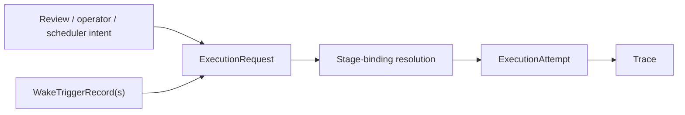

# Governed Execution Request Contract

This page defines the canonical request object that asks autokairos to start or resume execution.

It follows:

- [05-agent-execution-architecture.md](05-agent-execution-architecture.md)
- [07-runtime-bridge-interface.md](07-runtime-bridge-interface.md)
- [08-candidate-contract.md](08-candidate-contract.md)
- [23-wake-trigger-record-contract.md](23-wake-trigger-record-contract.md)
- [28-wake-policy-precedence-and-overlap-contract.md](28-wake-policy-precedence-and-overlap-contract.md)
- [../agent-system/06-first-code-seam.md](../agent-system/06-first-code-seam.md)
- [../../sources/library/anthropic-managed-agents.md](../../sources/library/anthropic-managed-agents.md)
- [../../sources/library/openai-next-evolution-of-the-agents-sdk.md](../../sources/library/openai-next-evolution-of-the-agents-sdk.md)
- [../../sources/library/repo-multica.md](../../sources/library/repo-multica.md)

It is also informed by additional official documentation:

- [OpenAI Sessions](https://openai.github.io/openai-agents-js/guides/sessions/)
- [OpenAI Results](https://openai.github.io/openai-agents-js/guides/results/)
- [OpenAI Human-in-the-loop](https://openai.github.io/openai-agents-python/human_in_the_loop/)
- [OpenClaw Automation](https://docs.openclaw.ai/automation)
- [Claude Code Scheduled Tasks](https://code.claude.com/docs/en/scheduled-tasks)

## Thesis

`ExecutionRequest` is the governed invocation object that exists before any runtime session,
workspace host, or execution attempt becomes live.

It is the control-plane answer to:

**what work is being requested, on which candidate and stage, and under what governing context,
before the system launches anything?**

## Why This Spec Exists

This spec exists because autokairos must not start runs from ad hoc prompt strings or directly from
one runtime driver's launch API.

The source layer points toward the same pattern repeatedly:

- Anthropic keeps `session` outside the currently running `harness` and `sandbox`
- OpenAI keeps resumable `state` outside the currently running turn
- Multica keeps task/runtime supervision outside the currently active CLI

Taken together, that means autokairos needs one explicit invocation object before it creates an
execution attempt.

## Canonical Object

`ExecutionRequest` is a durable control-plane record that asks the system to create or continue
work for one candidate-stage line of work.

It exists above:

- runtime session handles
- container hosts
- workspaces
- traces

And below:

- review and operator intent
- scheduling or automation
- candidate/stage governance

Operationally:

## Required Fields Or Required Behaviors

The contract should carry at least these categories of information.

## 1. Identity

### Required fields

- `execution_request_id`
- `created_at`
- `status`

### Why

The request must be durable and referenceable before any attempt exists.

## 2. Target Context

### Required fields

- `agent_identity_ref`
- `candidate_ref`
- `session_ref`
- `requested_stage`

### Why

The request must identify:

- who is acting
- what promotable line of work is being advanced
- what continuity surface the work belongs to
- what legitimacy level is being requested

## 3. Origin And Intent

### Required fields

- `origin`
  - `manual`
  - `scheduler`
  - `review_followup`
  - `retry`
  - another explicitly named system origin
- `objective`
  or `objective_ref`

### Optional but likely useful fields

- `requested_by_ref`
- `reason`
- `notes`

### Why

The request should say why execution is being asked for, not just where it should run.

## 4. Wake Origin And Resolution Context

### Required fields when the request was proactively emitted

- `primary_wake_trigger_record_ref`
- `wake_origin_posture`
  - `single_trigger`
  - `overlap_primary`

### Optional but likely useful fields

- `coalesced_wake_trigger_record_refs`
- `originating_proactive_evaluation_record_ref`
- `originating_wake_policy_ref`
- `originating_standing_order_ref`
- `wake_resolution_summary`

### Required behavior

If the request came from proactive orchestration, the request must preserve the primary wake cause
that actually emitted it.

If overlapping candidates were coalesced into one request, the request must also preserve enough
linkage to explain:

- which trigger became primary
- which additional candidates were coalesced
- which originating proactive evaluation justified the emitted primary wake
- which upstream wake policy and standing authority shaped the outcome

For non-proactive origins such as direct operator action, this wake-origin block may be absent or
explicitly marked `not_applicable`.

### Why

`origin = scheduler` is not enough.

The system needs a durable answer to:

- which evaluated wake actually caused this request to exist?
- was this request the primary result of overlap resolution?
- which wake candidates were merged into this one request?

Without that linkage, wake precedence remains durable on paper but disappears at the exact point
where execution starts.

## 5. Execution Posture Hints

### Required fields

- `preferred_execution_mode`
  or an explicit null meaning "resolver decides"
- timeout or duration profile reference

### Optional fields

- preferred runtime family
- priority
- retry budget

### Why

The request may express constraints, but it should not yet collapse into a concrete attempt.

## 6. Governance Context

### Required fields

- any blocking governance reference that caused the request
  when applicable

### Examples

- `review_item_ref`
- `evidence_record_ref`
- `promotion_decision_ref`

### Why

Requests often come from explicit governance work, and that provenance should not be lost.

## 7. Idempotency And Deduplication

### Required behavior

The request layer should be able to prevent accidental duplicate launches when the same operator or
automation action is replayed.

### Suggested fields

- `idempotency_key`
- optional `supersedes_execution_request_ref`

## Lifecycle Or State Model

The request lifecycle should remain simple.

### Suggested states

1. `queued`
2. `accepted`
3. `fulfilled`
4. `canceled`
5. `superseded`

### Meaning

- `queued`
  the request exists but has not yet produced an execution attempt
- `accepted`
  the control plane has accepted it as runnable work
- `fulfilled`
  at least one execution attempt has been created from it
- `canceled`
  the request was intentionally stopped before fulfillment
- `superseded`
  a newer request replaced it

One request may later be associated with multiple attempts if retries are allowed.

## What This Spec Is Not

`ExecutionRequest` is not:

- a prompt string
- an execution attempt
- a runtime session handle
- a workspace
- a trace
- a review item
- a promotion decision

Most importantly, it is not the live run itself.

## Failure Modes / Invariants

The key invariants are:

- a request exists before the first execution attempt exists
- a request names candidate, stage, and continuity explicitly
- a proactively emitted request has one durable primary wake-trigger reference
- overlap or coalescing must not erase the non-primary wake candidates that contributed to the
  request
- a request may carry posture hints, but does not become the resolved runtime binding
- a request remains durable even if launch never happens

The design is failing if:

- the runtime bridge is called without a durable request object
- prompt text becomes the only invocation boundary
- request provenance from review or scheduling disappears
- a proactively emitted request can only be traced back to a generic `scheduler` origin instead of
  one primary wake record
- coalesced wake candidates disappear once the request is created
- retries silently overwrite the original request instead of relating to it

## Relationship To Adjacent Specs

This spec depends on:

- [08-candidate-contract.md](08-candidate-contract.md)
- [05-agent-execution-architecture.md](05-agent-execution-architecture.md)
- [07-runtime-bridge-interface.md](07-runtime-bridge-interface.md)
- [23-wake-trigger-record-contract.md](23-wake-trigger-record-contract.md)
- [28-wake-policy-precedence-and-overlap-contract.md](28-wake-policy-precedence-and-overlap-contract.md)

It feeds directly into:

- [13-execution-attempt-contract.md](13-execution-attempt-contract.md)
- [09-trace-contract.md](09-trace-contract.md)
- [../agent-system/06-first-code-seam.md](../agent-system/06-first-code-seam.md)
- [38-proactive-evaluation-to-execution-linkage-contract.md](38-proactive-evaluation-to-execution-linkage-contract.md)
