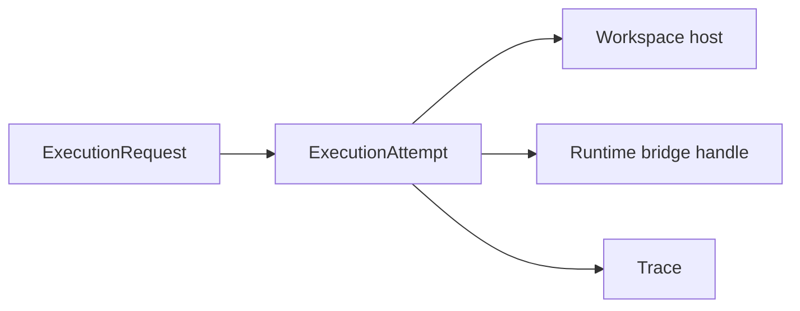

# Execution Attempt Contract

This page defines the durable record for one concrete attempt to execute work from an
`ExecutionRequest`.

It follows:

- [12-governed-execution-request-contract.md](12-governed-execution-request-contract.md)
- [05-agent-execution-architecture.md](05-agent-execution-architecture.md)
- [07-runtime-bridge-interface.md](07-runtime-bridge-interface.md)
- [09-trace-contract.md](09-trace-contract.md)
- [23-wake-trigger-record-contract.md](23-wake-trigger-record-contract.md)
- [../../sources/library/anthropic-managed-agents.md](../../sources/library/anthropic-managed-agents.md)
- [../../sources/library/repo-multica.md](../../sources/library/repo-multica.md)
- [../../sources/library/repo-safety-research-automated-w2s-research.md](../../sources/library/repo-safety-research-automated-w2s-research.md)

It is also informed by additional official documentation:

- [OpenAI Sessions](https://openai.github.io/openai-agents-js/guides/sessions/)
- [OpenAI Results](https://openai.github.io/openai-agents-js/guides/results/)
- [Docker Bind mounts](https://docs.docker.com/engine/storage/bind-mounts/)
- [Docker Storage](https://docs.docker.com/engine/storage/)

## Thesis

`ExecutionAttempt` is the durable record for one concrete try to run one request under one stage
binding and one execution mode.

It is the object that lets autokairos answer:

**what exactly was launched, where did it run, what trace did it emit, and how did that one try
end?**

## Why This Spec Exists

This spec exists because request intent and concrete execution are not the same thing.

The source layer repeatedly separates durable continuity and control from disposable runtime hosts:

- Anthropic can recreate a harness from session state after failure
- OpenAI can resume work from serialized run state while keeping session continuity
- W2S treats worker containers as disposable while keeping evaluation-relevant state outside them
- Multica treats task progress and runtime supervision as external managed state

autokairos therefore needs a durable record for one execution try that is still distinct from:

- the higher-level request
- the candidate lineage
- the raw trace itself

## Canonical Object

`ExecutionAttempt` is a control-plane execution reference record.

It ties together:

- one `ExecutionRequest`
- one candidate-stage context
- one resolved execution posture
- one runtime launch or attach
- one primary trace stream

Operationally:

## Required Fields Or Required Behaviors

## 1. Identity

### Required fields

- `execution_attempt_id`
- `execution_request_ref`
- `created_at`
- `status`

### Why

Every concrete try must be durable and distinct, even when many attempts come from one request.

## 2. Target Context

### Required fields

- `agent_identity_ref`
- `candidate_ref`
- `session_ref`
- `stage`
- `stage_binding_ref`

### Why

An attempt must preserve both the requested work context and the resolved semantics under which it
was actually run.

## 3. Execution Selection

### Required fields

- `execution_mode`
  - `host-local`
  - `containerized-local`
  - `containerized-remote`
- execution driver selection metadata

### Optional fields

- `worker_image_ref`
- runtime family or harness identifier
- runtime host reference

### Why

Execution legitimacy partly depends on how the attempt was run, not only on what it was trying to
do.

## 4. Wake Provenance Inheritance

### Required behavior

An `ExecutionAttempt` must be able to resolve back to the request's wake provenance without reading
runtime-local logs or scheduler memory.

### Optional denormalized fields

- `primary_wake_trigger_record_ref`
- `wake_origin_posture`

### Why

The request is the canonical invocation object.

The attempt may denormalize some wake-origin context for operational joins and observability, but
the attempt must not become the source of truth for:

- precedence resolution
- coalescing history
- wake-authority interpretation

That truth remains upstream in the `ExecutionRequest` and `WakeTriggerRecord` family.

## 5. Workspace And Trace References

### Required fields

- `workspace_ref`
- `trace_ref`

### Optional fields

- runtime-local execution handle
- artifact bundle reference

### Why

The attempt is the durable place where autokairos ties one launch to one workspace surface and one
primary raw run record.

## 6. Lifecycle Timestamps

### Required fields

- `accepted_at` or equivalent
- `started_at` when launch actually begins
- `last_heartbeat_at`

### Terminal timestamps

- `completed_at`
- `failed_at`
- `abandoned_at`
- `canceled_at`

### Why

The system should be able to reconstruct:

- when the attempt became real
- whether it stalled
- whether it ended cleanly
- whether it needs resume or investigation

## 7. Failure And Recovery Context

### Required behavior

The attempt record must preserve enough structured failure context for the control plane to decide
between retry, resume, pause, or abandon.

### Suggested fields

- `failure_code`
- `failure_summary`
- `interrupt_reason`
- `resumable`

## Lifecycle Or State Model

The attempt lifecycle should be more detailed than the request lifecycle.

### Suggested states

1. `pending`
2. `preparing`
3. `launching`
4. `active`
5. `interrupted`
6. `completed`
7. `failed`
8. `abandoned`
9. `canceled`

### Meaning

- `pending`
  the attempt record exists but environment preparation has not begun
- `preparing`
  stage binding, workspace shaping, or host preparation is in progress
- `launching`
  the runtime bridge is creating or attaching the runtime session
- `active`
  the runtime is live and expected to emit trace
- `interrupted`
  the run is paused or awaiting an explicit resume path
- `completed`
  the attempt ended cleanly
- `failed`
  the attempt ended in explicit failure
- `abandoned`
  the attempt stopped without a clean completion path but remains durable
- `canceled`
  the control plane intentionally stopped the attempt

## What This Spec Is Not

`ExecutionAttempt` is not:

- the governing execution request
- the candidate itself
- the session itself
- the trace itself
- the evidence record
- the promotion decision

Most importantly, it is not the place where candidate standing changes.

## Failure Modes / Invariants

The key invariants are:

- one attempt belongs to one request
- one attempt belongs to one candidate-stage context
- one attempt references one primary trace stream
- wake provenance may be copied onto the attempt for joins, but the request remains the canonical
  owner of primary wake cause and coalesced origins
- destroying a workspace or container must not erase the attempt record
- attempt status and trace status are related but not identical

The design is failing if:

- retries mutate one old attempt instead of creating a new concrete try
- the only durable record of an attempt is the trace blob
- the attempt cannot be interpreted without reading one surviving container
- stage binding or execution mode disappears from the attempt record
- wake provenance is only knowable from one scheduler log instead of the request and proactive
  record family

## Relationship To Adjacent Specs

This spec depends on:

- [12-governed-execution-request-contract.md](12-governed-execution-request-contract.md)
- [07-runtime-bridge-interface.md](07-runtime-bridge-interface.md)
- [09-trace-contract.md](09-trace-contract.md)
- [23-wake-trigger-record-contract.md](23-wake-trigger-record-contract.md)

It is used by:

- [../agent-system/06-first-code-seam.md](../agent-system/06-first-code-seam.md)
- [../control-plane/03-record-model.md](../control-plane/03-record-model.md)
