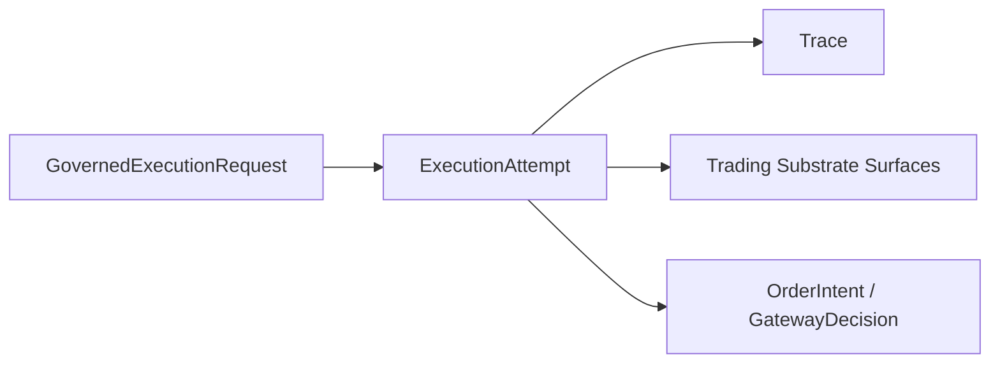

# Execution Attempt Contract

This page defines the minimum `ExecutionAttempt` contract needed by the current MLP-01 baseline.

It follows:

- [12-governed-execution-request-contract.md](12-governed-execution-request-contract.md)
- [09-trace-contract.md](09-trace-contract.md)
- [../03-pr3-bounded-live-trading-system-pod-design.md](../03-pr3-bounded-live-trading-system-pod-design.md)

## Thesis

`ExecutionAttempt` is the durable record for one concrete live try launched from one governed
execution request.

It is where autokairos says:

- what exactly was launched
- which candidate and venue scope it belongs to
- which raw trace it emitted
- whether the live attempt is active, failed, completed, or otherwise no longer usable

Without this object, "candidate is live" becomes vague and unreconstructable.

## Current Active Applicability

This spec is currently active for PR3.

Its job is to make one real live attempt durable outside runtime memory.

## What This Is Not

`ExecutionAttempt` is not:

- a `GovernedExecutionRequest`
- a `TraderSystemCandidate`
- a wake-trigger record
- the whole runtime system

Most importantly:

- the request is the governed launch intent
- the attempt is the concrete live try
- the trace is the raw history emitted by that try

## Canonical Role In The System

The separation must remain explicit:

- one request may produce one or more attempts over time
- one attempt must still be traceable as one concrete live try

## Minimum Contract

An `ExecutionAttempt` must carry at least:

| Field | Meaning |
| --- | --- |
| `execution_attempt_id` | Stable durable identity |
| `execution_request_ref` | Upstream governed request |
| `candidate_ref` | Candidate whose live pod is running |
| `stage` | Current baseline requires `live` |
| `execution_mode` | Concrete runtime mode used for this attempt |
| `venue_binding_ref` | Venue/product scope for the attempt |
| `workspace_ref` | Bounded runtime environment |
| `trace_ref` | Primary raw run history |
| `agent_loop_policy_ref` | loop envelope used by this attempt |
| `gateway_decision_refs` | accepted, rejected, or clipped gateway decisions produced during the attempt |
| `created_at` | When the attempt record was created |
| `started_at` | When the attempt became live |
| `last_heartbeat_at` | Latest sign of continuing activity |
| `status` | `pending`, `launching`, `active`, `completed`, `failed`, `abandoned`, or `canceled` |

## Required Interpretation

The attempt must preserve enough meaning to answer:

- which approved candidate is actually live?
- where is it trading?
- is it still running?
- which raw trace captures its behavior?
- which gateway decisions explain accepted, rejected, or clipped trading actions?

The attempt is also the durable place where live execution can later connect to wake and
intervention history, but PR3 does not need those downstream contracts yet.

## Boundary Rules

- every live pod that claims to be real must have an execution attempt
- the attempt must stay linked to one governed request and one candidate
- substrate facts remain separate from the attempt record even when they explain current live posture
- PR3 does not require wake or operator-action fields on the attempt itself
- PR3 does require gateway decision linkage when order intents occur

## Not In The Active Baseline

The current active baseline does not require:

- deeper host/container orchestration metadata
- richer wake-origin inheritance
- detailed retry/resume planning

If later work needs those, it should add them deliberately rather than broadening this contract by
default.

## What This Spec Is Not

`ExecutionAttempt` is not:

- the governing execution request
- the candidate itself
- the session itself
- the trace itself
- the evidence record
- the promotion decision

Most importantly, it is not the place where candidate standing changes.

## Failure Modes / Invariants

The key invariants are:

- one attempt belongs to one request
- one attempt belongs to one candidate-stage context
- one attempt references one primary trace stream
- wake provenance may be copied onto the attempt for joins, but the request remains the canonical
  owner of primary wake cause and coalesced origins
- destroying a hands environment or container must not erase the attempt record
- attempt status and trace status are related but not identical

The design is failing if:

- retries mutate one old attempt instead of creating a new concrete try
- the only durable record of an attempt is the trace blob
- gateway decisions are only visible in provider text
- the attempt cannot be interpreted without reading one surviving container
- stage binding or execution mode disappears from the attempt record
- wake provenance is only knowable from one scheduler log instead of the request and proactive
  record family

## Relationship To Adjacent Specs

This spec depends on:

- [12-governed-execution-request-contract.md](12-governed-execution-request-contract.md)
- [07-runtime-bridge-interface.md](07-runtime-bridge-interface.md)
- [09-trace-contract.md](09-trace-contract.md)
- [15-agent-loop-policy-contract.md](15-agent-loop-policy-contract.md)
- [16-order-intent-and-gateway-decision-contract.md](16-order-intent-and-gateway-decision-contract.md)
- [23-wake-trigger-record-contract.md](23-wake-trigger-record-contract.md)

It is used by:

- [../agent-system/06-first-code-seam.md](../agent-system/06-first-code-seam.md)
- [../control-plane/03-record-model.md](../control-plane/03-record-model.md)
