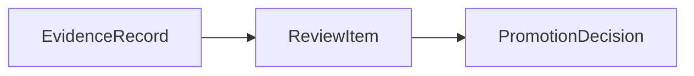

# Review Item Contract

This page defines the minimum `ReviewItem` contract needed by the current MLP-01 baseline.

It follows:

- [10-evidence-record-contract.md](10-evidence-record-contract.md)
- [11-promotion-decision-contract.md](11-promotion-decision-contract.md)
- [../02-pr2-candidate-becomes-externally-evaluated-design.md](../02-pr2-candidate-becomes-externally-evaluated-design.md)

## Thesis

`ReviewItem` is the durable work object for one pending governance question.

In the current active baseline, that question is the per-candidate live gate.

Without this object, evidence may exist, but the system still has no durable answer to:

- what question is actually pending?
- what evidence packet supports it?
- who is expected to resolve it?

## Current Active Applicability

This spec is currently active for PR2.

Its main job is to package one candidate's live-gate question after counted evidence becomes strong
enough to justify serious review.

## What This Is Not

`ReviewItem` is not:

- raw evidence
- the final gate decision
- an execution request
- a generic inbox item

Most importantly:

- `EvidenceRecord` says what counted and why
- `ReviewItem` says what question is now pending because of that evidence
- `PromotionDecision` resolves that question

## Canonical Role In The System

The separation must remain explicit:

- evaluation creates evidence
- review packages the pending live-gate question
- governance commits the decision

## Minimum Contract

A `ReviewItem` must carry at least:

| Field | Meaning |
| --- | --- |
| `review_item_id` | Stable durable identity |
| `candidate_ref` | Candidate under review |
| `review_kind` | Current baseline uses `live_gate_review` |
| `evidence_record_refs` | Counted evidence packet being reviewed |
| `question_summary` | What the governing surface must decide |
| `assigned_surface_kind` | Which review surface should resolve it |
| `created_at` | When the review item was opened |
| `status` | `open`, `ready`, `in_review`, `resolved`, or `canceled` |

## Required Interpretation

In the current active baseline, a `ReviewItem` should exist only when:

- the candidate already has a real counted evidence basis
- the next serious product question is whether live permission should open

It should not be used as:

- a general-purpose notes queue
- a substitute for evidence
- a substitute for the final gate decision

## Boundary Rules

- the review item must cite durable evidence rather than private notes or memory
- the review item must preserve the live-gate question in operator language
- resolving the review item should yield a `PromotionDecision`, not runtime behavior directly

## Not In The Active Baseline

The current active baseline does not require:

- broader review taxonomies
- enterprise routing or escalation chains
- generic task-system behavior beyond the one serious live-gate question

If later work needs those, it should add them deliberately rather than broadening this contract by
default.

Some review items may go to:

- a human operator
- a scheduled review pass
- a hybrid policy-constrained reviewer

The item should preserve that routing context explicitly.

## 6. Blocking State

The item should capture why it cannot yet be resolved when blocked.

### Example fields

- `blocked_reason`
- `missing_requirements`
- `required_policy_refs`

### Why

A blocked review item is different from an empty queue item.

Examples:

- freshness requirement not met
- required risk review absent
- evidence legitimacy too weak
- mandatory human review unavailable

## 7. Resolution Link

When resolved, the item should link to what resolved it.

### Example fields

- `resolved_at`
- `resolution_kind`
- `promotion_decision_ref`

### Candidate resolution kinds

- `decision_committed`
- `cancelled_as_invalid`
- `superseded_by_newer_review_item`

### Why

The review queue should preserve how work left the queue, not only that it disappeared.

## Review Item Lifecycle

The review-item lifecycle should remain simple.

### Suggested states

1. `open`
2. `ready`
3. `in_review`
4. `blocked`
5. `resolved`
6. `cancelled`

### Why

This is enough to represent:

- a new incoming review packet
- an item ready for resolution
- an item actively under review
- an item waiting for missing prerequisites
- an item resolved by a decision
- an item discarded because it became invalid or obsolete

## Review Item Versus Execution Task

This boundary matters because Multica's task model is nearby.

Execution task:

- asks the runtime to do work
- is about execution lifecycle
- sits close to agent/runtime activity

Review item:

- asks the control plane to resolve a governance question
- is about review lifecycle
- sits above evidence and below decision

They may reference the same candidate, but they are not the same class of object.

## Review Item Versus Ticket

This boundary matters because Paperclip's ticket model is nearby.

A ticket can be a broad threaded work object.

A review item should be narrower:

- one candidate
- one stage context
- one governance question
- one explicit evidence packet

autokairos may later render review items inside a broader ticket or issue system, but the contract
itself should remain precise.

## Review Item Versus Evidence

Evidence may exist without a pending review item.

Examples:

- exploratory evidence not yet ready for governance
- evidence awaiting freshness validation
- batch analysis that informs many candidates

The review item begins when the system decides:

- this candidate-stage question is now ready or nearly ready for explicit governance work

## Review Item Versus Promotion Decision

The review item does not decide.

It:

- packages the question
- packages the evidence
- tracks routing and status

The promotion decision is what finally:

- promotes
- stays
- pauses
- demotes
- rejects
- rolls back

## Failure Modes / Invariants

The key invariants are:

- review work must be explicit before decision commitment
- a review item is narrower than a general-purpose task or ticket
- a review item may block progression without changing stage standing on its own

The design is failing if:

- governance work lives only in operator memory
- evidence flows straight to decision with no durable pending object where one is needed
- review routing metadata is lost or mixed into generic task tooling

## Design Implications

If autokairos adopts this contract, several things become clearer.

- review work becomes first-class control-plane state
- evidence can accumulate without forcing immediate decisions
- blocked governance work can be represented explicitly
- decision history stays linked to the questions that produced it
- later UI or automation layers can operate over explicit queue items instead of inferred state

## Current Contract Intuition

The shortest safe intuition is:

> `EvidenceRecord` answers **what counted and why**.
>
> `ReviewItem` answers **what governance question is now pending because of that evidence**.
>
> `PromotionDecision` answers **what was finally committed**.

## Relationship To Adjacent Specs

This spec depends on:

- [10-evidence-record-contract.md](10-evidence-record-contract.md)
- [11-promotion-decision-contract.md](11-promotion-decision-contract.md)

It is used by the control-plane section, especially:

- [../control-plane/02-governance-surfaces.md](../control-plane/02-governance-surfaces.md)
- [../control-plane/04-review-operations-and-audit.md](../control-plane/04-review-operations-and-audit.md)
