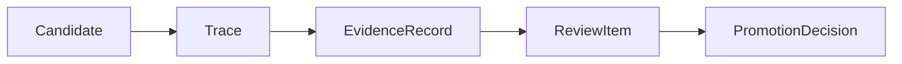
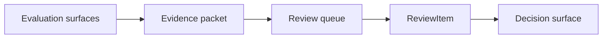

# Review Item Contract

This page defines what a `ReviewItem` is in autokairos.

It follows:

- [03-staged-evaluation.md](03-staged-evaluation.md)
- [10-evidence-record-contract.md](10-evidence-record-contract.md)
- [11-promotion-decision-contract.md](11-promotion-decision-contract.md)
- [../control-plane/02-governance-surfaces.md](../control-plane/02-governance-surfaces.md)
- [../control-plane/03-record-model.md](../control-plane/03-record-model.md)
- [../sources/library/anthropic-building-effective-agents.md](../../sources/library/anthropic-building-effective-agents.md)
- [../sources/library/repo-multica.md](../../sources/library/repo-multica.md)
- [../sources/library/repo-paperclip.md](../../sources/library/repo-paperclip.md)
- [../sources/synthesis/evaluation-governance-and-promotion.md](../../sources/synthesis/evaluation-governance-and-promotion.md)
- [../sources/synthesis/reference-systems-and-product-postures.md](../../sources/synthesis/reference-systems-and-product-postures.md)

## Thesis

`ReviewItem` is the durable control-plane work object that represents a pending governance question.

It is not evidence.

It is not the final promotion decision.

It is not an execution task.

It is the object that says:

- this candidate now has a review-worthy stage question
- here is the evidence packet relevant to that question
- here is the governing surface expected to resolve it
- here is the current review status

Without this object, autokairos ends up with either:

- evidence accumulating with no explicit governance intake
- promotion decisions written ad hoc without a tracked question

## Why This Spec Exists

The source set points toward a work object between evidence and committed governance.

### 1. Anthropic workflow posture

`Building effective agents` argues that open-ended agentic search should still be surrounded by
explicit workflow where the path should be predictable. Review is one of those predictable paths.

### 2. Paperclip ticket posture

Paperclip is useful because it treats governance-heavy work as durable ticketed work rather than as
ephemeral operator memory. autokairos does not need the full company metaphor, but it does need the
same instinct: governance questions should become explicit work objects.

### 3. Multica task posture

Multica is useful as a contrast. Its `AgentTask` is an externally tracked execution task. That
shows the value of durable work objects, but autokairos needs a different work object above
execution and below governance commitment.

That object is `ReviewItem`.

## What This Spec Is Not

`ReviewItem` is not:

- a `Candidate`
- a `Trace`
- an `EvidenceRecord`
- a `PromotionDecision`
- an execution task
- a runtime approval prompt
- a free-form checklist comment

Most importantly:

**EvidenceRecord says what counted and why. ReviewItem says what governance question is now pending
because of that evidence.**

And:

**PromotionDecision resolves the question. ReviewItem carries the question until it is resolved.**

## Review Item Definition

A `ReviewItem` should be understood as:

> a durable control-plane record that packages one candidate-stage governance question together
> with its evidence basis, routing metadata, and review status until a decision is committed or the
> item is otherwise closed.

The phrase `candidate-stage governance question` matters.

The review item is not a generic inbox item.

It should always be possible to answer:

- what candidate is under review?
- at which stage?
- what is the actual question?
- what evidence packet is attached?
- who or what is expected to resolve it?

## Review Item In The System

Operationally:

This separation must remain explicit.

- evaluation creates evidence
- review packages the pending governance question
- decision commits the outcome

## Review Item Contract

The review-item contract should carry at least these categories of information.

## 1. Identity

The review item needs stable identity and queue lifecycle state.

### Required fields

- `review_item_id`
- `created_at`
- `status`

### Suggested status values

- `open`
- `ready`
- `in_review`
- `blocked`
- `resolved`
- `cancelled`

### Why

The queue should not be reconstructed from loose evidence records and operator notes every time.

## 2. Candidate Scope

The item must say which candidate and stage it concerns.

### Required fields

- `candidate_ref`
- `stage`
- optional `stage_binding_ref`

### Why

Review questions are not generic. They belong to one candidate in one stage context.

## 3. Question Definition

The item must carry the actual governance question.

### Required fields

- `question_kind`
- short `question_summary`

### Candidate question kinds

- `promote_to_next_stage`
- `stay_in_stage`
- `pause_candidate`
- `demote_candidate`
- `reject_candidate`
- `rollback_live_candidate`
- `risk_recheck_required`

### Why

The governing surface should not have to infer the question from attached evidence alone.

## 4. Evidence Packet

The item must point to the evidence packet under review.

### Required fields

- one or more `evidence_record_refs`
- optional `trace_refs`
- optional supporting artifact refs

### Why

Review should not create its own private evidence store. It should package and route evidence that
already exists as external judged artifacts.

## 5. Routing Metadata

The item should say how it should be handled.

### Example fields

- `assigned_surface_kind`
- `assigned_surface_ref`
- `priority`
- `review_due_at`

### Why

Some review items may go to:

- a human operator
- a scheduled review pass
- a hybrid policy-constrained reviewer

The item should preserve that routing context explicitly.

## 6. Blocking State

The item should capture why it cannot yet be resolved when blocked.

### Example fields

- `blocked_reason`
- `missing_requirements`
- `required_policy_refs`

### Why

A blocked review item is different from an empty queue item.

Examples:

- freshness requirement not met
- required risk review absent
- evidence legitimacy too weak
- mandatory human review unavailable

## 7. Resolution Link

When resolved, the item should link to what resolved it.

### Example fields

- `resolved_at`
- `resolution_kind`
- `promotion_decision_ref`

### Candidate resolution kinds

- `decision_committed`
- `cancelled_as_invalid`
- `superseded_by_newer_review_item`

### Why

The review queue should preserve how work left the queue, not only that it disappeared.

## Review Item Lifecycle

The review-item lifecycle should remain simple.

### Suggested states

1. `open`
2. `ready`
3. `in_review`
4. `blocked`
5. `resolved`
6. `cancelled`

### Why

This is enough to represent:

- a new incoming review packet
- an item ready for resolution
- an item actively under review
- an item waiting for missing prerequisites
- an item resolved by a decision
- an item discarded because it became invalid or obsolete

## Review Item Versus Execution Task

This boundary matters because Multica's task model is nearby.

Execution task:

- asks the runtime to do work
- is about execution lifecycle
- sits close to agent/runtime activity

Review item:

- asks the control plane to resolve a governance question
- is about review lifecycle
- sits above evidence and below decision

They may reference the same candidate, but they are not the same class of object.

## Review Item Versus Ticket

This boundary matters because Paperclip's ticket model is nearby.

A ticket can be a broad threaded work object.

A review item should be narrower:

- one candidate
- one stage context
- one governance question
- one explicit evidence packet

autokairos may later render review items inside a broader ticket or issue system, but the contract
itself should remain precise.

## Review Item Versus Evidence

Evidence may exist without a pending review item.

Examples:

- exploratory evidence not yet ready for governance
- evidence awaiting freshness validation
- batch analysis that informs many candidates

The review item begins when the system decides:

- this candidate-stage question is now ready or nearly ready for explicit governance work

## Review Item Versus Promotion Decision

The review item does not decide.

It:

- packages the question
- packages the evidence
- tracks routing and status

The promotion decision is what finally:

- promotes
- stays
- pauses
- demotes
- rejects
- rolls back

## Failure Modes / Invariants

The key invariants are:

- review work must be explicit before decision commitment
- a review item is narrower than a general-purpose task or ticket
- a review item may block progression without changing stage standing on its own

The design is failing if:

- governance work lives only in operator memory
- evidence flows straight to decision with no durable pending object where one is needed
- review routing metadata is lost or mixed into generic task tooling

## Design Implications

If autokairos adopts this contract, several things become clearer.

- review work becomes first-class control-plane state
- evidence can accumulate without forcing immediate decisions
- blocked governance work can be represented explicitly
- decision history stays linked to the questions that produced it
- later UI or automation layers can operate over explicit queue items instead of inferred state

## Current Contract Intuition

The shortest safe intuition is:

> `EvidenceRecord` answers **what counted and why**.
>
> `ReviewItem` answers **what governance question is now pending because of that evidence**.
>
> `PromotionDecision` answers **what was finally committed**.

## Relationship To Adjacent Specs

This spec depends on:

- [10-evidence-record-contract.md](10-evidence-record-contract.md)
- [11-promotion-decision-contract.md](11-promotion-decision-contract.md)

It is used by the control-plane section, especially:

- [../control-plane/02-governance-surfaces.md](../control-plane/02-governance-surfaces.md)
- [../control-plane/04-review-operations-and-audit.md](../control-plane/04-review-operations-and-audit.md)
