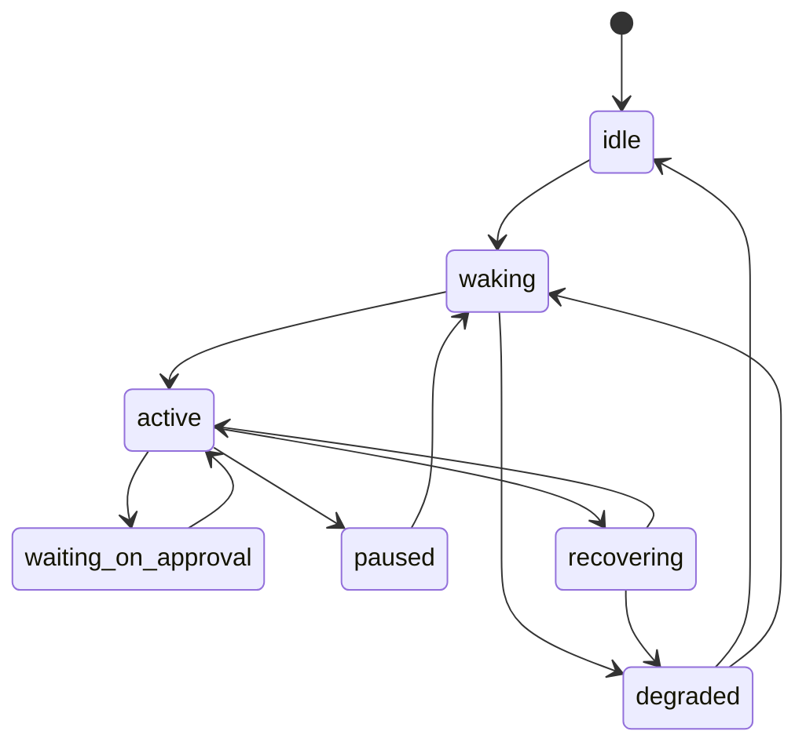

# Production Agent State Machine

This page defines the canonical operational state machine for the production autokairos agent.

It follows:

- [15-persistent-operations-and-wake-policy.md](15-persistent-operations-and-wake-policy.md)
- [12-governed-execution-request-contract.md](12-governed-execution-request-contract.md)
- [13-execution-attempt-contract.md](13-execution-attempt-contract.md)
- [../agent-system/08-production-agent-design.md](../agent-system/08-production-agent-design.md)

It is informed by:

- [Anthropic: Scaling Managed Agents](https://www.anthropic.com/engineering/managed-agents)
- [OpenAI Agents SDK: Results](https://openai.github.io/openai-agents-js/guides/results/)
- [OpenAI Agents SDK: Human-in-the-loop](https://openai.github.io/openai-agents-js/guides/human-in-the-loop/)
- [Anthropic: Claude Code auto mode](https://www.anthropic.com/engineering/claude-code-auto-mode)

## Thesis

The production agent needs an explicit operational state machine that is distinct from:

- candidate standing
- execution-attempt status
- wake class

Without that separation, pause, approval, degradation, and recovery become ad hoc runtime behavior
instead of a stable product contract.

## Why This Spec Exists

This spec exists to answer one question:

**what operational states can the production agent occupy while it is serving governed execution
work?**

That question is narrower than full system state and narrower than candidate progression, but it is
essential for production readiness.

## Canonical Object / Interface / Boundary

The canonical object here is the operational state of the production agent subsystem.

It answers:

- what the agent is doing right now
- whether it can accept work
- whether it is blocked, paused, or recovering

It does not answer candidate standing or promotion status.

## Required Fields Or Required Behaviors

### 1. `idle`

Meaning:

- no live runtime loop is currently executing for the relevant session line
- the agent may still have `cold` or `warm` readiness underneath

Required behavior:

- must be safe to accept a new governed execution request
- must not imply that prior continuity has been discarded

### 2. `waking`

Meaning:

- the system is resolving stage binding, continuity, workspace, or runtime activation

Required behavior:

- `ExecutionAttempt` must already exist or be in creation
- failures here must still leave durable records intact

### 3. `active`

Meaning:

- the runtime is live and the deliberation loop is executing

Required behavior:

- continuous trace emission
- liveness or heartbeat visibility
- tool calls must remain inside stage and guardrail posture

### 4. `waiting_on_approval`

Meaning:

- the live run is blocked on an explicit approval or runtime-local decision point

Required behavior:

- pending approval must be externally visible
- the agent must be resumable without reinterpreting the entire request from scratch

### 5. `paused`

Meaning:

- the agent is intentionally not executing, but the work is resumable

Required behavior:

- the pause reason must be recorded
- pause must not be confused with completion or rejection

### 6. `recovering`

Meaning:

- the runtime was lost or interrupted and the system is attempting to restore working execution

Required behavior:

- recovery must operate from durable references
- the system must not invent a fresh candidate or fresh session line during recovery

### 7. `degraded`

Meaning:

- the system cannot currently restore the target operational posture, but durable truth is intact

Required behavior:

- degraded posture must be externally visible
- the agent may later move back to `idle`, `waking`, or `active`

## Lifecycle Or State Model

### Required transition meanings

- `idle -> waking`
  governed work has been accepted
- `waking -> active`
  runtime activation succeeded
- `active -> waiting_on_approval`
  runtime hit an approval interruption
- `active -> paused`
  operator or policy intentionally paused the run
- `active -> recovering`
  runtime loss or interruption requires restoration
- `recovering -> degraded`
  recovery did not restore the intended posture
- `degraded -> idle`
  system stabilized without active execution

## What This Spec Is Not

This spec is not:

- the candidate lifecycle
- the execution-attempt status enum
- the wake-class policy itself
- the promotion model

## Failure Modes / Invariants

The key invariants are:

- operational state must be externally visible
- `waiting_on_approval` must not be treated as `paused` or `degraded`
- `degraded` must not imply candidate loss
- agent identity must survive all operational states

The design is failing if:

- runtime loss silently returns the agent to `idle` without recording disruption
- approvals are handled but the state machine never shows the waiting period
- degraded behavior is hidden inside logs rather than surfaced as state
- candidate standing is mutated as a side effect of operational recovery

## Relationship To Adjacent Specs

This spec depends on:

- [12-governed-execution-request-contract.md](12-governed-execution-request-contract.md)
- [13-execution-attempt-contract.md](13-execution-attempt-contract.md)
- [15-persistent-operations-and-wake-policy.md](15-persistent-operations-and-wake-policy.md)

It constrains:

- [../agent-system/02-execution-lifecycle.md](../agent-system/02-execution-lifecycle.md)
- [../agent-system/07-persistent-operations-model.md](../agent-system/07-persistent-operations-model.md)
- [../agent-system/08-production-agent-design.md](../agent-system/08-production-agent-design.md)
- [18-production-agent-observability-and-slos.md](18-production-agent-observability-and-slos.md)
