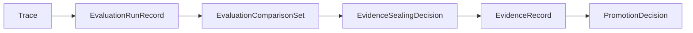

# Evaluation Comparability And Sealing Contract

## Purpose

This page defines the minimum contract that turns raw runtime history into comparable, sealed
evidence.

It follows:

- [03-staged-evaluation.md](03-staged-evaluation.md)
- [09-trace-contract.md](09-trace-contract.md)
- [10-evidence-record-contract.md](10-evidence-record-contract.md)
- [11-promotion-decision-contract.md](11-promotion-decision-contract.md)
- [../../sources/synthesis/evaluation-governance-and-promotion.md](../../sources/synthesis/evaluation-governance-and-promotion.md)

## Thesis

The evaluation path is:

```text
Trace
-> EvaluationRunRecord
-> EvidenceSealingDecision
-> EvidenceRecord
-> PromotionDecision
```

`Trace` says what happened.

`EvaluationRunRecord` says what the evaluator inspected and under which run conditions.

`EvidenceSealingDecision` says what was allowed to count or not count.

`EvidenceRecord` is the sealed judged artifact.

`PromotionDecision` is the governed state change that may cite counted evidence.

## Why This Spec Exists

autokairos is not trying to make one run look impressive.

It is trying to compare trader-system candidates under legitimate conditions so a weak human can
promote a stronger system without trusting runtime self-report.

That requires preserving:

- provider, model, and version attribution
- candidate version and trader-system spec identity
- capability package versions
- stage binding and legitimacy mode
- data window and market regime context
- evaluator method and evaluator version
- excluded runs and non-comparability reasons
- leakage, gaming, or ground-truth exposure flags

Without those fields, an operator can see a result but cannot know whether it is comparable.

## Canonical Flow



The important rule is that no provider, evaluator, or UI output skips the sealing decision.

## `EvaluationRunRecord`

`EvaluationRunRecord` records one evaluator pass over one or more traces.

Minimum fields:

| Field | Meaning |
| --- | --- |
| `evaluation_run_id` | Stable durable identity |
| `candidate_ref` | Candidate being evaluated |
| `candidate_version_ref` | Candidate version under judgment |
| `trader_system_spec_ref` | Trader-system spec used by the run |
| `trader_system_program_ref` | Program artifact used when relevant |
| `capability_package_refs` | Package ids and versions active in the run |
| `stage` | Stage context |
| `stage_binding_ref` | Concrete binding used |
| `trace_refs` | Raw trace inputs inspected |
| `provider_attribution` | Provider kind, invocation surface, model, version, and readiness record when relevant |
| `runtime_placement_refs` | Physical placements used by the traces |
| `data_window` | Market data, replay, or live-like window evaluated |
| `legitimacy_mode` | Convenience, legitimate, or quarantined/review mode |
| `evaluator_method_ref` | Evaluator, rubric, method, or scoring service |
| `evaluator_version` | Version or source identity for the method |
| `evaluation_status` | `completed`, `partial`, `failed`, or `quarantined_for_review` |
| `raw_evaluator_output_ref` | Raw score, labels, report, or provider eval output |
| `created_at` | When evaluation started or was recorded |
| `sealed_at` | When the evaluation run record became citeable |

`EvaluationRunRecord` is not evidence. It is the inspectable input basis for sealing.

## `EvaluationComparisonSet`

`EvaluationComparisonSet` records whether multiple evaluation runs can be compared.

Minimum fields:

| Field | Meaning |
| --- | --- |
| `evaluation_comparison_set_id` | Stable durable identity |
| `compared_candidate_refs` | Candidate refs included in the comparison |
| `evaluation_run_refs` | Evaluation runs considered |
| `comparability_criteria` | What had to match to compare these runs |
| `shared_stage_binding_assumptions` | Stage and binding assumptions held constant |
| `shared_data_window` | Data window, replay window, or reason no shared window exists |
| `capability_package_constraints` | Package/version constraints used for comparison |
| `provider_model_attribution` | Provider/model/version information that may affect comparison |
| `included_run_refs` | Runs admitted into the comparison |
| `excluded_run_refs` | Runs excluded from comparison |
| `non_comparability_reasons` | Why excluded or degraded runs cannot support strong claims |
| `created_at` | When the comparison set was created |

Comparison does not require every field to be identical, but differences must be explicit.

Examples of non-comparability reasons:

- different trader-system spec version
- different capability package version
- different data window or market regime
- different stage binding legitimacy
- provider/model change that materially affects the result
- trace missing required attribution
- possible ground-truth or evaluator leakage

## `EvidenceSealingDecision`

`EvidenceSealingDecision` is the act that converts evaluation output into counted, non-counted, or
quarantined evidence posture.

Minimum fields:

| Field | Meaning |
| --- | --- |
| `evidence_sealing_decision_id` | Stable durable identity |
| `evaluation_run_refs` | Evaluation runs considered |
| `comparison_set_ref` | Comparison set used, when applicable |
| `sealing_surface_kind` | Evaluator, review surface, policy surface, or hybrid surface |
| `sealed_by_ref` | Evaluator/reviewer identity or service ref |
| `evidence_disposition` | `counted`, `non_counted`, or `quarantined_for_review` |
| `disposition_reason` | Why that disposition was chosen |
| `leakage_flags` | Ground-truth, credential, benchmark, evaluator-target, or live-authority leakage flags |
| `gaming_flags` | Reward-hacking, overfitting, target gaming, or self-report reliance flags |
| `ambiguity_status` | Clear, ambiguous, partial, or failed |
| `resulting_evidence_refs` | Evidence records created by this decision |
| `created_at` | When sealing started |
| `sealed_at` | When the decision became citeable |

The sealing decision must be inspectable even when it produces no counted evidence.

## Counted, Non-Counted, And Quarantined

### `counted`

Counted evidence may be cited by `PromotionDecision`.

It requires:

- comparable or explicitly legitimate evaluation conditions
- evaluator method and version
- trace refs with required attribution
- no unresolved leakage or gaming flag
- enough result quality to support the claim being made

### `non_counted`

Non-counted evidence remains visible but cannot support promotion.

Typical reasons:

- local convenience run
- partial evaluator output
- insufficient trace attribution
- non-comparable data window
- possible but not severe leakage
- operator satisfaction without objective performance basis

### `quarantined_for_review`

Quarantined evaluation output is excluded from normal progression until reviewed.

Typical reasons:

- ground-truth or evaluator-target exposure
- credential or live-authority leakage
- runtime can read hidden labels, benchmark answers, or scoring artifacts
- strong reward-hacking signal
- false provenance or tampered trace suspicion

## Anti-Gaming And Leakage Rules

The runtime must not see:

- evaluator hidden labels
- benchmark answers
- scoring ground truth
- live approval state
- exchange credentials
- gateway signing material

Provider eval output, OpenAI/Google evaluation records, A2A artifacts, tool results, memory
summaries, and operator satisfaction are judgment inputs. They are not `EvidenceRecord` until an
`EvidenceSealingDecision` creates a sealed evidence record.

## Promotion Boundary

`PromotionDecision` may cite only sealed counted `EvidenceRecord`.

It must not cite:

- raw `Trace`
- raw provider output
- raw evaluator output
- unsealed `EvaluationRunRecord`
- `non_counted` evidence
- quarantined evidence
- subjective satisfaction without objective counted basis

Ambiguous, partial, or non-comparable results can create review items or follow-up requirements.
They must not open a live gate.

## Failure Modes / Invariants

The design is failing if:

- a provider/model run result becomes evidence without sealing
- subjective operator satisfaction becomes objective performance evidence
- evaluation output promotes a candidate directly
- a non-comparable result opens a live gate
- leakage or reward-hacking flags are hidden in trace payloads but absent from sealing decisions
- a failed or partial evaluator run creates counted evidence by default

## Relationship To Adjacent Specs

This spec makes concrete:

- [03-staged-evaluation.md](03-staged-evaluation.md)
- [09-trace-contract.md](09-trace-contract.md)
- [10-evidence-record-contract.md](10-evidence-record-contract.md)
- [11-promotion-decision-contract.md](11-promotion-decision-contract.md)

It does not implement an evaluator API, scoring service, storage schema, or UI.
