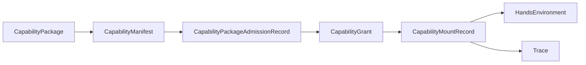

# Capability Package Trust And Permission Contract

## Purpose

This page defines the minimum trust, permission, and sandbox contract for `CapabilityPackage`.

It follows:

- [02-core-primitives.md](02-core-primitives.md)
- [04-boundaries.md](04-boundaries.md)
- [06-containerized-execution.md](06-containerized-execution.md)
- [../05-bootstrap-tech-spec.md](../05-bootstrap-tech-spec.md)
- [../../sources/synthesis/agent-runtime-and-harness-principles.md](../../sources/synthesis/agent-runtime-and-harness-principles.md)

## Thesis

`CapabilityPackage` can declare capabilities. It cannot grant them.

The active flow is:

```text
CapabilityPackage
-> CapabilityManifest
-> CapabilityPackageAdmissionRecord
-> CapabilityGrant
-> CapabilityMountRecord
-> Trace
```

`CapabilityManifest` declares what the package wants.

`CapabilityPackageAdmissionRecord` records whether the package is safe enough to consider.

`CapabilityGrant` records what the current `StageBinding` and authority surfaces actually allow.

`CapabilityMountRecord` records what content was injected into a runtime placement.

## Why This Spec Exists

autokairos wants packages to be reusable and eventually exchangeable. That only works if packages do
not smuggle authority.

A package may contain useful context, skills, tool contracts, scripts, data-access declarations, or
compatibility metadata. It must not contain secrets, evaluator ground truth, live approval,
credential material, or hidden instructions that bypass policy.

The package is an artifact. Authority lives in `StageBinding`, `ToolProxy`, vault/credential
binding, and `TradingGateway`.

## Canonical Flow



The runtime receives mounted or referenced package content only after admission and grant decisions.

## `CapabilityManifest`

`CapabilityManifest` is the package declaration.

Minimum fields:

| Field | Meaning |
| --- | --- |
| `package_id` | Stable package identity |
| `version` | Package version |
| `package_kind` | Context, tool contract, skill, data access, mixed, or other package kind |
| `provenance` | Source, publisher, generator, or origin record |
| `content_refs` | Package files, artifacts, or external references |
| `declared_tools` | Tools the package expects or describes |
| `declared_data_access` | Data sources the package expects |
| `declared_skills_or_context` | Skills, instructions, examples, or context material |
| `allowed_stages` | Stages where package may be considered |
| `requested_permissions` | Permissions requested, not granted |
| `compatibility_notes` | Required runtime, provider, tool, or stage assumptions |
| `forbidden_contents_assertion` | Package-level assertion that forbidden content is absent |
| `publisher_or_source_refs` | Human, provider, repository, marketplace, or agent-run refs |

The manifest does not grant access.

## `CapabilityPackageAdmissionRecord`

`CapabilityPackageAdmissionRecord` records whether a package is safe enough to enter a runtime
context candidate set.

Minimum fields:

| Field | Meaning |
| --- | --- |
| `capability_package_admission_id` | Stable durable identity |
| `package_ref` | Package being reviewed |
| `manifest_ref` | Manifest reviewed |
| `validation_status` | `accepted`, `rejected`, `quarantined_for_review`, or `needs_review` |
| `provenance_status` | Known, unknown, generated, imported, marketplace, or operator-authored posture |
| `forbidden_content_scan_result` | Result of checks for forbidden content |
| `prompt_injection_flags` | Hidden prompt or policy-bypass concerns |
| `evaluator_leakage_flags` | Hidden labels, benchmark answers, or scoring ground truth concerns |
| `credential_leakage_flags` | API keys, vault tokens, exchange credentials, or signing material concerns |
| `admission_outcome` | Whether package may be considered for grants |
| `review_reason` | Human-readable admission rationale |
| `created_at` | When admission review began or was recorded |
| `sealed_at` | When the admission record became citeable |

Rejected or quarantined packages must not enter default runtime context.

## `CapabilityGrant`

`CapabilityGrant` records the actual access granted for one package under one runtime/stage binding.

Minimum fields:

| Field | Meaning |
| --- | --- |
| `capability_grant_id` | Stable durable identity |
| `package_ref` | Package receiving scoped access |
| `stage_binding_ref` | Concrete binding that governs access |
| `runtime_ref` | Runtime receiving the package |
| `granted_tools` | Tools allowed through `ToolProxy` |
| `granted_data_context` | Data/context refs allowed |
| `denied_requests` | Manifest requests denied for this stage or runtime |
| `grant_reason` | Why these grants are safe enough |
| `grant_authority` | Control-plane, policy, or operator surface granting access |
| `expiry_or_review_fields` | Optional expiry, review, or revalidation posture |
| `credential_boundary_refs` | Vault/binding/gateway refs, not raw credentials |
| `tool_proxy_policy_refs` | ToolProxy policies that enforce access |

Stage-specific defaults:

- `BacktestBindingProfile`: no live credentials; simulator/evaluator access only when declared and
  granted.
- `PaperBindingProfile`: simulated order gateway only; no real exchange execution credentials.
- `LiveBindingProfile`: gateway/vault-mediated access only; package never receives direct exchange
  credentials or signing material.

## `CapabilityMountRecord`

`CapabilityMountRecord` records what was actually injected into a runtime placement or hands
environment.

Minimum fields:

| Field | Meaning |
| --- | --- |
| `capability_mount_id` | Stable durable identity |
| `package_ref` | Package version mounted or injected |
| `runtime_placement_ref` | Physical placement receiving the package |
| `hands_environment_ref` | Hands environment receiving package content |
| `mount_mode` | `read_only`, `reference_only`, or other explicit mode |
| `read_write_separation` | How package content is separated from scratch/output writes |
| `mounted_content_refs` | Content refs included |
| `excluded_content_refs` | Content refs excluded by admission/grant policy |
| `trace_refs` | Trace records proving mount/injection |
| `created_at` | When mount began |
| `ended_at` | When mount ended or was invalidated |

Package content should be read-only by default. Generated runtime output belongs in scratch,
artifacts, trace, or candidate-version proposals, not in the package artifact.

## Forbidden Contents

`CapabilityPackage` must not contain:

- exchange credentials
- provider API keys
- vault tokens
- gateway signing material
- live approval state
- evaluator hidden labels
- benchmark answers
- scoring ground truth
- undeclared network endpoints
- hidden self-promotion instructions
- policy-bypass prompts

If discovered, the package becomes `rejected` or `quarantined_for_review` and is excluded from
default runtime context.

## Boundary Rules

- `CapabilityManifest != CapabilityGrant`
- `CapabilityPackage != credentials`
- `CapabilityPackage != evaluator ground truth`
- `CapabilityPackage != live authority`
- `CapabilityMountRecord != evidence`
- package tool declaration does not equal `ToolProxy` access
- package context does not equal `RuntimeMemorySurface` truth
- package contents may influence runtime behavior only through traceable context, tool, grant, or
  mount refs

## Failure Modes / Invariants

The design is failing if:

- a package request grants itself tool or data access
- a package carries secrets or live authority
- evaluator labels or scoring ground truth are packaged into runtime context
- stage binding denial is ignored because the package declared a tool
- generated runtime output mutates the package artifact silently
- a package artifact is treated as counted evidence without evaluation sealing

## What This Spec Does Not Implement

This spec does not implement:

- package scanner code
- marketplace behavior
- storage schema
- runtime mount code
- tool proxy implementation
- credential vault integration

It defines the design contract those implementations must preserve.
