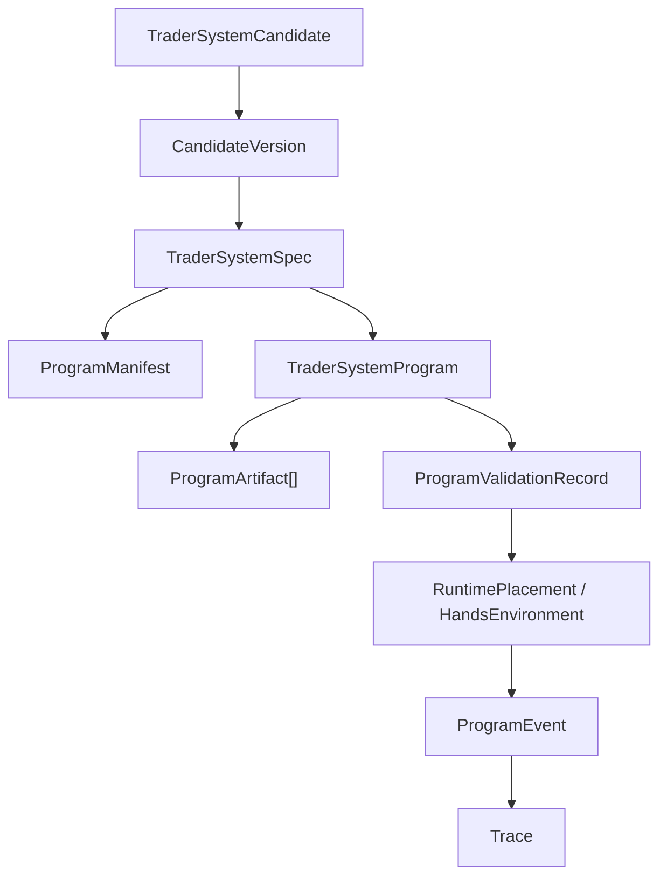

# Trader System Artifact Contract

## Purpose

This page defines the active artifact contract for `TraderSystemSpec` and `TraderSystemProgram`.

It follows:

- [02-core-primitives.md](02-core-primitives.md)
- [04-boundaries.md](04-boundaries.md)
- [06-containerized-execution.md](06-containerized-execution.md)
- [08-candidate-contract.md](08-candidate-contract.md)
- [../09-trader-system-runtime-operating-model.md](../09-trader-system-runtime-operating-model.md)
- [../05-bootstrap-tech-spec.md](../05-bootstrap-tech-spec.md)
- [../../sources/synthesis/agent-runtime-and-harness-principles.md](../../sources/synthesis/agent-runtime-and-harness-principles.md)

## Thesis

`TraderSystemSpec` defines the versioned trader-system artifact.

`TraderSystemProgram` is the agent-authored executable behavior bundle attached to that spec.

The program may be open-ended inside a sandbox or hands environment. The boundary is strict at the
outside edge:

```text
inside hands = open-ended agent-authored program behavior
outside hands = ProgramEvent / ToolRequest / OrderIntent / Artifact / ReviewRequest / CandidateVersion proposal
```

`TraderSystemSpec` and `TraderSystemProgram` are not evidence, promotion authority, credentials,
live approval, or exchange execution authority.

## Source Grounding

The reference lesson is consistent across the maintained source layer:

- Anthropic Managed Agents separates brain, hands, session, events, files, memory, and vault
  surfaces.
- Anthropic long-running harness writing emphasizes handoff artifacts and durable progress outside
  one uninterrupted context window.
- OpenAI Agents/Codex references emphasize sandbox, manifest, tools, trace, guardrails, and
  reviewable artifacts.
- Google ADK and A2A separate agent/session/event/artifact/tool/task boundaries.

autokairos translates those sources into one rule:

```text
artifact freedom belongs inside sandboxed execution;
truth, evidence, credentials, promotion, and live authority stay outside it.
```

## Canonical Artifact Chain



The candidate points to versioned artifacts. Execution placement may run a validated program.
Runtime output becomes trace before it can affect evaluation, promotion, live execution, or audit.

## `TraderSystemSpec`

`TraderSystemSpec` answers:

> what trader system is this candidate trying to run?

Minimum fields:

| Field | Meaning |
| --- | --- |
| `trader_system_spec_id` | Stable spec identity |
| `version` | Version of the system definition |
| `candidate_version_ref` | Candidate version this spec belongs to |
| `system_manifest_ref` | Human/agent-readable manifest for the system |
| `program_refs` | Program artifacts attached to this spec |
| `agent_spec_refs` | Configured agent participants expected by the system |
| `capability_package_refs` | Package refs the system expects |
| `supported_stage_binding_profiles` | Backtest, paper, and/or live profiles this spec claims to support |
| `declared_input_surfaces` | Inputs the system expects, such as market context, risk state, memory refs, or attention context |
| `declared_output_contracts` | Outputs the system is allowed to emit |
| `provenance_refs` | Provider run, operator, repository, or trace refs that created the spec |
| `compatibility_notes` | Runtime, sandbox, package, provider, or venue assumptions |

`TraderSystemSpec` must not contain:

- secrets
- exchange credentials
- provider API keys
- live approval
- gateway signing material
- evaluator hidden labels
- benchmark answers
- scoring ground truth
- counted evidence
- promotion state

## `ProgramManifest`

`ProgramManifest` is the inspectable declaration for one program bundle.

Minimum fields:

| Field | Meaning |
| --- | --- |
| `program_manifest_id` | Stable manifest identity |
| `program_ref` | Program described by the manifest |
| `entrypoint_ref` | Main executable entrypoint |
| `runtime_kind` | `python`, `typescript`, `shell`, `mixed`, `container_image_ref`, or `fixture_only` |
| `artifact_refs` | Files, modules, scripts, model prompts, generated policies, or package-relative refs |
| `output_contract_ref` | Contract the program must use at the boundary |
| `required_capability_grant_refs` | Grants needed before execution |
| `sandbox_required` | Must be true for executable programs |
| `declared_side_effects` | Side effects requested through `ToolProxy` or gateway only |
| `integrity_refs` | Hashes, signatures, repository commit refs, or artifact digests when available |

The manifest is not a permission grant. It only declares what the program needs.

## `TraderSystemProgram`

`TraderSystemProgram` answers:

> what executable behavior did the agent build for this trader system?

Minimum fields:

| Field | Meaning |
| --- | --- |
| `trader_system_program_id` | Stable program identity |
| `version` | Program artifact version |
| `spec_ref` | Owning trader-system spec |
| `artifact_refs` | Program files or generated artifacts |
| `runtime_kind` | Runtime needed to execute the program |
| `entrypoint_ref` | Entry point for execution |
| `output_contract_ref` | Allowed boundary outputs |
| `sandbox_required` | Whether execution must happen in sandbox/hands |
| `required_capability_grant_refs` | Stage-bound grants required before execution |
| `generated_by_agent_run_ref` | Agent run that generated or materially changed this program |
| `trace_refs` | Trace refs linked to generation or validation |
| `integrity_refs` | Hashes, signatures, commit refs, or artifact digests |

The program may include:

- Python scripts
- TypeScript or JavaScript modules
- generated rules or policies
- local planners
- indicator code
- experiment scripts
- self-authored attention logic
- fast-path logic
- tool-proxy client code for allowed surfaces

The program must not:

- call exchange APIs directly
- read raw secrets or credentials
- hide side effects outside trace
- bypass `ToolProxy`
- bypass `TradingGateway`
- write counted evidence
- promote itself
- mutate a live runtime in place

## `ProgramArtifact`

`ProgramArtifact` is a file, module, generated policy, manifest, script, or executable bundle that
belongs to a `TraderSystemProgram`.

It is not evidence.

It can become evaluation input only through trace and evaluator sealing:

```text
ProgramArtifact / ProgramEvent
-> Trace
-> EvaluationRunRecord
-> EvidenceSealingDecision
-> EvidenceRecord
```

## `ProgramValidationRecord`

`ProgramValidationRecord` records whether a program is safe enough to mount or execute under a
runtime placement.

Minimum fields:

| Field | Meaning |
| --- | --- |
| `program_ref` | Program being validated |
| `validation_status` | `accepted`, `rejected`, `quarantined_for_review`, `needs_review`, or `placeholder_only` |
| `entrypoint_status` | Whether the declared entrypoint exists and is executable in the expected runtime |
| `output_contract_status` | Whether the program declares an allowed output contract |
| `sandbox_status` | Whether sandbox/hands execution is required and available |
| `forbidden_content_flags` | Hidden prompt, self-promotion, evaluator leakage, or policy-bypass concerns |
| `side_effect_flags` | Direct exchange/API/network side-effect concerns |
| `secret_leakage_flags` | Raw credential, vault token, provider key, or signing-material concerns |
| `evaluator_leakage_flags` | Hidden labels, benchmark answers, or scoring ground truth concerns |
| `live_authority_flags` | Live approval or gateway bypass concerns |
| `review_reason` | Human-readable validation rationale |
| `created_at` | When validation was recorded |

Invalid programs must not be mounted or executed.

## Self-Evolution Boundary

Runtime execution may discover improvements. It must not mutate the live program in place.

Valid flow:

```text
runtime insight
-> CandidateVersion proposal
-> new TraderSystemSpec / TraderSystemProgram version
-> backtest or evaluation binding
-> sealed evidence
-> promotion
```

Invalid flow:

```text
live runtime edits its own program and continues as the same promoted artifact
```

The same artifact can run under different `StageBinding` profiles. A changed artifact is a new
candidate-version path.

## Boundary Rules

- `TraderSystemSpec != Docker image`
- `TraderSystemProgram != human DSL`
- `ProgramManifest != CapabilityGrant`
- `ProgramValidationRecord != PromotionDecision`
- `ProgramArtifact != EvidenceRecord`
- `ProgramEvent != EvidenceRecord`
- `program output != live execution`
- `program mutation != self-evolution`
- direct exchange execution remains outside the program and inside `TradingGateway`
- secrets remain outside program artifacts, package artifacts, and hands environments

## Bootstrap Posture

Bootstrap may store and display:

- `TraderSystemSpecRef`
- `TraderSystemProgramRef`
- `ProgramManifestRef`
- `ProgramValidationRecordRef`
- placeholder artifact refs

Bootstrap must not:

- execute programs
- validate real executable code
- mount real program artifacts
- run providers
- run evaluators
- submit live orders

The bootstrap proof is inspectability and durable seams, not program execution.

## Acceptance Test

A reader of this spec can explain:

- what belongs in `TraderSystemSpec`
- what belongs in `TraderSystemProgram`
- why program internals stay open-ended
- why program boundary outputs are narrow
- why validation is not promotion
- why program artifacts are not evidence
- why changed program behavior creates a candidate-version path
- why live authority still goes through `OrderIntent -> GatewayDecision -> ExecutionAttempt`
