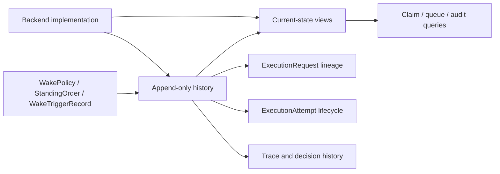

# Event-Log-First Durable Truth Posture

This page defines the storage posture for the first serious execution and control-plane truth.

It follows:

- [29-execution-record-store-contract.md](29-execution-record-store-contract.md)
- [12-governed-execution-request-contract.md](12-governed-execution-request-contract.md)
- [13-execution-attempt-contract.md](13-execution-attempt-contract.md)
- [21-wake-policy-contract.md](21-wake-policy-contract.md)
- [22-standing-order-contract.md](22-standing-order-contract.md)
- [23-wake-trigger-record-contract.md](23-wake-trigger-record-contract.md)
- [../agent-system/05-implementation-plan.md](../agent-system/05-implementation-plan.md)
- [../control-plane/03-record-model.md](../control-plane/03-record-model.md)

It is also informed by additional official documentation:

- [OpenAI Sessions](https://openai.github.io/openai-agents-js/guides/sessions/)
- [OpenAI Results](https://openai.github.io/openai-agents-js/guides/results/)
- [OpenAI Context Management](https://openai.github.io/openai-agents-js/guides/context/)
- [Claude Code Scheduled Tasks](https://code.claude.com/docs/en/scheduled-tasks)
- [Claude Code Routines](https://code.claude.com/docs/en/web-scheduled-tasks)
- [Supabase Architecture](https://supabase.com/docs/guides/getting-started/architecture)
- [MongoDB Transactions](https://www.mongodb.com/docs/manual/core/transactions/index.html)
- [MongoDB Data Modeling Best Practices](https://www.mongodb.com/docs/manual/data-modeling/best-practices/)

## Thesis

The first serious autokairos execution and control-plane truth should be designed around
**append-only evented history plus materialized current-state views**.

That means:

- the architecture should not be centered on one database product
- backend choice should remain downstream of truth shape
- Postgres or Supabase-backed Postgres can still be good serious implementations
- SQLite can still be useful for local bootstrap
- MongoDB can still be useful for projections or secondary read models
- but none of those storage products should become the architecture thesis

## Why This Spec Exists

[29-execution-record-store-contract.md](29-execution-record-store-contract.md) already fixed the
logical record family:

- request headers
- wake-origin links
- attempt headers
- append-only attempt lifecycle events

The next unresolved question is:

**what kind of storage model fits these records without distorting the architecture?**

This matters because autokairos is not storing one self-contained task document or one mutable row.
It is storing durable truth across:

- one-to-many provenance links
- current-state snapshots
- append-only lifecycle history
- cross-record idempotency and supersession
- governance and audit queries

Those are not neutral storage requirements.

## Canonical Object / Interface / Boundary

This spec defines the truth posture for the first serious control-plane and execution subsystem.

The canonical baseline is:

The important point is that canonical truth is:

- append-only where history matters
- explicitly projected where current state matters
- backend-agnostic at the architecture level

## Required Fields Or Required Behaviors

## 1. Event history comes first

The first serious implementation should preserve durable history explicitly before it optimizes for
mutable current-state convenience.

### Required history families

- wake-trigger history
- self-scheduling intent history
- execution-attempt lifecycle history
- governance decision history
- trace history or stable trace references

### Why

The source layer points repeatedly toward durable continuity outside any one live runtime:

- OpenAI keeps session and resume state outside one active turn.
- Claude distinguishes session-scoped scheduled tasks from unattended routines.
- OpenClaw distinguishes automation/task records from the currently active session turn.

This means autokairos should not treat current mutable records as the primary truth surface.

## 2. Current-state views must be explicit projections

Current operational posture still matters.

### Required current-state views

- active wake-policy view
- current `ExecutionRequest` view
- current `ExecutionAttempt` view
- current substrate-state views
- current review and decision standing

### Required behavior

The system should be able to answer operational questions quickly without replaying every event on
every read.

That implies explicit materialized or derivable current-state views above history.

### Why

autokairos is a living trading system. It needs:

- fast wake decisions
- current run posture
- current risk and review posture
- fast operator inspection

So event history alone is not enough.

## 3. Backend choice is downstream of truth shape

The architecture should define:

- what history must be append-only
- what current-state views must exist
- what invariants must hold across both

before it picks a database.

### Why

Otherwise the architecture drifts into:

- "we have a relational system because we chose Postgres"
- "we have a document system because we chose MongoDB"

Those are implementation-led conclusions, not architecture-led ones.

## 4. Postgres / Supabase posture

Postgres-compatible storage remains a strong serious implementation option.

Supabase remains acceptable when treated as:

- managed Postgres
- optional Realtime surface
- optional RLS surface
- optional operator-facing platform surface

### Why

Postgres and Supabase fit well because they can host:

- append-only event tables
- current-state projections
- transactional mutation paths
- operator-facing policy surfaces
- queue and claim patterns

But they are still **implementations of the posture**, not the posture itself.

## 5. SQLite posture

SQLite remains acceptable only as a **local bootstrap or single-node development posture**.

### Appropriate uses

- one local developer
- one local process family on one host
- initial record-store prototyping
- offline-first design validation

### Not the intended serious baseline

SQLite should not define the architecture's long-term truth model.

### Why

SQLite is good at:

- embedded deployment
- short writer transactions
- strong local durability

That makes it useful for local bootstrap of event history plus projections, but it should not
define the long-term architecture.

## 6. MongoDB posture

MongoDB is **not forbidden**, but it should not be the canonical truth store for the first serious
execution and proactive record families.

### Why

MongoDB's strongest native posture is:

- denormalized documents
- single-document atomicity
- schema shapes that try to minimize the need for multi-document transactions

That can be useful for:

- projections
- analytics documents
- denormalized operator views

But it is not the best baseline for the first canonical truth path, because autokairos wants
durable explicit history across:

- durable one-to-many wake provenance
- append-only lifecycle history
- explicit event-to-view derivation
- explicit supersession and idempotency links
- cross-family governance queries

MongoDB's own documentation also warns that distributed transactions carry cost and should not
replace good schema design.

## 7. Claim and coordination posture

The architecture should require one explicit claim and coordination surface above durable truth.

### Required behavior

- deterministic claiming of pending work
- duplicate-launch prevention
- explicit active-work ownership
- durable linkage from claim to request and attempt truth

### Why

This is a system invariant, not a database-brand invariant.

Different implementations may realize this differently:

- Postgres can use row locking patterns
- SQLite can use single-node transactional claims
- another store could use a different claim mechanism

## 8. Security and operator posture

The truth posture should remain compatible with operator-facing governance and projection later.

### Required behavior

The serious implementation should support:

- strong role separation
- row or record scoping where needed
- external operator views without copying truth out of the canonical store first

### Why

The control plane should not need to invent a second truth store just to support operator review.

## Lifecycle Or State Model

The storage posture itself has three layers.

1. `append_only_history`
   what happened
2. `materialized_current_state`
   what currently stands
3. `backend_realization`
   how those two layers are stored and queried in a specific deployment

Implementations can then vary by deployment:

- local bootstrap
- serious single-team deployment
- managed control-plane deployment
- secondary analytics or projection stores

## What This Is Not

This spec does not say:

- Postgres is banned
- Supabase is banned
- SQLite is banned
- MongoDB is banned

It says something narrower:

**the first serious canonical execution/control-plane store should be designed around append-only
evented history and explicit current-state projections, with backend choice kept downstream.**

## Failure Modes / Invariants

### Invariants

- canonical execution truth remains event-log-first
- current operational posture is an explicit projection, not an implicit side effect
- request provenance is queryable from durable truth
- attempt history stays append-only
- backend choice does not redefine the architecture's truth model

### Failure modes

- one mutable record becomes the only truth surface
- lifecycle history collapses into in-place status mutation
- projections become the only history source
- backend product features become the data model
- local bootstrap constraints define the long-term architecture

## Relationship To Adjacent Specs

This spec narrows the truth posture that sits underneath:

- [29-execution-record-store-contract.md](29-execution-record-store-contract.md)
- [12-governed-execution-request-contract.md](12-governed-execution-request-contract.md)
- [13-execution-attempt-contract.md](13-execution-attempt-contract.md)

It also sharpens the implementation reading of:

- [../agent-system/05-implementation-plan.md](../agent-system/05-implementation-plan.md)
- [../agent-system/06-first-code-seam.md](../agent-system/06-first-code-seam.md)
- [../control-plane/06-proactive-record-implementation-plan.md](../control-plane/06-proactive-record-implementation-plan.md)

The next store-design step should therefore be:

- exact first-cut history and projection shapes
- claim and coordination rules
- then one concrete backend realization

not a premature database-brand commitment.
