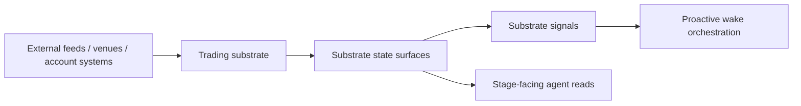

# Trading Substrate Overview

This page defines why autokairos needs an explicit always-on trading-substrate subsystem.

It follows:

- [README.md](README.md)
- [../foundation/01-naming-and-vocabulary.md](../foundation/01-naming-and-vocabulary.md)
- [../specs/04-boundaries.md](../specs/04-boundaries.md)
- [../specs/15-persistent-operations-and-wake-policy.md](../specs/15-persistent-operations-and-wake-policy.md)
- [../../sources/synthesis/proactive-operations-and-wake-orchestration.md](../../sources/synthesis/proactive-operations-and-wake-orchestration.md)

It is also informed by additional official documentation:

- [OpenClaw: Automation & Tasks](https://docs.openclaw.ai/automation)
- [OpenClaw: Standing Orders](https://docs.openclaw.ai/automation/standing-orders)
- [Claude Code: Automate work with routines](https://code.claude.com/docs/en/web-scheduled-tasks)
- [Claude Code: Run prompts on a schedule](https://code.claude.com/docs/en/scheduled-tasks)
- [OpenAI: Introducing the Codex app](https://openai.com/index/introducing-the-codex-app/)

## Purpose

Define the always-on domain layer that keeps trading facts live even when the cognitive runtime is
not currently executing.

## Scope And Non-Goals

This page covers:

- why the substrate must be its own subsystem
- what belongs in that subsystem
- how it relates to proactive wake orchestration and the agent runtime

This page does not cover:

- detailed record schemas
- exact venue adapter APIs
- runtime tool contracts

## Responsibilities

The trading substrate should:

- keep domain-relevant operational surfaces continuously available or explicitly degraded
- normalize venue and connector input into stable autokairos-facing state surfaces
- emit substrate signals without deciding wake authority
- make freshness and liveness explicit
- remain useful even if the agent runtime is currently `cold`

## System Boundaries

This subsystem sits:

- above external feeds, connectors, account systems, and venue APIs
- below proactive operations
- below the agent system's stage-facing read and execution surfaces

It should not:

- hold wake-policy truth
- turn substrate events directly into governed execution requests
- become the evaluation or promotion layer

## Primary Abstractions

- `SubstrateStateSurface`
  a continuously maintained operational view such as market, order, or risk posture
- `SubstrateSignal`
  a domain-relevant fact that may become a wake candidate
- `FreshnessPosture`
  whether a surface is current, delayed, stale, or degraded
- `ConnectorLiveness`
  whether the upstream ingress path is healthy enough to trust

## Primary Flows

## Failure And Recovery Model

This subsystem should assume:

- upstream systems can be partially unavailable
- some surfaces may be fresh while others lag
- runtime death must not destroy market, account, order, or risk awareness

Recovery therefore depends on:

- independently supervised connectors
- explicit freshness and liveness metadata
- replayable or inspectable signal history
- separation from runtime-local process state

## Dependencies On Other Subsystems

- Depends on foundation for vocabulary and boundary discipline.
- Depends on control plane for governance truth that constrains what the system may do with live facts.
- Feeds proactive operations with signal candidates.
- Feeds the agent system with stage-facing state and execution bindings.

## What Is Still Delegated To Specs / ADRs

- the canonical substrate boundary remains in
  [../specs/24-always-on-trading-substrate-contract.md](../specs/24-always-on-trading-substrate-contract.md)
- the decision to treat this as its own subsystem remains in
  [../adrs/0007-trading-substrate-layer.md](../adrs/0007-trading-substrate-layer.md)

## Core Claim

The current architecture already says:

- always-on substrate
- proactive wake orchestration
- wakeable runtime

But that stack is incomplete if the substrate remains only a slogan.

autokairos therefore needs a dedicated trading-substrate subsystem whose job is:

- keep domain facts live
- expose them with explicit freshness
- emit signal candidates
- stay separate from wake authority and runtime cognition

This is the missing layer that makes a living trading system more than a scheduled agent.
