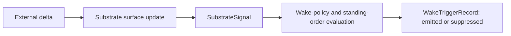

# Trading Substrate Signal And Liveness Model

This page defines how the trading substrate should emit domain-relevant signals and liveness
posture without collapsing them into wake-policy decisions.

It follows:

- [01-overview.md](01-overview.md)
- [02-state-surfaces.md](02-state-surfaces.md)
- [../proactive-operations/02-trigger-model.md](../proactive-operations/02-trigger-model.md)
- [../specs/19-wake-orchestration-and-trigger-model.md](../specs/19-wake-orchestration-and-trigger-model.md)
- [../specs/23-wake-trigger-record-contract.md](../specs/23-wake-trigger-record-contract.md)

## Purpose

Define the line between:

- domain facts the substrate notices
- orchestration decisions about whether those facts should wake the system

## Scope And Non-Goals

This page covers:

- substrate signal families
- freshness and liveness posture
- the separation between substrate signal and wake-trigger record

This page does not cover:

- exact policy evaluation logic
- review routing
- runtime tool behavior

## Responsibilities

The signal and liveness model should:

- expose domain-relevant change candidates
- make stale or degraded ingress visible
- preserve enough posture for proactive orchestration to decide whether to wake
- avoid turning every signal into a wake

## System Boundaries

The substrate may notice facts.

The substrate should not decide:

- whether a governed execution request is emitted
- whether a heartbeat should be suppressed
- whether a standing order authorizes action

Those belong above it.

## Signal Families

### 1. Market signals

Examples:

- threshold crossing
- volatility expansion or compression
- spread or liquidity change
- regime or session transition

### 2. Order and fill signals

Examples:

- order accepted
- order partially filled
- order rejected
- order timed out
- unexpected fill or cancel

### 3. Position and account signals

Examples:

- new position opened
- exposure changed materially
- margin usage crossed a threshold
- cash or collateral changed

### 4. Risk signals

Examples:

- soft limit warning
- hard limit breach
- kill-switch active
- risk posture recovered

### 5. Connector and freshness signals

Examples:

- feed delayed
- connector degraded
- connector disconnected
- liveness restored

## Signal Versus Wake Trigger

This distinction must stay explicit.

| Layer | Meaning |
| --- | --- |
| `SubstrateSignal` | the substrate noticed a domain-relevant fact |
| `WakeTriggerRecord` | proactive orchestration evaluated a candidate and emitted or suppressed a governed wake |

A substrate signal is therefore:

- upstream of wake orchestration
- not yet authority-checked
- not yet a governed execution decision

## Freshness And Liveness Classes

At minimum the substrate should expose:

- `fresh`
- `delayed`
- `stale`
- `degraded`
- `disconnected`
- `recovering`

### Meaning

- `fresh`
  current enough for intended use
- `delayed`
  lagging but still usable for some paths
- `stale`
  too old for trusted action
- `degraded`
  partially available with known impairment
- `disconnected`
  unavailable for trusted use
- `recovering`
  re-entering a trusted posture after impairment

## Primary Flow

## Failure And Recovery Model

The model is failing if:

- stale data looks fresh
- connector failure disappears into runtime-local logs
- every substrate signal becomes a wake by default
- emitted wake history cannot be traced back to a substrate signal family

Recovery depends on:

- explicit liveness posture
- inspectable signal families
- dedupe and burst control above the substrate

## What Is Still Delegated To Specs / ADRs

- substrate-signal object semantics remain in
  [../specs/25-substrate-signal-contract.md](../specs/25-substrate-signal-contract.md)
- trigger-family semantics remain in
  [../specs/19-wake-orchestration-and-trigger-model.md](../specs/19-wake-orchestration-and-trigger-model.md)
- durable emitted-or-suppressed wake history remains in
  [../specs/23-wake-trigger-record-contract.md](../specs/23-wake-trigger-record-contract.md)

## Core Claim

The substrate should be able to say:

- what happened
- when it happened
- how fresh the relevant surfaces are

But not:

- whether the system was authorized to wake
- whether work was emitted

That separation is what keeps signal, policy, and runtime from collapsing into one layer.
