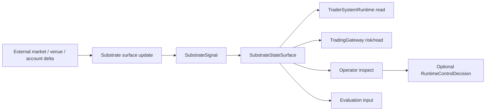

# Trading Substrate Signal And Liveness Model

This page defines how the trading substrate exposes market, order, position, risk, and connector
state without becoming the trader-system brain or the runtime control plane.

It follows:

- [01-overview.md](01-overview.md)
- [02-state-surfaces.md](02-state-surfaces.md)
- [../specs/24-always-on-trading-substrate-contract.md](../specs/24-always-on-trading-substrate-contract.md)
- [../specs/25-substrate-signal-contract.md](../specs/25-substrate-signal-contract.md)
- [../specs/26-substrate-state-surface-contract.md](../specs/26-substrate-state-surface-contract.md)
- [../specs/27-order-fill-surface-contract.md](../specs/27-order-fill-surface-contract.md)

## Purpose

Define the line between:

- domain facts the substrate observes
- state surfaces a trader system can read
- lifecycle/intervention decisions the control plane may make

The substrate does not decide trader-system actions. It provides current state and signal records
that runtimes, evaluation, gateway, and operator inspection can consume.

## Scope And Non-Goals

This page covers:

- substrate signal families
- freshness and liveness posture
- the boundary between domain facts and runtime lifecycle control

This page does not cover:

- exact policy evaluation logic
- runtime internal strategy
- direct exchange side effects
- review routing

## Signal Families

### 1. Market signals

Examples:

- threshold crossing
- volatility expansion or compression
- spread or liquidity change
- regime or session transition

### 2. Order and fill signals

Examples:

- order accepted
- order partially filled
- order rejected
- order timed out
- unexpected fill or cancel

### 3. Position and account signals

Examples:

- new position opened
- exposure changed materially
- margin usage crossed a threshold
- cash or collateral changed

### 4. Risk signals

Examples:

- soft limit warning
- hard limit breach
- kill-switch active
- risk posture recovered

### 5. Connector and freshness signals

Examples:

- feed delayed
- connector degraded
- connector disconnected
- liveness restored

## Signal Versus Runtime Control

| Layer | Meaning |
| --- | --- |
| `SubstrateSignal` | the substrate noticed a domain-relevant fact |
| `SubstrateStateSurface` | the current readable state exposed to runtimes, gateway, evaluation, and operator inspection |
| `RuntimeControlDecision` | the control plane accepted, rejected, or applied a lifecycle/intervention action |

A substrate signal is therefore:

- upstream of runtime reads, trace, evaluation, and operator inspection
- not a lifecycle command
- not an order
- not evidence
- not a promotion decision

## Freshness And Liveness Classes

At minimum the substrate should expose:

- `fresh`
- `delayed`
- `stale`
- `degraded`
- `disconnected`
- `recovering`

### Meaning

- `fresh`
  current enough for intended use
- `delayed`
  lagging but still usable for some paths
- `stale`
  too old for trusted action
- `degraded`
  partially available with known impairment
- `disconnected`
  unavailable for trusted use
- `recovering`
  re-entering a trusted posture after impairment

## Primary Flow

## Failure And Recovery Model

The model is failing if:

- stale data looks fresh
- connector failure disappears into runtime-local logs
- substrate records are treated as trader-system decisions
- substrate records directly create evidence, promotion, or live authority

Recovery depends on:

- explicit liveness posture
- inspectable signal families
- traceable state reads
- gateway and runtime-control boundaries above the substrate

## Core Claim

The substrate should be able to say:

- what happened
- when it happened
- how fresh the relevant surfaces are

It should not say:

- what the trader system should decide internally
- whether a candidate should be promoted
- whether an order should bypass the gateway
- whether the control plane should lifecycle-control a runtime
