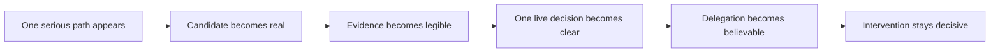

# MLP-01 Journey Map

## Purpose

This page turns the locked MLP into a concrete operator trust journey.

It must show:

- the broken as-is journey
- the target to-be journey
- the exact trust breakpoints
- the branches where the product can hold, reject, or interrupt without collapsing trust

## Journey Thesis

The journey problem is not lack of activity.

The journey problem is that the operator currently has to carry trust and meaning manually across
too many transitions.

MLP-01 succeeds only if the product absorbs those trust transitions without hiding why they
happened.

The real journey question is:

- when does the operator still feel like the runtime?
- when does the operator finally feel safe delegating?

## As-Is Narrative

Before the product, the operator is still living inside a mostly manual loop.

Ideas appear in bursts from discretion, feeds, rough automation, or ad hoc LLM help.

The operator filters them manually, runs scattered checks, interprets the results by hand, and
still has to decide whether anything deserves live risk.

Even if some automation already exists, it does not feel like a system the operator can safely
delegate to.

It feels more like partial assistance wrapped around the same old responsibility.

So the operator never really leaves the loop:

- they still carry the meaning of each stage
- they still decide what evidence matters
- they still hesitate at live approval
- they still keep shadowing live behavior because trust never fully lands

## To-Be Narrative

The target journey should feel different in one specific way:

the operator is no longer manually carrying trust from step to step.

Instead, one serious path appears, becomes real, earns legible evidence, reaches one meaningful
live decision, and then continues under bounded delegation unless something important requires
attention.

The operator should feel:

- this is one serious path, not idea spam
- I understand what became real and why
- I can tell what counts and what does not
- I know exactly what I am approving for live
- I can step away after approval because delegation now feels earned
- if I am interrupted, it is for a meaningful reason and I can act decisively

If the journey still feels like hidden manual supervision, the product has failed even if all the
stages technically exist.

## As-Is Journey Map

| Stage | What the operator experiences now | Trust question in the operator's head | What trust failure feels like |
| --- | --- | --- | --- |
| Something appears | Ideas show up from many places in bursts | "Is this even worth tracking?" | Most ideas feel disposable or noisy |
| Manual filtering | The operator decides what deserves attention | "Am I wasting time on noise?" | Filtering stays inconsistent and tiring |
| Scattered checking | Backtests, paper checks, and notes live across uneven tools | "Did any of this actually mean something?" | Evidence is hard to compare and easy to over- or under-trust |
| Manual legitimacy judgment | The operator decides what counts by hand | "What should count here?" | Counted versus non-counted remains fuzzy |
| Separate live judgment | Live approval feels like a new risky leap | "What am I actually approving?" | Approval meaning is unclear and outside the product |
| Shadow monitoring | The operator keeps checking because trust never lands | "Can I safely stop watching?" | The operator still feels like the real runtime |

## To-Be Journey Map

| Stage | What the operator experiences in the product | Trust question answered by the product | What the product must prove |
| --- | --- | --- | --- |
| Serious path appears | One concrete path is surfaced instead of a wall of ideas | "Why is this worth following?" | The system can originate something serious enough to matter |
| Candidate becomes real | The path becomes a durable tracked candidate | "Is this now a real thing in the system?" | The operator does not have to hold the record manually |
| Evidence becomes legible | Counted and non-counted evidence are separated clearly | "What should influence my trust?" | The product knows what counts and makes it visible |
| Live decision becomes clear | One serious live gate appears with explicit meaning | "What exactly am I approving?" | The hard delegation decision is product-owned and bounded |
| Delegation becomes believable | The promoted path runs within explicit limits | "Can I actually step away now?" | Normal live behavior no longer requires constant human shadowing |
| Intervention stays decisive | The system wakes the operator only when something meaningful happens | "Why am I being interrupted, and what can I do now?" | Control returns cleanly without restoring full manual operation |

## Canonical Trust Journey

The first lovable journey is:

This is not just a stage flow.

It is the trust journey the operator must feel all the way through.

If the operator still has to mentally reconnect the meaning between those moments, the journey is
not lovable yet.

## Trust Breakpoints

The first MLP either wins or loses trust at four moments.

### 1. When a path first appears

#### The operator's real question

"Why did the system surface this now, and why should I care?"

#### What must be visible

- why the path exists at all
- enough context to see that it is serious
- enough specificity to distinguish it from commentary or spam

#### What failure feels like

The system looks chatty, generic, or noisy.

#### Why this matters

If the first moment feels weak, the operator will not even enter the journey seriously.

### 2. When counted and non-counted evidence diverge

#### The operator's real question

"What should actually change my trust here?"

#### What must be visible

- what counted
- what did not count
- why the difference matters
- how the path is getting stronger, weaker, or held back

#### What failure feels like

Runs happen, but the operator still cannot tell what matters.

#### Why this matters

This is the moment where the product either becomes a legitimate evaluator or stays a bag of runs.

### 3. When the live gate asks for one serious decision

#### The operator's real question

"What exactly am I putting live, and on what basis?"

#### What must be visible

- what the candidate is
- what evidence supports promotion
- what live approval means
- what the approved path is allowed to do

#### What failure feels like

Approval feels ceremonial, fuzzy, or detached from the real path.

#### Why this matters

If this moment is weak, the product has not actually absorbed the hard delegation decision.

### 4. When the system wakes the operator during live operation

#### The operator's real question

"Why am I being interrupted, and what decisive action can I take?"

#### What must be visible

- the wake reason
- why it matters now
- what actions are available
- what happens if no action is taken

#### What failure feels like

Wakes are noisy, vague, or too slow to act on confidently.

#### Why this matters

If this moment is weak, the operator will fall back into constant manual shadowing.

## Failure Branches

The journey must preserve trust even when the happy path does not happen.

### Hold

- the path remains visible
- it is not yet delegable
- the operator can tell why progression stopped
- trust is preserved because the product makes non-promotion legible

### Reject

- the path is explicitly disqualified
- the operator can explain why it should not count
- trust is preserved because the system rejects visibly rather than failing silently

### Intervene

- live delegation is interrupted for a meaningful reason
- the operator can inspect that reason and act decisively
- control returns cleanly without collapsing back into permanent manual oversight

## Reference Scenario

Use this reference scenario when evaluating whether the journey is vivid enough.

### Scenario

- the operator is away from the desk for a meaningful period
- the operator is still mostly manual today, even if they already use some alerts and rough
  automation
- Binance BTC perpetual futures remain the first market being watched
- a market condition change produces one concrete hypothesis worth following
- the operator later reviews one serious candidate path, not a wall of ideas
- the operator can see what counted before facing one live decision
- after approval, the system runs live until either normal bounded execution continues or a
  meaningful wake is required

### Why this scenario matters

It anchors the product around the hardest believable promise:

- the operator is not continuously watching
- the agent still originates something worth following
- the system still progresses it credibly
- the operator still feels safe enough to delegate bounded live behavior

It also keeps first-market specificity where it belongs:

- inside the wedge and reference scenario
- not inside the primary journey thesis
- not inside the core trust breakpoint definitions

## Journey Acceptance Test

The journey is good enough only if one reader can explain:

- what the operator's current journey feels like before the product
- what changes emotionally and operationally in the target journey
- where trust breaks today
- where trust must be earned in the target product
- what the operator is really asking at each critical moment
- what happens when the path is held, rejected, or interrupted
- why the product is lovable only if the operator can delegate without becoming the runtime

without falling back to architecture jargon or private implementation knowledge.

## Read Next

1. [03-story-map-and-release-slices.md](03-story-map-and-release-slices.md)
2. [04-scope-and-cutline.md](04-scope-and-cutline.md)
3. [05-success-metrics-and-launch-bar.md](05-success-metrics-and-launch-bar.md)
