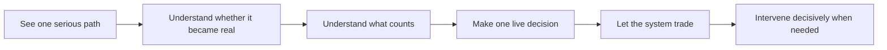

# MLP-01 Story Map And Release Slices

## Purpose

This page turns the trust journey into a delivery model.

Its job is not to list product features by subsystem.

Its job is to define the minimum sequence of proofs required for a weak human operator to trust
delegation.

It must answer:

- what operator-visible activities exist in the lovable path
- what tasks sit under those activities
- how those tasks bundle into trust-proof release slices
- why the slices must happen in the chosen order

## Story-Mapping Thesis

This page is not a feature breakdown.

This page defines the minimum sequence of proofs needed for the operator to believe:

- this path is real
- this path is trustworthy
- this path can really trade
- I can still stay in control after I let it trade

A slice belongs in MLP-01 only if it closes a user-visible trust question that the next slice
depends on.

## Why Slices Follow Trust Proof, Not Taxonomy

Release slices are not allowed to follow technical taxonomy.

They must follow visible operator trust formation through the lovable loop.

That means:

- a slice is not "whatever one subsystem can implement"
- a slice is not "whatever one PRD section happens to contain"
- a slice is not "whatever is easiest to build first"

A slice is only valid if it creates a new believable proof for the operator.

## User Activities And Tasks

| User activity | User task | Why the task matters |
| --- | --- | --- |
| See one serious path | See one agent-originated path instead of idea spam | Proves the system can surface something worth following |
| Understand whether it became real | Know the path is now a durable candidate | Proves the product owns the path, not the operator's memory |
| Understand what counts | Distinguish counted from non-counted evidence | Proves progression is governed rather than opaque |
| Make one live decision | Understand one bounded live approval | Proves promotion has serious meaning |
| Let the system trade | Allow bounded live operation without shadowing it | Proves this is a live operator system, not a paper artifact |
| Intervene decisively when needed | Inspect, pause, stop, or override on meaningful wake | Proves trust and control survive live delegation |

## Canonical Story Map

This is the happy-path story map.

It stays centered on operator progress, not subsystem boundaries.

## Canonical Release Slices

### Slice 1: Path Becomes Real

#### What it closes

- one serious path appears
- the path becomes a durable candidate
- the operator no longer has to carry the record manually

#### Visible proof

This is not disposable output anymore.

#### Trust question resolved

"Is this path real?"

#### Exit criteria

- the operator can see one serious path instead of generic commentary
- the operator can see that it became one durable candidate
- the candidate remains inspectable without depending on transient runtime state

### Slice 2: Path Becomes Trustworthy

#### What it closes

- counted versus non-counted evidence is visible
- the operator can explain why the path is or is not becoming stronger
- one explicit live gate appears with clear meaning

#### Visible proof

This product governs progression instead of just running checks.

#### Trust question resolved

"Why should I trust this path?"

#### Exit criteria

- the operator can explain what counted
- the operator can explain what did not count
- the operator can explain why the path is stronger, weaker, held, or rejected
- the operator can explain what one live deployment decision means

### Slice 3: Path Can Really Trade

#### What it closes

- one promoted candidate actually runs live
- bounded delegation becomes real
- the operator is no longer required for routine live actions

#### Visible proof

This is a live operator system, not a paper artifact.

#### Trust question resolved

"Can I actually let it trade?"

#### Exit criteria

- one promoted candidate can trade live on Binance BTC perpetual futures
- the operator is not required for routine live actions
- explicit live limits remain visible and meaningful

### Slice 4: Delegation Stays Safe Under Live Conditions

#### What it closes

- meaningful wake reasons exist
- inspect, pause, stop, and override are decisive
- intervention preserves control without collapsing back into manual runtime

#### Visible proof

The operator can delegate and still trust recovery and control.

#### Trust question resolved

"Can I stay in control after I let it trade?"

#### Exit criteria

- wake reasons are understandable
- intervention actions are clear and decisive
- operator trust improves rather than collapsing under live conditions

## Slice Dependency Logic

The slice order is fixed because each slice answers a prerequisite trust question.

| Slice | Trust question answered | Why it must happen before the next slice |
| --- | --- | --- |
| Slice 1 | "Is this path real?" | Without this, the operator is still the system of record |
| Slice 2 | "Why should I trust this path?" | Without this, live approval has no credible basis |
| Slice 3 | "Can I actually let it trade?" | Without this, there is no believable delegation proof |
| Slice 4 | "Can I stay in control after I let it trade?" | Without this, live delegation still feels emotionally unsafe |

### Why the order must not flip

#### Slice 2 cannot follow Slice 3

If the system trades live before visible legitimacy exists, the product becomes reckless rather than
trustworthy.

#### Slice 4 cannot be deferred outside the lovable proof

If live delegation exists without credible intervention, the operator still experiences autonomy as
unsafe or fake.

#### Slice 1 cannot be skipped

Without durable path ownership, the operator still carries the meaning of the system manually.

## Branch Markers

The main story map stays centered on the happy path.

Non-happy-path behavior should appear as trust-preserving branch markers, not as equal-weight story
lanes.

### Slice 2 branch markers

- `hold`
  The path remains visible but not yet delegable.
- `reject`
  The path is explicitly disqualified and the operator can explain why.

These branches preserve trust because non-promotion is legible rather than silent.

### Slice 4 branch marker

- `intervene`
  Live delegation is interrupted for a meaningful reason and control returns cleanly.

This branch preserves trust because intervention is decisive without forcing the operator back into
permanent manual runtime.

## Reference Scenario Through The Slices

In the reference scenario:

- Slice 1 makes one surfaced path become a real candidate instead of a fleeting event
- Slice 2 makes the operator understand why that path should or should not earn live risk
- Slice 3 makes the operator see the product actually carry the path into live execution
- Slice 4 makes the operator willing to trust that live path without staying glued to the runtime

This is where first-market specificity stays explicit.

The story-map activity model itself remains product-level.

## Relationship To PRDs

- Slice 1 -> [prds/01-hypothesis-to-candidate.md](prds/01-hypothesis-to-candidate.md)
- Slice 2 -> [prds/02-candidate-evaluation-and-live-gate.md](prds/02-candidate-evaluation-and-live-gate.md)
- Slice 3 -> [prds/03-live-deployment-and-autonomous-execution.md](prds/03-live-deployment-and-autonomous-execution.md)
- Slice 4 -> [prds/04-operator-trust-wake-and-intervention.md](prds/04-operator-trust-wake-and-intervention.md)

PRDs should elaborate the slice contracts.

They should not redefine the slice order or the proof each slice is supposed to earn.

## Slice Acceptance Test

This page is good enough only if one reader can explain:

- what the operator-visible activities are in the lovable path
- why slices are ordered the way they are
- what new trust proof each slice earns
- why live operation without visible legitimacy is unsafe
- why intervention must be included in the first lovable proof
- how hold, reject, and intervene are handled without overwhelming the main story map
- how this page differs from `02-journey-map`

without falling back to subsystem or implementation language.

## Read Next

1. [04-scope-and-cutline.md](04-scope-and-cutline.md)
2. [05-success-metrics-and-launch-bar.md](05-success-metrics-and-launch-bar.md)
3. [prds/README.md](prds/README.md)
