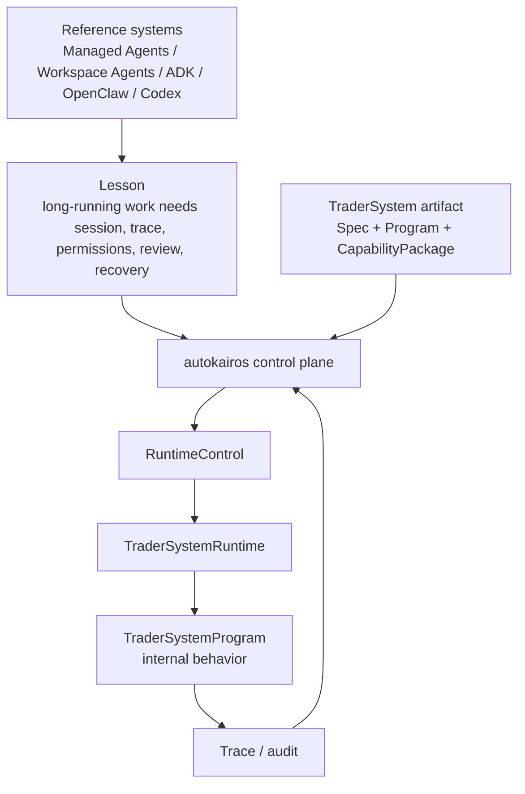

# Proactive Operations And Runtime Control

This page compares the reference set for proactive, background, long-running, and operator-supervised
agent work.

The active autokairos conclusion changed on 2026-04-26:

```text
do not model autokairos as waking the trader-system brain
model autokairos as control plane/devops for deployed trader systems
```

Older semantic-attention and activation-oriented notes are preserved under architecture history. They are
not the active runtime architecture.

## Sources Used

- [proactive-agent-research-papers.md](../library/proactive-agent-research-papers.md)
- [anthropic-2026-runtime-and-managed-agent-stack.md](../library/anthropic-2026-runtime-and-managed-agent-stack.md)
- [openai-2026-agent-codex-workspace-stack.md](../library/openai-2026-agent-codex-workspace-stack.md)
- [google-2026-agent-platform-and-protocols.md](../library/google-2026-agent-platform-and-protocols.md)
- [repo-anthropics-claude-code.md](../library/repo-anthropics-claude-code.md)
- [repo-openai-codex.md](../library/repo-openai-codex.md)
- [repo-openclaw.md](../library/repo-openclaw.md)
- [repo-multica.md](../library/repo-multica.md)
- [repo-paperclip.md](../library/repo-paperclip.md)

## Active Design Rules

The references still matter, but the autokairos translation is now different:

- Long-running agents need durable session, trace, artifact, permission, and review surfaces.
- Background/proactive work must return to inspectable supervision surfaces.
- Semantic context should not be prematurely collapsed into enums.
- However, autokairos should not own the trader-system's internal activation loop.
- `TraderSystemProgram` owns internal trading behavior and may schedule, poll, stream, reason, or call
  provider-backed agents inside its sandboxed runtime boundary.
- autokairos owns `RuntimeControl`: `register`, `deploy`, `start`, `pause`, `resume`, `stop`,
  `inspect`, `override`, and `kill`.
- autokairos owns lifecycle, placement, trace, tool/gateway boundaries, evaluation, promotion, and
  audit.

## Correct Autokairos Translation



The references do not imply that autokairos must become a scheduler, dispatcher, traffic
controller, or handler map for every market/fill/risk/time condition.

## What To Transfer

| Reference pressure | Transfer to autokairos |
| --- | --- |
| Managed long-running sessions | durable `AgentSession`, trace, artifacts, recovery posture |
| Harness/sandbox separation | `BrainSession` / `HandsEnvironment` / `RuntimePlacement` boundaries |
| Background work review surfaces | inspectable runtime control, trace, evaluation, audit |
| Proactive-agent evaluation | evaluate runtime outcomes and trace quality; do not rely on subjective confidence |
| Memory/reflection systems | versioned `RuntimeMemorySurface`, never hidden truth or evidence |
| OpenClaw/Multica task ledgers | durable lifecycle and placement records outside provider sessions |
| Google runtime/gateway posture | keep runtime, memory, gateway, identity, evaluation, and observability separate |

## What Not To Copy

- event-source enum dispatch as product truth
- a central workflow engine that calls every internal trader-system step
- one generic gateway that hides the difference between tools and live trading
- provider-private memory as durable truth
- enterprise/fleet breadth as MLP scope
- A2A mesh as a first implementation dependency

## Current Boundary

```text
TraderSystemProgram may be proactive internally.
autokairos controls runtime lifecycle externally.
```

That means a trader system can internally:

- subscribe to market streams
- run scripts
- call provider-backed agents
- maintain local planners
- decide when no action is needed
- propose `OrderIntent`
- emit traceable diagnostics

But external side effects still cross:

- `ToolProxy`
- `TradingGateway`
- trace/audit
- evaluation sealing
- promotion decisions
- runtime lifecycle control

## One Sentence Summary

The reference set supports long-running, proactive, recoverable agent systems, but autokairos should
apply those lessons as runtime-control, trace, permission, evaluation, and audit boundaries rather
than as an autokairos-owned internal activation loop.
